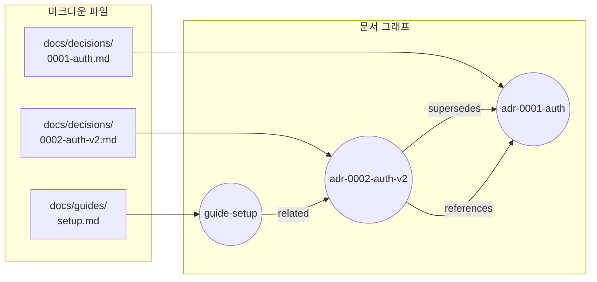
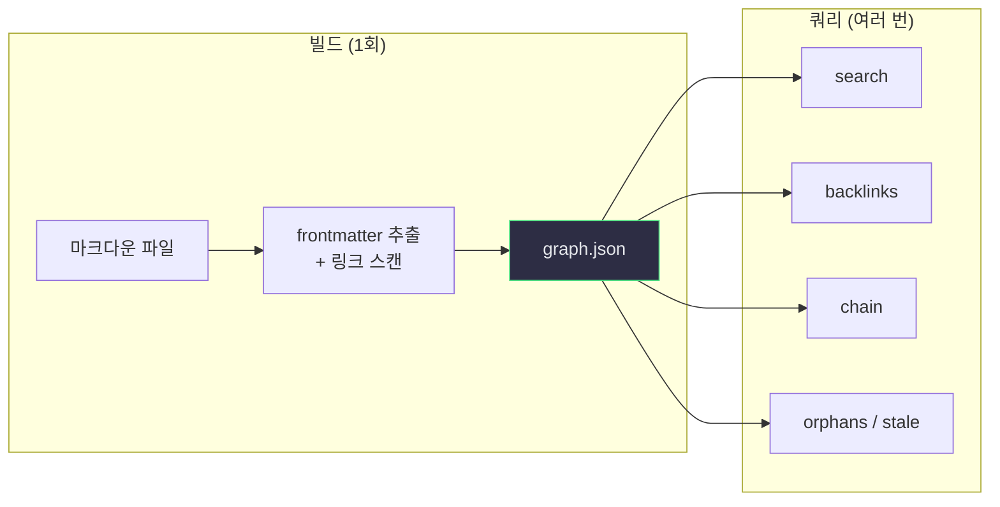
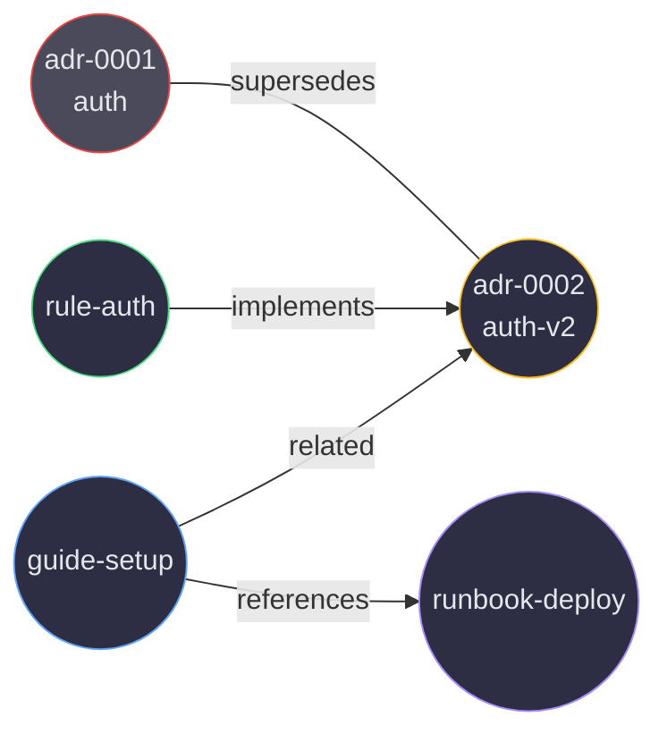

[](https://www.rust-lang.org)
[](https://doc.rust-lang.org/edition-guide/rust-2024/)
[](LICENSE)

# nodex

> **[English](README.md)** | **한국어**

**마크다운 파일을 쿼리 가능한 문서 그래프로 변환합니다.**

nodex는 프로젝트의 마크다운 파일을 스캔하여 YAML frontmatter와 링크 관계를 추출하고, 검색, 검증, 보고가 가능한 불변 문서 그래프를 구축합니다. AI 에이전트 통합을 위한 JSON 기반 CLI를 제공합니다.

---

## 왜 nodex인가?

- **폴더가 아닌 그래프** — 백링크, 대체 체인, 상호 참조를 통해 문서 간 관계를 탐색
- **코드가 아닌 설정** — 모든 프로젝트별 규칙은 `nodex.toml`에 정의, 하드코딩된 도메인 로직 없음
- **빠른 속도** — Rust + rayon 병렬 파싱, SHA256 캐시 기반 증분 빌드
- **AI 에이전트 네이티브** — 모든 명령이 일관된 `{ok, data}` JSON envelope로 출력

---

## 빠른 시작

```bash
# 설치 (macOS / Linux)
curl -fsSL https://raw.githubusercontent.com/junyeong-ai/nodex/main/scripts/install.sh | bash

# 프로젝트에 설정 초기화
nodex init

# 문서 그래프 빌드
nodex build

# 문서 검색
nodex query search "auth"

# 관계 탐색
nodex query backlinks <node-id>
nodex query chain <node-id>
```

---

## 그래프 동작 원리

### 파일에서 그래프로

nodex는 평면적인 마크다운 파일 모음을 탐색 가능한 지식 그래프로 변환합니다. 각 문서는 **노드**가 되고, 문서 간 모든 링크는 방향성 있는 **엣지**가 됩니다.



### 엣지 유형

엣지는 두 가지 소스에서 추출됩니다:

| 소스 | 엣지 유형 | 예시 |
|------|----------|------|
| Frontmatter `supersedes` | supersedes | ADR 2가 ADR 1을 대체 |
| Frontmatter `implements` | implements | Rule이 ADR을 구현 |
| Frontmatter `related` | related | Guide가 ADR과 관련 |
| 마크다운 `[텍스트](경로.md)` | references | 본문에서 다른 문서로 링크 |
| 커스텀 패턴 `@경로.md` | imports | `nodex.toml`에서 설정 가능 |

### 한 번 색인, 무한 쿼리

기존 방식은 검색할 때마다 모든 파일을 읽습니다. nodex는 **색인**과 **쿼리**를 분리합니다:



- **빌드**는 각 파일의 frontmatter 메타데이터를 추출하고 마크다운 링크를 스캔합니다 — 컴팩트한 `graph.json`이 모든 노드와 관계를 캡처
- **쿼리**는 `graph.json`만 읽고, 원본 파일은 읽지 않음 — 밀리초 이내 응답
- **증분 빌드**: 파일별 SHA256 해시로 변경된 파일만 재파싱

### 빌드 파이프라인


- **스캔**: include/exclude glob으로 파일시스템 탐색, terminal spec 하위 파일 조건부 제외
- **파싱**: serde로 YAML frontmatter, pulldown-cmark AST로 마크다운 링크 (regex가 아닌 AST), 프로젝트별 커스텀 패턴
- **해석**: 파일 경로를 노드 ID로 변환 — 엄격한 매칭만, bare filename fallback 없음
- **검증**: 반복적 3-color DFS로 supersedes 엣지의 사이클 감지
- **그래프**: 사전 구축된 인접 인덱스로 O(degree) 쿼리를 지원하는 불변 `Graph` 구조체

### 그래프 DB 없는 멀티홉 탐색

nodex는 사전 구축된 인접 인덱스와 함께 그래프를 메모리에 저장합니다 — 외부 데이터베이스 불필요.



`adr-0001`에서 시작하여 AI 에이전트가 엣지를 따라가며 관련 지식 클러스터 전체를 발견할 수 있습니다:

```bash
# 홉 1: adr-0001은 어디로 갔나?
nodex query chain adr-0001
# → adr-0001 → adr-0002-auth-v2

# 홉 2: 대체 문서에 의존하는 것은?
nodex query backlinks adr-0002-auth-v2
# → rule-auth, guide-setup

# 홉 3: 그 외에 관련된 것은?
nodex query node guide-setup
# → outgoing: references runbook-deploy
```

각 쿼리는 인접 인덱스를 사용하여 O(degree) — 전체 그래프 스캔 불필요.

### 키워드 검색의 한계를 넘어서

`grep "auth"`는 해당 단어를 포함하는 파일을 찾습니다. 그래프 탐색은 키워드를 공유하지 않더라도 **구조적으로 관련된** 문서를 찾습니다:

| 시나리오 | `grep` 결과 | `nodex` 결과 |
|---------|------------|-------------|
| "이 ADR을 대체한 것은?" | 답변 불가 | `chain` → 대체 이력 |
| "이 문서에 의존하는 것은?" | 답변 불가 | `backlinks` → 링크하는 모든 문서 |
| "고립된 지식은?" | 답변 불가 | `orphans` → 연결되지 않은 문서 |
| "오래된 문서는?" | 답변 불가 | `stale` → 리뷰 기한 초과 |
| "auth 관련 문서 찾기" | "auth"를 언급하는 모든 파일 | `search` + 관계 컨텍스트 |

핵심 차이: **grep은 텍스트에서, nodex는 관계에서 작동합니다**. 가이드가 "auth"를 전혀 언급하지 않더라도 `related:` frontmatter를 통해 auth ADR과 구조적으로 연결될 수 있습니다.

### 문서 건강 관리 루프

nodex는 문서의 지속적 자가 개선 사이클을 가능하게 합니다:


| 신호 | 의미 | 조치 |
|------|------|------|
| 고아 감지 | 수신 링크가 없는 문서 — 고립된 지식 | `related:` 링크 추가 또는 `orphan_ok: true` 설정 |
| 미갱신 감지 | N일 동안 리뷰되지 않은 활성 문서 | 정확성 확인 후 `lifecycle review` |
| 체인 단절 | 대체된 문서에 후속 문서 누락 | 후속 문서 생성 후 `lifecycle supersede` |
| 검증 오류 | 필수 frontmatter 필드 누락 | `migrate --apply`로 frontmatter 추가 |

이것은 ADR에만 국한되지 않습니다. **스펙, 가이드, 런북, 규칙, 스킬** — frontmatter가 있는 모든 문서가 그래프에 참여합니다. 마크다운 파일로 지식을 관리하는 모든 프로젝트에서 작동합니다.

---

## 명령어

| 명령어 | 설명 |
|--------|------|
| `nodex init` | 주석이 포함된 기본 `nodex.toml` 생성 |
| `nodex build [--full]` | 그래프 빌드 (기본: 증분 빌드) |
| `nodex query search <키워드>` | id, title, tags에서 키워드 검색 |
| `nodex query backlinks <id>` | 대상을 링크하는 모든 노드 검색 |
| `nodex query chain <id>` | 대체 체인 추적 |
| `nodex query orphans` | 수신 엣지가 없는 노드 |
| `nodex query stale` | 리뷰 기한이 지난 문서 |
| `nodex query tags <태그...> [--all]` | 태그 기반 검색 |
| `nodex query node <id>` | 엣지 포함 전체 노드 상세 |
| `nodex query issues` | 고아·stale·미해결 엣지·규칙 위반 통합 리포트 |
| `nodex check [--severity error]` | 검증 규칙 실행 |
| `nodex lifecycle <액션> <id>` | 상태 전이: supersede, archive, deprecate, abandon, review |
| `nodex report [--format md\|json]` | GRAPH.md와 graph.json 생성 |
| `nodex migrate [--apply]` | 레거시 문서에 frontmatter 주입 |
| `nodex rename <이전> <새로운>` | 파일 이동 + 모든 참조 갱신 |
| `nodex scaffold --kind X --title "..."` | 유효한 frontmatter를 갖춘 새 문서 생성 |

모든 명령은 JSON을 출력합니다. `--pretty`로 사람이 읽기 쉬운 형식으로 변환됩니다.

---

## 설정

모든 동작은 `nodex.toml`로 제어됩니다:

```toml
[scope]
include = ["docs/**/*.md", "specs/**/*.md", "README.md"]
exclude = ["docs/_index/**"]

# Kind 추론 — 첫 번째 매칭 우선
[[identity.kind_rules]]
glob = "docs/decisions/**"
kind = "adr"

# ID 템플릿 변수: {stem}, {parent}, {kind}, {path_slug}
[[identity.id_rules]]
kind = "adr"
template = "adr-{stem}"

# 커스텀 링크 패턴 (예: @경로.md 문법)
[[parser.link_patterns]]
pattern = "@([A-Za-z0-9_./-]+\\.md)"
relation = "imports"

# 검증 규칙
[[rules.naming]]
glob = "docs/decisions/**"
pattern = "^\\d{4}-[a-z0-9-]+\\.md$"
sequential = true

# 스키마 엄격 검증. 최상위 항목은 모든 문서에 적용되고,
# `overrides`는 특정 종류에 merge 됩니다.
[schema]
required = ["id", "title", "kind", "status"]
cross_field = [
  { when = "status=superseded", require = "superseded_by" },
]

[[schema.overrides]]
kinds = ["adr"]
required = ["id", "title", "kind", "status", "decision_date"]
types = { decision_date = "date", priority = "integer" }
enums = { status = ["draft", "active", "superseded", "deprecated"] }

[detection]
stale_days = 180
orphan_grace_days = 14
```

---

## 아키텍처

```
nodex/
├── nodex-core/    라이브러리: model, parser, builder, query, rules, output
└── nodex-cli/     바이너리: core를 감싸는 clap CLI + JSON envelope
```

- **nodex-core** — 모든 로직: 파싱, 그래프 구축, 쿼리, 검증, 보고서 생성
- **nodex-cli** — 얇은 clap 래퍼, JSON 포맷팅, 에러 분류

---

## 설치

### 빠른 설치 (권장)

**macOS / Linux**
```bash
curl -fsSL https://raw.githubusercontent.com/junyeong-ai/nodex/main/scripts/install.sh | bash
```

**Windows (PowerShell)**
```powershell
iwr -useb https://raw.githubusercontent.com/junyeong-ai/nodex/main/scripts/install.ps1 | iex
```

설치 스크립트는 플랫폼을 자동 감지해 검증된 프리빌드 바이너리를 다운로드하고, `~/.local/bin`(Windows는 `%USERPROFILE%\.local\bin`)에 설치합니다. Claude Code 스킬 설치도 함께 진행합니다. 터미널에서 실행 시 대화형으로 동작하며, 자동화용으로 `--yes`를 지원합니다.

### 지원 플랫폼

| OS | 아키텍처 | 타깃 |
|---|---|---|
| Linux | x86_64 | `x86_64-unknown-linux-musl` (정적) |
| Linux | arm64 | `aarch64-unknown-linux-musl` (정적) |
| macOS | Intel + Apple Silicon | `universal-apple-darwin` (universal2) |
| Windows | x86_64 | `x86_64-pc-windows-msvc` |

### 설치 플래그

```
--version VERSION        특정 버전 설치 (기본: 최신)
--install-dir PATH       설치 경로 (기본: ~/.local/bin)
--skill user|project|none  스킬 설치 범위 (기본: user)
--from-source            프리빌드 대신 소스에서 빌드
--force                  프롬프트 없이 덮어쓰기
--yes, -y                비대화 모드
--dry-run                계획만 출력, 실행 안 함
```

모든 플래그는 환경변수로도 설정 가능 (`NODEX_VERSION`, `NODEX_INSTALL_DIR`, `NODEX_SKILL_LEVEL`, `NODEX_FROM_SOURCE`, `NODEX_FORCE`, `NODEX_YES`, `NODEX_DRY_RUN`). `NO_COLOR=1`로 ANSI 색상 출력을 끌 수 있습니다. 플래그가 환경변수보다, 환경변수가 기본값보다 우선합니다.

### 수동 설치 (체크섬 검증 포함)

**macOS / Linux**
```bash
VERSION=0.2.0
TARGET=x86_64-unknown-linux-musl   # 또는 aarch64-unknown-linux-musl, universal-apple-darwin
curl -fLO "https://github.com/junyeong-ai/nodex/releases/download/v$VERSION/nodex-v$VERSION-$TARGET.tar.gz"
curl -fLO "https://github.com/junyeong-ai/nodex/releases/download/v$VERSION/nodex-v$VERSION-$TARGET.tar.gz.sha256"
shasum -a 256 -c "nodex-v$VERSION-$TARGET.tar.gz.sha256"
tar -xzf "nodex-v$VERSION-$TARGET.tar.gz"
install -m 755 nodex "$HOME/.local/bin/nodex"
```

**Windows (PowerShell)**
```powershell
$Version = "0.2.0"
$Target  = "x86_64-pc-windows-msvc"
$Archive = "nodex-v$Version-$Target.zip"
Invoke-WebRequest -Uri "https://github.com/junyeong-ai/nodex/releases/download/v$Version/$Archive"         -OutFile $Archive
Invoke-WebRequest -Uri "https://github.com/junyeong-ai/nodex/releases/download/v$Version/$Archive.sha256" -OutFile "$Archive.sha256"
$expected = (Get-Content "$Archive.sha256" -Raw).Trim().Split()[0]
$actual   = (Get-FileHash $Archive -Algorithm SHA256).Hash.ToLower()
if ($expected -ne $actual) { throw "checksum mismatch" }
Expand-Archive -Path $Archive -DestinationPath "$env:USERPROFILE\.local\bin" -Force
```

### 소스에서 빌드

```bash
git clone https://github.com/junyeong-ai/nodex
cd nodex
./scripts/install.sh --from-source
# 또는: cargo install --path nodex-cli
```

### 제거

```bash
# macOS / Linux
curl -fsSL https://raw.githubusercontent.com/junyeong-ai/nodex/main/scripts/uninstall.sh | bash

# Windows
iwr -useb https://raw.githubusercontent.com/junyeong-ai/nodex/main/scripts/uninstall.ps1 | iex
```

---

## 라이선스

MIT

---

> **[English](README.md)** | **한국어**
