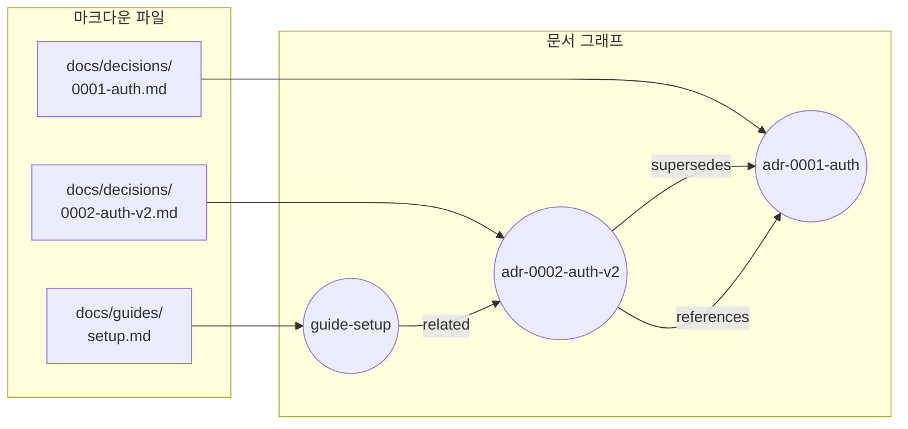
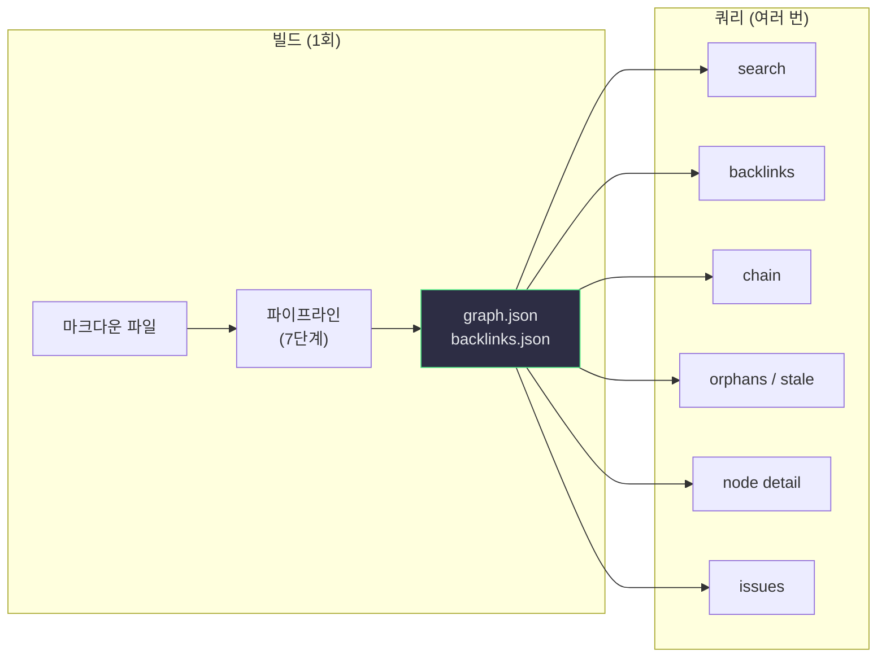
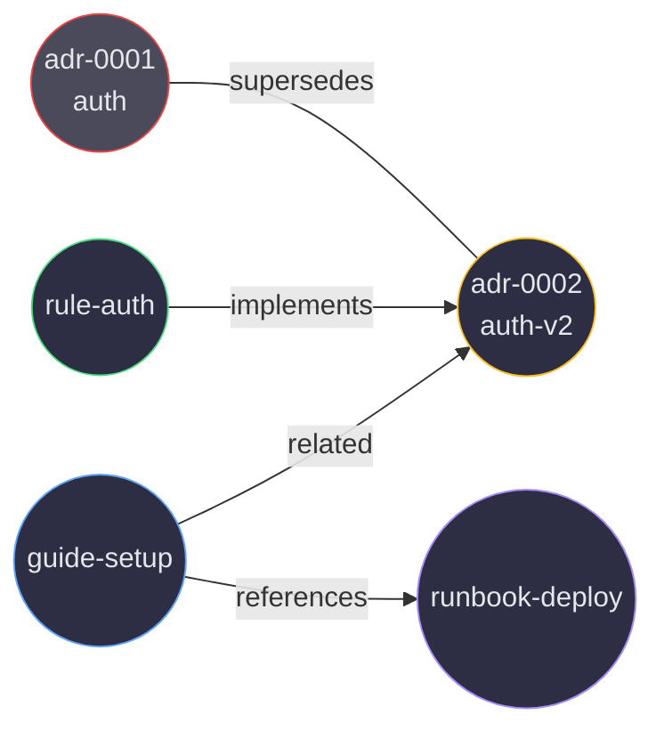
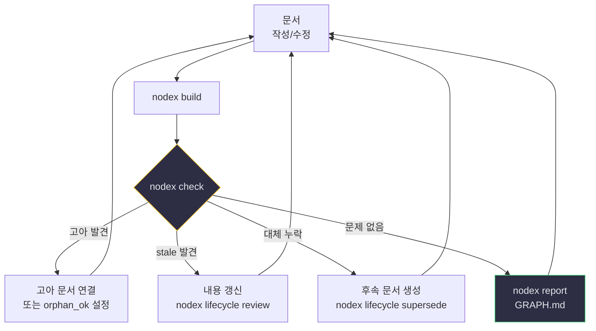

[](https://www.rust-lang.org)
[](https://doc.rust-lang.org/edition-guide/rust-2024/)
[](LICENSE)

# nodex

> **[English](README.md)** | **한국어**

**마크다운 파일을 쿼리 가능한 문서 그래프로 변환합니다.**

nodex는 프로젝트의 마크다운 파일을 스캔하여 YAML frontmatter와 링크 관계를 추출하고, 검색·검증·보고가 가능한 불변 문서 그래프를 구축합니다. AI 에이전트 통합을 위한 JSON 기반 CLI를 제공합니다.

---

## 목차

1. [해결하려는 문제](#해결하려는-문제)
2. [빠른 시작](#빠른-시작)
3. [핵심 개념](#핵심-개념) — 파일에서 그래프로, 엣지 유형, frontmatter 스키마
4. [동작 원리](#동작-원리) — 빌드 파이프라인, 증분 캐시, 쿼리 알고리즘
5. [JSON 우선 CLI](#json-우선-cli) — envelope, 에러 코드, 종료 코드, 명령어 레퍼런스, 출력 예시
6. [검증과 라이프사이클](#검증과-라이프사이클) — 내장 규칙, lifecycle 액션, 헬스 루프
7. [설정](#설정) — `nodex.toml` 모든 섹션 설명
8. [아키텍처와 설계 원칙](#아키텍처와-설계-원칙) — 워크스페이스, 모듈, 불변식
9. [설치](#설치)
10. [라이선스](#라이선스)

---

## 해결하려는 문제

프로젝트의 문서는 결코 평면적인 파일 더미가 아닙니다 — 그것은 그래프입니다. ADR-0002가 ADR-0001을 대체합니다. 런북이 가이드에 의존합니다. 스펙이 세 개의 규칙으로 구현됩니다. 그러나 그 그래프는 `[링크 텍스트](경로.md)` 와 frontmatter 필드 안에 암묵적으로만 존재하며, `grep` 과 `find` 에는 보이지 않습니다.

이로 인해 일상적인 질문에 답하기가 어렵습니다:

| 질문 | `grep` 이 하는 일 | 실제로 필요한 것 |
|---|---|---|
| "이 ADR을 무엇이 대체했나?" | 아무것도 — 대체 관계는 텍스트가 아님 | `superseded_by` 를 따라 전진 탐색 |
| "이 문서에 의존하는 것은?" | 이름을 언급한 파일은 찾지만 `related:` frontmatter는 놓침 | 출처 무관, 모든 수신 엣지 |
| "고립된 문서는?" | 아무것도 — 부재는 검색 불가 | 수신 엣지가 0인 노드 |
| "오래된 문서는?" | 아무것도 — 날짜는 비교 안됨 | 리뷰 기한을 넘긴 활성 문서 |
| "auth 문서 찾기" | "auth"를 포함한 모든 파일 | id/title/tag 점수화 + 관계 컨텍스트 |

nodex는 암묵적 그래프를 명시적으로 만듭니다. 마크다운을 한 번 파싱하여 인접 인덱스를 갖춘 타입 안전 인메모리 그래프를 구축하고, 구조적 질문에 밀리초 이내로 답합니다 — 단순한 키워드 매칭이 아니라, AI 에이전트나 자동화가 문서 집합을 실제로 *이해*하기 위해 필요로 하는 종류의 쿼리입니다.

**핵심 속성:**

- **폴더가 아닌 그래프** — 대체 체인, 백링크, 상호 참조가 1급 시민
- **코드가 아닌 설정** — 모든 프로젝트별 규칙은 `nodex.toml` 에, 하드코딩된 도메인 로직 없음
- **증분 + 병렬** — Rust + rayon 병렬 읽기, 파일별 SHA256 캐시로 변경된 부분만 무효화
- **AI 에이전트 네이티브** — 모든 명령이 안정적 JSON envelope (`{ok, data, warnings}` / `{ok, error: {code, message}}`) 와 분류된 에러 코드를 출력

---

## 빠른 시작

```bash
# 설치 (macOS / Linux)
curl -fsSL https://raw.githubusercontent.com/junyeong-ai/nodex/main/scripts/install.sh | bash

# 프로젝트에 설정 초기화
nodex init

# 문서 그래프 빌드
nodex build

# 문서 검색
nodex query search "auth"

# 관계 탐색
nodex query backlinks <node-id>
nodex query chain <node-id>
```

모든 명령은 JSON 을 출력합니다. `--pretty` 로 사람이 읽기 쉬운 형식으로 변환됩니다. 전체 출력 예시는 [JSON 우선 CLI](#json-우선-cli) 섹션을 참고하세요.

---

## 핵심 개념

### 파일에서 그래프로

nodex는 평면적인 마크다운 파일 모음을 탐색 가능한 지식 그래프로 변환합니다. 각 문서는 **노드**가 되고, 문서 간 모든 링크는 방향성 있는 **엣지**가 됩니다.



### 엣지 유형

엣지는 두 가지 소스에서 추출됩니다: YAML frontmatter 필드, 그리고 마크다운 본문 자체.

| 소스 | 기본 relation | 예시 |
|---|---|---|
| Frontmatter `supersedes` | `supersedes` | ADR 2가 ADR 1을 대체 |
| Frontmatter `implements` | `implements` | Rule 이 ADR 을 구현 |
| Frontmatter `related` | `related` | Guide 가 ADR 과 관련 |
| 마크다운 본문 링크 `[텍스트](경로.md)` | `references` | 본문에서 다른 문서로 링크 |
| 커스텀 패턴 (설정 가능) | **임의의 문자열** | 예: `@경로.md` → `imports` |

위 다섯 개 frontmatter / 본문 relation 은 내장입니다. 그 외에도 `nodex.toml` 의 `[[parser.link_patterns]]` 가 **임의의 relation 이름**을 정의할 수 있게 해줍니다 — 정규식(본문 일부에 매칭)과 relation 문자열을 짝지으면, 모든 매치가 그 relation 의 엣지가 됩니다. `imports`, `cites`, `mentions`, `todo_reference` 등을 엣지 유형으로 쓰고 싶은 프로젝트는 코드를 건드리지 않고 추가할 수 있습니다.

마크다운 링크는 [pulldown-cmark](https://github.com/pulldown-cmark/pulldown-cmark) — regex 가 아닌 AST 기반 파서 — 로 추출되므로, fenced code block 안의 링크는 정확히 무시됩니다.

### Frontmatter 스키마

모든 노드는 아래의 인식되는 필드들로 구성됩니다. 여기에 없는 항목은 `attrs` (자유 형식 `BTreeMap`) 로 들어가며 round-trip 으로 보존되므로, 프로젝트별 필드는 그대로 살아남습니다.

| 필드 | 타입 | 필수 | 의미 |
|---|---|---|---|
| `id` | string | 예 (또는 경로에서 자동 추론) | 고유 노드 식별자 |
| `title` | string | 예 | 사람이 읽는 이름 |
| `kind` | string | 예 (또는 자동 추론) | 문서 유형 — `[kinds].allowed` 안에 있어야 함 |
| `status` | string | 예 | 라이프사이클 상태 — `[statuses].allowed` 안에 있어야 함 |
| `created` | date (ISO) | 선택 | 생성일 |
| `updated` | date (ISO) | 선택 | 마지막 편집일 |
| `reviewed` | date (ISO) | 선택 | 마지막 리뷰일 — stale 감지의 기준 |
| `owner` | string | 선택 | 소유자 식별자 |
| `supersedes` | string \| array | 선택 | 대체된 문서 ID |
| `superseded_by` | string | 선택 | 대체 문서 ID |
| `implements` | string \| array | 선택 | 구현하는 스펙 ID |
| `related` | string \| array | 선택 | 관련 문서 ID |
| `tags` | array | 선택 | 임의의 태그 |
| `orphan_ok` | bool | 선택 (기본 `false`) | 고아 경고 억제 |
| (그 외 모두) | any | 선택 | `attrs` 에 저장, 프로젝트별 |

`supersedes`, `implements`, `related`, `tags` 는 단일 문자열과 배열 형식 모두를 받습니다 — 둘 다 같은 형태로 파싱됩니다.

---

## 동작 원리

### 빌드 파이프라인

빌드는 일련의 순수한 단계로 이루어집니다 — 입력이 들어가면 출력이 나옵니다. 유일하게 공유되는 상태는 SHA256 캐시뿐입니다.


| 단계 | 하는 일 | 모듈 |
|---|---|---|
| **스캔** | `[scope].include` / `exclude` glob 으로 파일시스템 탐색. `conditional_exclude` 로 terminal 상태 부모의 자식 파일 (예: 아카이브된 스펙의 하위 파일) 을 건너뜀. | `builder/scanner.rs` |
| **캐시** | `_index/cache.json` 로드. config 직렬화 SHA256 또는 `nodex` 바이너리 버전이 바뀌면 캐시 전체 무효화 (바이너리 업그레이드 시 절대 stale 캐시를 재사용하지 않음). | `builder/cache.rs` |
| **읽기** | `rayon::par_iter` 로 파일 내용을 병렬로 읽음. IO 에러는 fatal 이 아니라 warning 으로 처리 — 읽을 수 없는 파일 한 개가 빌드를 죽이지 않음. | `builder/mod.rs` |
| **파싱** | 파일별 SHA256 해시 체크. Hit 시 캐시된 `Node` + `RawEdge` 집합 재생. Miss 시 YAML frontmatter 파싱 (`yaml_serde`), pulldown-cmark AST 로 마크다운 링크 추출, 설정된 커스텀 패턴 regex 실행 — 파싱도 `rayon::par_iter` 로 병렬. | `parser/` |
| **ID 중복 검사** | 두 문서가 같은 노드 id 로 해석되면 `Error::DuplicateId { id, first, second }` 로 빌드 거부. 에러 코드 `DUPLICATE_ID` 로 표면화. | `builder/mod.rs` |
| **해석** | 각 `RawEdge.target_path` 를 노드 ID 로 변환. 엄격한 매칭만 — bare filename fallback 없음, 대소문자 무시 없음. 매칭 실패 시 `ResolvedTarget::Unresolved { raw, reason }` 로 보존 (조용히 버리지 않고 warning 으로 표면화). 그 후 모든 `superseded_by: Y` 스칼라를 정규 `Y → M` `supersedes` 엣지로 미러링하여 두 작성 스타일이 같은 그래프를 만들도록 보장하고, `(source, target, relation)` 으로 dedup 하여 양쪽 모두 선언된 문서가 단일 엣지만 만들도록 함. | `builder/resolver.rs` |
| **검증** | `supersedes` 엣지에 대한 반복적 3-color DFS 로 사이클 감지. 발견 시 `Error::SupersedesCycle { chain }` 을 반환하며 위반된 노드 ID 들을 순서대로 포함. | `builder/validator.rs` |
| **그래프** | 결정론적 출력을 위해 엣지와 노드를 정렬한 후 불변 `Graph` 구축: 노드는 `IndexMap` (삽입 순서, 직렬화 가능), 엣지는 `Vec`, 그리고 사전 구축된 `incoming` / `outgoing` 인접 인덱스 (`BTreeMap<String, Vec<usize>>`). | `model/graph.rs` |

그래프 구축 후 `_index/graph.json` 과 `_index/backlinks.json` 이 작성됩니다.

### 한 번 색인, 영원히 쿼리

기존 방식은 검색마다 모든 파일을 다시 읽습니다. nodex는 **색인** (1회) 과 **쿼리** (N회) 를 분리합니다:



- **빌드 산출물**: `graph.json` (쿼리용 전체 그래프), `backlinks.json` (nodex 를 로드하지 않고 백링크 맵만 원하는 도구를 위한 사전 계산된 역인덱스)
- **쿼리** 는 `graph.json` 만 읽음 — 원본 마크다운 파일은 다시 만지지 않으며, 응답은 밀리초 이내
- **증분**: 파일별 SHA256 으로 변경된 파일만 다음 빌드에서 재파싱. 강제로 신선한 빌드 (예: 커스텀 규칙 업그레이드 후) 가 필요하면 `--full` 추가

### 쿼리 알고리즘

그래프는 두 개의 인접 인덱스를 메모리에 유지합니다. 모든 쿼리는 O(degree) 또는 O(n) — 쿼리 의미상 필요하지 않은 한 절대 전체 그래프를 스캔하지 않습니다.

| 쿼리 | 결과 | 알고리즘 | 복잡도 |
|---|---|---|---|
| `search <kw>` | id/title/tag 매치, 점수 포함 | 부분 문자열 매치, 점수화 (id 정확 +3.0, title 정확 +2.5, id 부분 +1.5, title 부분 +1.0, tag +0.5) | O(n·m) |
| `backlinks <id>` | 대상으로 링크하는 노드 | `incoming_indices(id)` 조회, 엣지 역참조 | O(degree_in) |
| `chain <id>` | 대체 체인 (오래된 → 최신) | `superseded_by` 포인터 전진 추적 | O(chain_length) |
| `node <id>` | 전체 노드 + 수신/송신 엣지 | `IndexMap` 조회 + 두 인접 인덱스 | O(degree) |
| `tags <t...>` | 태그 매치 노드 | 선형 필터 (any-of 또는 `--all` 로 all-of) | O(n·t) |
| `orphans` | 수신 엣지 0인 노드 | 선형 스캔, 인접 비어있음 필터, `orphan_grace_days` 적용 | O(n) |
| `stale` | `stale_days` 내 미리뷰 활성 문서 | 선형 스캔, status (non-terminal) + `reviewed` 날짜 필터 | O(n) |
| `issues` | orphans + stale + unresolved + 규칙 위반 통합 | 위 항목 합성 + 모든 `Rule` impl 실행 | O(n + e) |

**인접에 대한 주의**: 해석된 엣지만 인덱싱됩니다. `Unresolved { raw, reason }` 엣지는 그래프에 여전히 존재하지만 (`query issues` 로 나열 가능) `incoming_indices` 에는 나타나지 않습니다 — 백링크 쿼리가 해석 실패한 대상의 노드를 절대 반환하지 않습니다.

### 멀티홉 탐색



`adr-0001` 에서 시작하여, AI 에이전트는 세 번의 호출로 관련 클러스터 전체를 발견할 수 있습니다:

```bash
# 홉 1: adr-0001 은 어디로 갔나?
nodex query chain adr-0001
# → adr-0001 → adr-0002-auth-v2

# 홉 2: 대체 문서에 의존하는 것은?
nodex query backlinks adr-0002-auth-v2
# → rule-auth, guide-setup

# 홉 3: guide-setup 은 또 어디를 가리키나?
nodex query node guide-setup
# → outgoing: references runbook-deploy
```

각 홉은 O(degree) — 전체 그래프 스캔도, 파일 재읽기도 없습니다.

---

## JSON 우선 CLI

모든 명령은 stdout 으로 JSON 을 출력합니다. 사람이 읽는 텍스트는 `--help` / `--version` 에만 나타납니다 (CLI 관례). 이것이 AI 에이전트 계약입니다 — 프로그램이 envelope, 에러 코드, data 형태를 산문 스크래핑 없이 파싱합니다.

### Envelope 스키마

**성공:**
```json
{
  "ok": true,
  "data": { /* 명령별 형태 */ },
  "warnings": ["..."]
}
```
- `warnings` 는 비어있을 때 생략 (`skip_serializing_if`).
- 모든 `query` 명령은 `data: { items: [...], total: N }` 을 반환하므로, 소비자가 다시 세지 않고 페이지네이션·카운트가 가능.

**에러:**
```json
{
  "ok": false,
  "error": { "code": "ERROR_CODE", "message": "..." }
}
```

### 에러 코드

에러 코드는 타입화된 `nodex_core::error::Error` enum 에서 `downcast_ref` 로 도출됩니다 — 메시지 문자열 매칭은 **절대로** 사용하지 않으므로, 메시지가 표면적으로 바뀌어도 안정적으로 유지됩니다.

| 코드 | 원인 |
|---|---|
| `CYCLE_DETECTED` | `supersedes` 엣지에 사이클 존재 (메시지에 chain 포함) |
| `DUPLICATE_ID` | 두 문서가 같은 노드 ID 로 해석됨 |
| `PARSE_ERROR` | 잘못된 YAML frontmatter, 또는 손상된 `graph.json` |
| `INVALID_TRANSITION` | 허용되지 않는 상태에서 `lifecycle` 액션 시도 (예: terminal → terminal) |
| `NOT_FOUND` | 참조된 노드 ID 가 그래프에 없음 |
| `ALREADY_EXISTS` | `scaffold` / `rename` 대상 경로에 이미 실제 파일이 존재 |
| `PATH_ESCAPES_ROOT` | 경로 traversal (`..`) 또는 symlink 가 프로젝트 루트를 벗어남 |
| `CONFIG_ERROR` | `nodex.toml` 이 로드 시점 검증 실패 (예: terminal 상태가 `allowed` 에 없음) |
| `IO_ERROR` | 파일시스템 읽기/쓰기 실패 |
| `INVALID_ARGUMENT` | clap 파싱 실패 — 알 수 없는 플래그, 잘못된 값, 누락된 필수 인자 |
| `INTERNAL_ERROR` | 분류되지 않은 모든 것 (버그 — 신고 부탁드립니다) |

### 종료 코드

| 코드 | 의미 |
|---|---|
| `0` | 성공 — 명령 완료, 검증 에러 없음 |
| `1` | `nodex check` 가 `severity = error` 위반 발견 |
| `2` | 런타임 실패 — 에러 envelope 을 생성한 모든 경우 |

종료 코드 `1` 은 `check` 가 에러를 발견한 경우 전용입니다. 그 외 모든 실패 (parse, IO, cycle, not-found, …) 는 종료 코드 `2` 이므로, CI 가 "검증 실패" 와 "도구 깨짐" 을 다르게 처리할 수 있습니다.

### 출력 예시

<details>
<summary><strong>Build</strong> — <code>nodex build --pretty</code></summary>

```json
{
  "ok": true,
  "data": {
    "nodes": 3,
    "edges": 5,
    "cached": 0,
    "parsed": 3,
    "duration_ms": 2
  }
}
```

`cached` vs `parsed` 가 증분 캐시의 효과를 보여줌 — no-op 재빌드에서는 `parsed` 가 0 이고 `cached` 가 `nodes` 와 같음.
</details>

<details>
<summary><strong>Backlinks</strong> — <code>nodex query backlinks adr-0002-auth-v2 --pretty</code></summary>

```json
{
  "ok": true,
  "data": {
    "items": [
      {
        "id": "guide-setup",
        "title": "Setup guide",
        "relation": "references",
        "location": "L2"
      },
      {
        "id": "guide-setup",
        "title": "Setup guide",
        "relation": "related",
        "location": "frontmatter:related"
      }
    ],
    "total": 2
  }
}
```

`location` 은 본문 링크 백링크 (`L2` = 소스 파일의 2번째 줄) 와 frontmatter 백링크 (`frontmatter:related`) 를 구분.
</details>

<details>
<summary><strong>Node 상세</strong> — <code>nodex query node guide-setup --pretty</code></summary>

```json
{
  "ok": true,
  "data": {
    "node": {
      "id": "guide-setup",
      "path": "docs/guides/setup.md",
      "title": "Setup guide",
      "kind": "guide",
      "status": "active",
      "created": "2025-03-05",
      "reviewed": "2025-03-05",
      "related": ["adr-0002-auth-v2"],
      "tags": ["setup", "onboarding"],
      "orphan_ok": false
    },
    "incoming": [
      { "node_id": "adr-0002-auth-v2", "relation": "references", "confidence": "extracted" },
      { "node_id": "adr-0002-auth-v2", "relation": "related", "confidence": "extracted" }
    ],
    "outgoing": [
      { "node_id": "adr-0002-auth-v2", "relation": "references", "confidence": "extracted" },
      { "node_id": "adr-0002-auth-v2", "relation": "related", "confidence": "extracted" }
    ]
  }
}
```
</details>

<details>
<summary><strong>Issues</strong> — <code>nodex query issues --pretty</code></summary>

```json
{
  "ok": true,
  "data": {
    "orphans": [],
    "stale": [
      {
        "id": "adr-0002-auth-v2",
        "title": "Auth v2 with JWT",
        "path": "docs/decisions/0002-auth-v2.md",
        "reviewed": "2025-03-01",
        "days_since": 416
      }
    ],
    "unresolved_edges": [],
    "violations": [
      {
        "rule_id": "stale_review",
        "severity": "warning",
        "node_id": "adr-0002-auth-v2",
        "path": "docs/decisions/0002-auth-v2.md",
        "message": "not reviewed for 416 days (threshold: 180 days)"
      }
    ],
    "summary": {
      "total": 2,
      "by_category": { "stale": 1, "violation_stale_review": 1 }
    }
  }
}
```

`issues` 는 "무엇을 고쳐야 하지?" 를 한 번에 보여주는 뷰 — orphans, stale, unresolved 엣지, 규칙 위반을 단일 envelope 으로 합성.
</details>

<details>
<summary><strong>에러</strong> — <code>nodex query node nonexistent-id</code></summary>

```json
{"ok":false,"error":{"code":"NOT_FOUND","message":"node not found: nonexistent-id"}}
```

종료 코드: `2`. `code` 필드가 안정적 계약이며, `message` 는 사람을 위한 것으로 변경될 수 있음.
</details>

### 명령어 레퍼런스

**전역 플래그** (모든 서브명령에 적용):

| 플래그 | 효과 |
|---|---|
| `-C DIR` | `DIR` 에서 시작한 것처럼 실행 (`git -C` 와 동일) |
| `--pretty` | JSON 출력을 pretty-print |

**서브명령:**

| 명령어 | 설명 |
|---|---|
| `nodex init` | 주석이 포함된 기본 `nodex.toml` 생성 |
| `nodex build [--full]` | 그래프 빌드; `--full` 은 캐시 무시 |
| `nodex query search <키워드> [--status x,y]` | id, title, tags 키워드 검색 |
| `nodex query backlinks <id>` | 대상으로 링크하는 모든 노드 |
| `nodex query chain <id>` | 대체 체인 추적 (오래된 → 최신) |
| `nodex query orphans` | 수신 엣지 0인 노드 (`orphan_grace_days` 적용 후) |
| `nodex query stale` | `stale_days` 리뷰 기한을 넘긴 활성 문서 |
| `nodex query tags <태그...> [--all]` | 태그 기반 검색; `--all` 은 모든 태그 일치 요구 |
| `nodex query node <id>` | 수신 + 송신 엣지 포함 전체 노드 상세 |
| `nodex query issues` | orphans + stale + unresolved + 규칙 위반 통합 |
| `nodex check [--severity error\|warning]` | 모든 검증 규칙 실행; 에러 시 종료 코드 1 |
| `nodex lifecycle <액션> <id> [--to id]` | 상태 전이: `supersede --to <new>`, `archive`, `deprecate`, `abandon`, `review` |
| `nodex report [--format md\|json\|all]` | `GRAPH.md` + `graph.json` + `backlinks.json` 생성 (기본: `all`) |
| `nodex migrate [--apply]` | 레거시 문서에 frontmatter 주입 (기본 dry-run) |
| `nodex rename <이전> <새로운>` | 파일 이동 + 본문 링크의 모든 참조 갱신 |
| `nodex scaffold --kind X --title "..." [--id ...] [--path ...] [--dry-run] [--force]` | 유효한 frontmatter 를 갖춘 새 문서 생성 |

---

## 검증과 라이프사이클

### 내장 규칙

`nodex check` 는 등록된 모든 규칙을 그래프에 대해 실행하고 평면적인 `Violation` 레코드 목록을 출력합니다. 각 위반은 `rule_id`, `severity`, 선택적 `node_id` / `path`, 사람이 읽는 message 를 포함합니다.

| `rule_id` | Severity | 검증 내용 |
|---|---|---|
| `required_field` | error | 모든 필수 필드 (`[schema].required` + 종류별 override) 가 존재 |
| `field_type` | error | `attrs` 값들이 선언된 `types` (string / integer / bool / date) 과 일치 |
| `field_enum` | error | `attrs` + `kind` + `status` 가 선언된 `enums` 허용 목록 안에 있음 |
| `cross_field` | error | `when status=superseded require superseded_by` 같은 조건부 요구사항 |
| `filename_pattern` | error | 파일명이 `[[rules.naming]].pattern` 정규식과 일치 |
| `sequential_numbering` | warning | 선두 숫자 시퀀스에 빈틈 없음 (예: `0001`, `0002` 후 `0004` 면 `0003` 누락 표시) |
| `unique_numbering` | warning | 두 파일이 같은 선두 숫자 prefix 를 공유하지 않음 |
| `stale_review` | warning | 활성 (non-terminal) 노드가 `[detection].stale_days` 내 리뷰되지 않음 |

`--severity error` 는 에러만 필터링. 플래그 없이는 에러와 warning 모두 반환. 커스텀 규칙 추가는 `nodex-core/src/rules/` 에 `Rule` trait 을 구현하고 `check_all()` 에 등록 — [`nodex-core/CLAUDE.md`](nodex-core/CLAUDE.md#adding-a-validation-rule) 참고.

### Lifecycle 액션

`nodex lifecycle <액션> <node-id>` 가 문서의 status 를 안전하게 변경하는 유일한 방법입니다 — 이는 `lifecycle::transition()` 을 통과하는데, 소스 status 를 검증하고, YAML frontmatter 를 in-place 로 수정하며, symlink 를 통한 쓰기를 거부합니다.

| 액션 | 결과 `status` | 추가로 쓰이는 필드 |
|---|---|---|
| `supersede --to <new-id>` | `superseded` | `superseded_by: <new-id>` |
| `archive` | `archived` | (없음) |
| `deprecate` | `deprecated` | (없음) |
| `abandon` | `abandoned` | (없음) |
| `review` | (변경 없음) | `reviewed: <오늘>` |

네 개의 타깃 status (`superseded`, `archived`, `deprecated`, `abandoned`) 는 **terminal** 입니다 — 문서가 terminal status 에 들어가면 어떤 `lifecycle` 액션도 더 이상 움직이지 않습니다. `review` 만이 status 를 바꾸지 않는 액션이며, `reviewed` 날짜를 갱신하여 문서를 `stale` 목록에서 제거합니다.

### 문서 헬스 루프

이 명령들이 합쳐져 지속적인 개선 사이클을 이룹니다:



| 신호 | 의미 | 조치 |
|---|---|---|
| 고아 감지 | 수신 링크가 없는 문서 — 고립된 지식 | `related:` 링크 추가 또는 `orphan_ok: true` 설정 |
| Stale 감지 | N일 동안 리뷰되지 않은 활성 문서 | 정확성 확인 후 `lifecycle review` |
| 체인 단절 | 대체된 문서에 후속 문서 누락 | 후속 문서 생성 후 `lifecycle supersede --to <new>` |
| 검증 오류 | 필수 frontmatter 필드 누락 | `migrate --apply` 로 추가 또는 직접 편집 |

이는 ADR 에만 국한되지 않습니다. **스펙, 가이드, 런북, 규칙, 스킬** — frontmatter 가 있는 모든 문서가 그래프에 참여합니다.

---

## 설정

모든 동작은 `nodex.toml` 로 제어됩니다. `Config::load` 가 시작 시점에 `validate()` 를 실행하여 일관성 없는 config (예: `lifecycle` 이 같은 config 가 거부할 status 를 쓰는 경우) 를 거부하므로, 잘못된 설정은 잘못된 빌드를 만드는 대신 즉시 실패합니다.

```toml
[scope]
include = ["docs/**/*.md", "specs/**/*.md", "README.md"]
exclude = ["docs/_index/**"]
# Terminal 상태 부모의 자식 파일 건너뛰기:
# [[scope.conditional_exclude]]
# parent_glob = "specs/**/*.md"
# condition = "status_terminal"   # 기본값

# 프로젝트가 사용하는 kind. "generic", "guide", "readme" 는 내장
# 기본값이고 "adr" 은 이 프로젝트가 추가한 값입니다. 아래 identity /
# schema 규칙에서 참조하는 모든 kind 는 여기에 등록되어 있어야 합니다.
[kinds]
allowed = ["generic", "guide", "readme", "adr"]

# 상태 어휘. 값을 추가할 수 있지만 (예: "draft") lifecycle 타깃 넷
# (superseded, archived, deprecated, abandoned) 은 반드시 유지해야
# `nodex lifecycle` 이 쓴 상태값이 나머지 설정 검증을 통과합니다.
[statuses]
allowed = ["draft", "active", "superseded", "archived", "deprecated", "abandoned"]
terminal = ["superseded", "archived", "deprecated", "abandoned"]

# Kind 추론 — 첫 번째 매칭 우선
[[identity.kind_rules]]
glob = "docs/decisions/**"
kind = "adr"

# ID 템플릿 변수: {stem}, {parent}, {kind}, {path_slug}
[[identity.id_rules]]
kind = "adr"
template = "adr-{stem}"

# 커스텀 링크 패턴 — relation 은 임의의 문자열 가능
[[parser.link_patterns]]
pattern = "@([A-Za-z0-9_./-]+\\.md)"
relation = "imports"

# 검증 규칙
[[rules.naming]]
glob = "docs/decisions/**"
pattern = "^\\d{4}-[a-z0-9-]+\\.md$"
sequential = true
unique = true

# 스키마 검증. 최상위 항목은 모든 문서에 적용되고 `overrides` 는
# 특정 종류에 merge 됩니다. override 의 enum 값은 반드시 전역
# `statuses.allowed` / `kinds.allowed` 의 부분집합이어야 하며,
# `enums.status` 를 선언하는 경우 lifecycle 타깃 넷
# (`superseded`, `archived`, `deprecated`, `abandoned`) 을 모두
# 포함해야 — 그래야 `nodex lifecycle <action>` 이 쓴 값이 자기
# 설정을 위반하지 않습니다. `Config::load` 가 시작 시점에 거부합니다.
[schema]
required = ["id", "title", "kind", "status"]
cross_field = [
  { when = "status=superseded", require = "superseded_by" },
]

[[schema.overrides]]
kinds = ["adr"]
required = ["id", "title", "kind", "status", "decision_date"]
types = { decision_date = "date" }
enums = { priority = ["low", "medium", "high"] }

[detection]
stale_days = 180
orphan_grace_days = 14
# 본질적으로 leaf 인 종류 (수신 엣지가 없는 게 정상) — skill,
# readme, runbook 등. 나열된 종류는 orphan 감지에서 통째로 제외되며,
# 추적 대상 종류 안의 개별 예외는 노드 단위 `orphan_ok: true` 로
# 그대로 처리한다. 모든 항목은 `kinds.allowed` 에도 있어야 하며,
# 오타는 `Config::load` 시점에 거부된다.
# orphan_ok_kinds = ["readme"]

[output]
dir = "_index"   # 기본값

[report]
title = "Document Graph"
god_node_display_limit = 10
orphan_display_limit = 20
stale_display_limit = 20
```

<details>
<summary><strong>섹션 레퍼런스</strong> — 각 섹션이 제어하는 것</summary>

| 섹션 | 제어 대상 |
|---|---|
| `[scope]` | 어떤 파일이 스캔되는지; `conditional_exclude` 는 terminal 상태 부모의 자식을 건너뜀 |
| `[kinds]` | 허용되는 `kind` 값들 (`"generic"` 포함 필수 — fallback) |
| `[statuses]` | 허용되는 `status` 값들 + 어떤 것이 terminal (이후 lifecycle 이동 차단) |
| `[identity]` | `kind_rules` (glob → kind) 와 `id_rules` (`{stem}`, `{parent}`, `{kind}`, `{path_slug}` 변수 템플릿) |
| `[parser]` | 커스텀 `link_patterns` (정규식 + relation 이름) |
| `[rules]` | `naming` 패턴 + 선택적 `sequential` / `unique` 번호 검사 |
| `[schema]` | 최상위 `required` / `types` / `enums` / `cross_field` + 종류별 `overrides` |
| `[detection]` | `stale_days` / `orphan_grace_days` 임계값; `orphan_ok_kinds` 로 leaf 종류를 orphan 감지에서 제외 |
| `[output]` | 빌드 산출물 위치 (기본 `_index`) |
| `[report]` | `GRAPH.md` 포맷팅 한도 |

</details>

---

## 아키텍처와 설계 원칙

### 워크스페이스 구조

```
nodex/
├── nodex-core/    라이브러리 — 모든 로직: parser, builder, query, rules, output, lifecycle, scaffold
└── nodex-cli/     바이너리  — clap CLI; JSON envelope + 에러 분류를 추가하는 얇은 래퍼
```

분리된 이유는 `nodex-core` 가 다른 Rust 도구 (빌드 스크립트, 커스텀 검증기, IDE 플러그인) 에 임베드될 수 있도록 — CLI 전용 의존성 스택을 끌어오지 않으면서. CLI 는 도메인 로직을 절대 포함하지 않습니다 — 플래그를 파싱하고, 단일 core 함수를 호출하고, 결과를 출력할 뿐입니다.

### nodex-core 모듈

<details>
<summary><strong>모듈 맵</strong> — 각 모듈이 소유하는 것</summary>

| 모듈 | 책임 | 주요 타입 / 함수 |
|---|---|---|
| `model/` | 데이터 타입 — 그래프의 어휘 | `Node`, `Edge`, `Graph`, `Kind`, `Status`, `Confidence`, `ResolvedTarget`, `RawEdge` |
| `parser/` | 마크다운 파일 → `(Node, Vec<RawEdge>)` 로 변환 | `parse_document()`, `frontmatter::split_frontmatter()`, `body::extract_links()`, `identity::infer_kind()` / `infer_id()` |
| `builder/` | 빌드 파이프라인 오케스트레이션 | `build()`, `scanner::scan_scope()`, `cache::BuildCache`, `resolver::resolve_edges()`, `validator::validate_supersedes_dag()` |
| `query/` | 읽기 전용 그래프 순회 | `search::search()` / `search_by_tags()`, `traverse::find_backlinks()` / `find_chain()` / `find_node_detail()`, `detect::find_orphans()` / `find_stale()`, `issues::collect_issues()` |
| `rules/` | `Rule` trait + 내장 구현체 | `Rule { id, severity, check }`, `RequiredFieldRule`, `FieldTypeRule`, `FieldEnumRule`, `CrossFieldRule`, `FilenamePatternRule`, `SequentialNumberingRule`, `UniqueNumberingRule`, `StaleReviewRule` |
| `output/` | 그래프를 디스크로 직렬화 | `json::write_json_outputs()` (`graph.json` + `backlinks.json`), `markdown::render_markdown()` (결정론적 `GRAPH.md`) |
| `lifecycle.rs` | 디스크의 frontmatter 를 변경하는 status 전이 | `transition()`, 정규 status 상수, `LIFECYCLE_TARGET_STATUSES` |
| `scaffold.rs` | 유효한 frontmatter 를 갖춘 새 문서 생성 | `scaffold()`, `render_default_frontmatter()` (`migrate` 도 사용) |
| `path_guard.rs` | 변경 안전성 — symlink + `..` 거부 | `reject_traversal()`, `is_symlink()` (모든 쓰기 명령이 사용) |
| `config.rs` | `nodex.toml` 역직렬화 + 로드 시점 검증 | `Config::load()`, `Config::validate()`, `Config::required_for(kind)` / `types_for(kind)` / `enums_for(kind)` / `cross_field_for(kind)` / `is_terminal(status)` / `initial_status_for(kind)` |
| `error.rs` | 어디에서나 사용되는 타입화된 에러 enum | `Error` (`downcast_ref` 로 안정적 에러 코드에 매핑), `Result<T>` |

</details>

### 설계 원칙

이 불변식들은 타입 시스템 또는 로드 시점 검증 수준에서 강제됩니다 — 단순한 스타일 가이드라인이 아닙니다.

1. **불변 그래프.** `Graph` 는 `Graph::new()` 로 한 번 구축되며 절대 변경되지 않습니다. 인접 인덱스는 파생 상태로, 생성자 안에서 계산되고 로드 시 `Deserialize` 가 재구축합니다. `add_node()` / `remove_edge()` API 는 존재하지 않습니다. 이는 쿼리 결과가 항상 일관됨을 의미합니다 — concurrent-modification 클래스의 버그가 없습니다.

2. **코드보다 설정.** 프로젝트별 모든 것은 `nodex.toml` 에 있습니다. Kind 이름, status 어휘, 엣지 relation 이름, ID 템플릿, naming 규칙, 스키마 제약, 커스텀 링크 패턴 — 모두 설정 가능. 코어에는 하드코딩된 도메인 지식이 0 입니다. 새 프로젝트에 nodex 를 추가하는 것은 fork 패치가 아니라 config 파일을 작성하는 일입니다.

3. **타입 안전 엣지 해석.** `ResolvedTarget` 은 enum 입니다: `Resolved { id }` 또는 `Unresolved { raw, reason }`. `"unresolved://path"` 같은 string-prefix 핵 없음. 해석되지 않은 엣지는 명시적이며, `query issues` 로 표면화되고, 인접 인덱스는 건너뜁니다 — 그래서 백링크 쿼리가 실수로 환영(phantom) 노드를 반환할 수 없습니다.

4. **SHA256 증분, 버전 무효화 포함.** 파일별 콘텐츠 해시로 변경된 파일만 재파싱. 캐시 키는 config 직렬화 해시 *그리고* `nodex` 바이너리 버전 둘 다를 섞으므로, 바이너리 업그레이드 또는 config 값 변경이 클린 재빌드를 트리거합니다. stale 캐시가 `--full` 과 다른 결과를 만드는 경로는 존재하지 않습니다.

5. **대칭적 변경 가드.** 디스크에 쓰는 모든 명령 (`scaffold`, `migrate`, `rename`, `lifecycle`) 은 `path_guard` 를 통해 `..` / 절대 경로를 거부하고 symlink 를 통한 쓰기를 거부합니다. 가드는 각 CLI 핸들러가 아닌 코어에 살아있어 — 미래의 어떤 명령도 실수로 건너뛸 수 없습니다. 빌드의 스캐너는 여전히 읽기 위해 symlink 를 *따라가므로*, 링크된 문서는 인덱싱됩니다.

이들을 묶는 메타 불변식: **nodex 가 직접 쓰는 모든 것은 nodex 자신의 `check` 를 통과해야 합니다.** `scaffold`, `migrate`, `lifecycle` 이 같은 config 가 거부할 문서를 만들 수 있다면 그것은 버그이며, `Config::validate` 가 해당 config 형태를 로드 시점에 거부하도록 확장됩니다. 현재의 self-consistency 불변식 목록은 [`.claude/rules/config-driven.md`](.claude/rules/config-driven.md) 참고.

---

## 설치

### 빠른 설치 (권장)

**macOS / Linux**
```bash
curl -fsSL https://raw.githubusercontent.com/junyeong-ai/nodex/main/scripts/install.sh | bash
```

**Windows (PowerShell)**
```powershell
iwr -useb https://raw.githubusercontent.com/junyeong-ai/nodex/main/scripts/install.ps1 | iex
```

설치 스크립트는 플랫폼을 자동 감지해 검증된 프리빌드 바이너리를 다운로드하고, `~/.local/bin` (Windows 는 `%USERPROFILE%\.local\bin`) 에 설치합니다. Claude Code 스킬 설치도 함께 진행합니다. 터미널에서 실행 시 대화형으로 동작하며, 자동화용으로 `--yes` 를 지원합니다.

### 지원 플랫폼

| OS | 아키텍처 | 타깃 |
|---|---|---|
| Linux | x86_64 | `x86_64-unknown-linux-musl` (정적) |
| Linux | arm64 | `aarch64-unknown-linux-musl` (정적) |
| macOS | Intel + Apple Silicon | `universal-apple-darwin` (universal2) |
| Windows | x86_64 | `x86_64-pc-windows-msvc` |

### 설치 플래그

```
--version VERSION        특정 버전 설치 (기본: 최신)
--install-dir PATH       설치 경로 (기본: ~/.local/bin)
--skill user|project|none  스킬 설치 범위 (기본: user)
--from-source            프리빌드 대신 소스에서 빌드
--force                  프롬프트 없이 덮어쓰기
--yes, -y                비대화 모드
--dry-run                계획만 출력, 실행 안 함
```

모든 플래그는 환경변수로도 설정 가능 (`NODEX_VERSION`, `NODEX_INSTALL_DIR`, `NODEX_SKILL_LEVEL`, `NODEX_FROM_SOURCE`, `NODEX_FORCE`, `NODEX_YES`, `NODEX_DRY_RUN`). `NO_COLOR=1` 로 ANSI 색상 출력을 끌 수 있습니다. 플래그가 환경변수보다, 환경변수가 기본값보다 우선합니다.

### 수동 설치 (체크섬 검증 포함)

**macOS / Linux**
```bash
VERSION=0.2.2
TARGET=x86_64-unknown-linux-musl   # 또는 aarch64-unknown-linux-musl, universal-apple-darwin
curl -fLO "https://github.com/junyeong-ai/nodex/releases/download/v$VERSION/nodex-v$VERSION-$TARGET.tar.gz"
curl -fLO "https://github.com/junyeong-ai/nodex/releases/download/v$VERSION/nodex-v$VERSION-$TARGET.tar.gz.sha256"
shasum -a 256 -c "nodex-v$VERSION-$TARGET.tar.gz.sha256"
tar -xzf "nodex-v$VERSION-$TARGET.tar.gz"
install -m 755 nodex "$HOME/.local/bin/nodex"
```

**Windows (PowerShell)**
```powershell
$Version = "0.2.2"
$Target  = "x86_64-pc-windows-msvc"
$Archive = "nodex-v$Version-$Target.zip"
Invoke-WebRequest -Uri "https://github.com/junyeong-ai/nodex/releases/download/v$Version/$Archive"         -OutFile $Archive
Invoke-WebRequest -Uri "https://github.com/junyeong-ai/nodex/releases/download/v$Version/$Archive.sha256" -OutFile "$Archive.sha256"
$expected = (Get-Content "$Archive.sha256" -Raw).Trim().Split()[0]
$actual   = (Get-FileHash $Archive -Algorithm SHA256).Hash.ToLower()
if ($expected -ne $actual) { throw "checksum mismatch" }
Expand-Archive -Path $Archive -DestinationPath "$env:USERPROFILE\.local\bin" -Force
```

### 소스에서 빌드

```bash
git clone https://github.com/junyeong-ai/nodex
cd nodex
./scripts/install.sh --from-source
# 또는: cargo install --path nodex-cli
```

### 제거

```bash
# macOS / Linux
curl -fsSL https://raw.githubusercontent.com/junyeong-ai/nodex/main/scripts/uninstall.sh | bash

# Windows
iwr -useb https://raw.githubusercontent.com/junyeong-ai/nodex/main/scripts/uninstall.ps1 | iex
```

---

## 라이선스

MIT

---

> **[English](README.md)** | **한국어**
