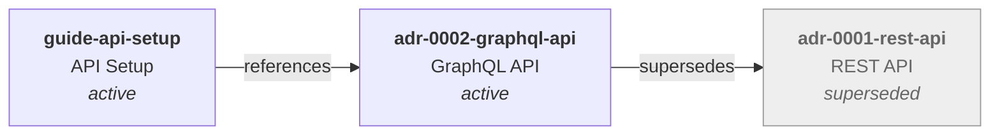
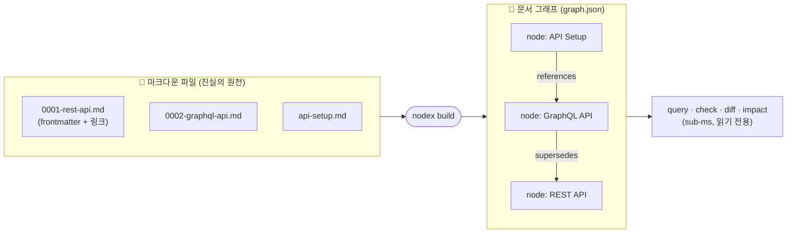
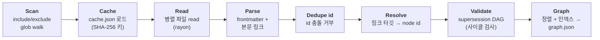

[](https://www.rust-lang.org)
[](https://doc.rust-lang.org/edition-guide/rust-2024/)
[](LICENSE)

# nodex

> **[English](README.md)** | **한국어**

**마크다운 파일을 조회·검증·diff 가능한 문서 그래프로.**

nodex 는 프로젝트의 markdown 파일들을 스캔해 YAML frontmatter 와 링크 관계를 추출하고, 불변 그래프를 빌드해서 JSON-first CLI 로 조회·검증·diff·report 합니다. 에이전트·서버·AI 의존성 없는 순수 Rust 바이너리, 안정된 JSON 컨트랙트.

---

## 목차

1. [문제 정의](#문제-정의)
2. [빠른 시작](#빠른-시작)
3. [핵심 개념](#핵심-개념)
4. [동작 원리](#동작-원리)
5. [JSON-First CLI](#json-first-cli)
6. [검증 & Lifecycle](#검증--lifecycle)
7. [Diff & Export](#diff--export)
8. [설정](#설정)
9. [아키텍처](#아키텍처)
10. [설치](#설치)
11. [라이선스](#라이선스)

---

## 문제 정의

프로젝트 문서는 평평한 파일 더미가 아니라 그래프입니다. ADR-0002 가 ADR-0001 을 대체하고, 런북이 가이드에 의존하고, 스펙이 세 개의 룰로 구현됩니다. 하지만 이 그래프는 `[text](paths.md)` 와 frontmatter 필드 안에 암묵적으로 존재해 `grep` 과 `find` 로는 보이지 않습니다.

| 질문 | `grep` 의 한계 | 실제로 필요한 것 |
|---|---|---|
| "이 ADR 을 무엇이 대체했나?" | 텍스트가 아님 — supersession 추적 불가 | 어느 멤버에서든 전체 supersession 계보; 현재 문서는 비종단(`active`) tip (fork 면 여럿일 수 있음) |
| "이 문서에 무엇이 의존하나?" | 이름 매칭만, `related:` frontmatter 누락 | 모든 incoming edge |
| "어떤 문서가 고립됐나?" | 부재는 검색 불가 | incoming edge 0 인 노드 |
| "어떤 문서가 stale 인가?" | 날짜 비교 불가 | active + 리뷰 임계 초과 |
| "이 ref 간 무엇이 바뀌었나?" | 라인 diff 수준 | 추가/제거 노드, status 전이, field 변경 |
| "auth 문서 찾기" | 'auth' 포함 전체 | id/title/tag 가중치, 관계 컨텍스트 포함 |

nodex 는 그 암묵적 그래프를 명시화합니다. 한 번 파싱해서 인접 인덱스를 갖춘 타입 안전 in-memory 그래프를 만들고, 구조적 질문에 sub-millisecond 로 답합니다. 일상 워크플로 — pre-commit 검증, PR diff gate, 작성 전 중복 탐지, 외부 도구 vocabulary sync — 가 단일 JSON-emitting 명령으로 압축됩니다.

**핵심 속성:**

- **그래프, 폴더가 아님** — supersession chain, backlink, cross-reference 가 일급 시민
- **Config, 코드 아님** — 모든 프로젝트별 룰은 `nodex.toml`; 도메인 로직 하드코딩 0
- **증분 + 병렬** — Rust + rayon 병렬 read, SHA256 per-file 캐시로 변경된 파일만 재파싱
- **JSON-first 컨트랙트** — 모든 operational 명령이 안정된 envelope (`{ok, data, warnings}` / `{ok, error: {code, message}}`) emit (clap 의 `--help` / `help` / `--version` surface 제외)
- **순수 CLI** — 데몬·서버·AI/네트워크 의존성 없음, 모든 것이 동기 로컬 프로세스

---

## 빠른 시작

```bash
# 설치 (macOS / Linux)
curl -fsSL https://raw.githubusercontent.com/junyeong-ai/nodex/main/scripts/install.sh | bash

# 프로젝트에 config 초기화
nodex init

# 그래프 빌드
nodex build

# 문서 검색
nodex query search "auth"

# 관계 탐색
nodex query backlinks <node-id>
nodex query chain <node-id>

# 스키마 검증
nodex check

# 두 git ref 간 diff
nodex diff origin/main HEAD
```

모든 operational 명령은 JSON 출력 (`--help` / `help` / `--version` 제외); `--pretty` 로 indented JSON.

---

## 5분 워크스루: 파일에서 답까지

마크다운 파일 세 개가 있다고 합시다 — 아키텍처 결정 두 개(하나는 다른 하나로 대체됨)와 현재 결정을 링크하는 가이드:

```text
docs/
├── decisions/
│   ├── 0001-rest-api.md      # 옛 결정, 지금은 대체됨(superseded)
│   └── 0002-graphql-api.md   # 그것을 대체한 결정
└── guides/
    └── api-setup.md          # 현재 결정을 링크
```

```markdown
---
title: REST API
status: superseded
superseded_by: adr-0002-graphql-api
created: 2025-01-10
---
# REST API
원래 API 설계.
```

…그리고 가이드는 본문 첫 줄에서 현재 결정으로 링크합니다(그래서 뒤의 백링크가
`L2` 로 잡힙니다 — 본문 1번째 줄은 `# API Setup` 제목):

```markdown
---
title: API Setup
status: active
created: 2025-02-01
---
# API Setup
[GraphQL API decision](../decisions/0002-graphql-api.md) 에서 시작하세요.
```

최소 `nodex.toml` 로 "어떻게 읽을지"를 알려줍니다(전체는 [Configuration](#configuration)):

```toml
[scope]
include = ["docs/**/*.md"]         # docs 트리만 스캔; 다른 곳의 임시 draft 는 scope 밖

[kinds]
allowed = ["generic", "adr", "guide"]

[statuses]
allowed = ["active", "superseded"]
terminal = ["superseded"]

[[identity.kind_rules]]            # docs/decisions/ 아래 파일은 ADR
glob = "docs/decisions/**"
kind = "adr"
[[identity.kind_rules]]            # docs/guides/ 아래 파일은 guide
glob = "docs/guides/**"
kind = "guide"
[[identity.id_rules]]              # ADR 의 id 는 "adr-<파일명>"
kind = "adr"
template = "adr-{stem}"

[schema]
required = ["created"]             # 모든 문서는 created 날짜 필수
cross_field = [{ when = "status=superseded", require = "superseded_by" }]
```

**1. 그래프 빌드** — 파일을 한 번 스캔해 불변 그래프로:

```jsonc
$ nodex build --pretty
{ "ok": true, "data": {
  "nodes": 3, "edges": 2, "annotations": 0, "body_line_matches": 0,
  "cached": 0, "parsed": 3, "duration_ms": 1
} }
```

대체(supersession)와 본문 링크가 일급 엣지인 그래프가 됩니다:


```mermaid
graph LR
  A1["<b>adr-0001-rest-api</b><br/>REST API<br/><i>superseded</i>"]
  A2["<b>adr-0002-graphql-api</b><br/>GraphQL API<br/><i>active</i>"]
  G["<b>guide-api-setup</b><br/>API Setup<br/><i>active</i>"]
  A2 -- supersedes --> A1
  G  -- references --> A2
  classDef term fill:#eee,stroke:#999,color:#666;
  class A1 term;
```

**2. "REST API 결정을 무엇이 대체했나?"** — `grep` 은 못 답하지만 그래프 walk 는 답합니다:

```jsonc
$ nodex query chain adr-0001-rest-api --pretty
{ "ok": true, "data": { "items": [
  { "id": "adr-0001-rest-api",    "title": "REST API",     "status": "superseded", ... },
  { "id": "adr-0002-graphql-api", "title": "GraphQL API",  "status": "active",     ... }
], "total": 2 } }   //  오래된 → 최신 — 이 선형 계보에선 현재 문서가 마지막 항목(유일한 `active` tip): GraphQL 이 REST 를 대체.
                    //  어떤 멤버로 앵커해도(현재 문서로도) 전체 계보를 얻음. (supersedes 는 DAG — fork/통합은 tip 이 여럿일 수 있고, 현재성은 위치가 아니라 `status` 로 판단.)
```

**3. "현재 결정을 무엇이 가리키나?"** — 출처와 무관하게 모든 incoming 엣지:

```jsonc
$ nodex query backlinks adr-0002-graphql-api --pretty
{ "ok": true, "data": { "items": [
  { "id": "guide-api-setup", "relation": "references", "location": "L2", ... }
], "total": 1 } }   //  가이드가 본문 2번째 줄에서 링크
```

**4. 전체 코퍼스 검증** — schema·cross-field·깨진 링크·supersession 사이클을 한 패스로:

```jsonc
$ nodex check --pretty
{ "ok": true, "data": {
  "violations": [], "skipped_rules": [],
  "rule_coverage": [ { "rule_id": "required_field", "unit": "nodes", "subjects": 41, "unjudged": 0 } ],
  "total": 0, "has_errors": false } }
//  exit 0 — 위반 없음. 그런데 빈 violations 는 철저한 통과와 공허한 통과가 똑같이 내는 모양이라,
//  rule_coverage 가 각 룰이 실제로 **지킨** 모집단(subjects)과 판정할 수 없었던 수(unjudged)를 함께 싣습니다.
//  subjects: 0 인 룰은 config 에 선언돼 있을 뿐 아무것도 다스리지 않는다는 뜻입니다.
```

**5. 쓰기 *전에* 편집을 게이트** — 에이전트가 새 ADR 을 제안하면서 `created` 를 빠뜨림. `check --content` 는 디스크를 건드리지 않고 제안 바이트를 검증해 머신 가독 형태로 답합니다:

```jsonc
$ nodex check --content docs/decisions/0003-grpc-api.md=draft.md --pretty
{ "ok": true, "data": {
  "violations": [ {
    "rule_id": "required_field", "severity": "error",
    "node_id": "adr-0003-grpc-api", "path": "docs/decisions/0003-grpc-api.md",
    "message": "missing required field: created",
    "details": { "type": "required_field", "field": "created" }   // ← 산문이 아니라 타입화
  } ],
  "skipped_rules": [],
  "rule_coverage": [ { "rule_id": "required_field", "unit": "nodes", "subjects": 42, "unjudged": 0 } ],
  "total": 1,
  "has_errors": true,
  "proposals": [ { "path": "docs/decisions/0003-grpc-api.md", "in_scope": true, "has_path_errors": true } ]
} }
```

에이전트는 `details.field == "created"` 를 읽고 날짜를 추가합니다 — **메시지 문자열 파싱 없음**. 이 타입화 `details` 는 모든 룰이 동일하게 싣고(`field_enum` 은 `allowed` 집합, `field_type` 은 기대 타입 등), 도구가 기계적으로 자동수정안을 낼 수 있습니다.

> 위의 모든 것은 명령당 하나의 동기 로컬 프로세스이며, `jq`·타입 클라이언트·LLM 에이전트로 파이프할 수 있는 안정적 JSON 모양입니다. 데몬·네트워크·예외 없음.

---

## 핵심 개념

### 파일이 그래프가 된다

각 문서는 **노드**, 각 링크는 directed **edge** 가 됩니다 — 그래서 파일 *사이*에 있는 질문(무엇이 이걸 대체했나? 무엇이 이걸 의존하나? 무엇이 고립됐나?)이 수동 교차참조 대신 단일 쿼리가 됩니다.


```mermaid
flowchart LR
  subgraph FS["📁 마크다운 파일 (진실의 원천)"]
    direction TB
    f1["0001-rest-api.md<br/>(frontmatter + 링크)"]
    f2["0002-graphql-api.md"]
    f3["api-setup.md"]
  end
  build(["nodex build"])
  subgraph GR["🔗 문서 그래프 (graph.json)"]
    direction TB
    n1["node: REST API"]
    n2["node: GraphQL API"]
    n3["node: API Setup"]
    n2 -->|supersedes| n1
    n3 -->|references| n2
  end
  FS --> build --> GR
  GR --> Q["query · check · diff · impact<br/>(sub-ms, 읽기 전용)"]
```

### Edge 종류

| Source | 기본 relation | 예 |
|---|---|---|
| Frontmatter `supersedes` | `supersedes` | ADR 2 가 ADR 1 을 supersede |
| Frontmatter `implements` | `implements` | 룰이 ADR 을 구현 |
| Frontmatter `related` | `related` | 가이드가 ADR 과 관련 |
| Frontmatter `covers` | `covers` | 문서가 `src/auth.rs` 를 커버 (그래프 밖 코드 경로) |
| 본문 링크 `[text](path.md)` | `references` | 본문에서 다른 문서 참조 |
| 커스텀 패턴 (config) | **새 relation 이름** | 예: `@path.md` → `imports` |

위 다섯 내장 relation — `supersedes`, `implements`, `related`, `covers`, `references` — 은 고정입니다. 그 외에 `[[parser.link_patterns]]` 로 새 relation 이름을 정의할 수 있습니다 — regex + relation 문자열 쌍. 단, 해석 방식이 코드에 고정된 내장 relation 은 사용할 수 없습니다: `covers`(path-only) 와 `supersedes` / `implements` / `related`(id-resolved) 는 각자의 frontmatter 필드로만 생성되며, 이를 지정한 link pattern 은 load 시 거부됩니다. `references` 는 패턴에 사용 가능 — 어차피 document reference 로 해석되기 때문입니다.

커스텀 패턴 캡처는 코드 블록과 인라인 코드 스팬을 동일하게 건너뛰고, 참조 리라이터(`rename` / `retarget`)도 같은 표면을 존중하므로 추출과 리라이팅은 결코 어긋나지 않습니다. 인용 관용구가 스팬 안에 사는 코퍼스 — `` `adr-001` `` 처럼 쓰는 노드 id — 는 패턴에 `code_spans = true` 를 선언합니다: **전체 내용이 패턴에 일치하는** 인라인 코드 스팬은 양쪽 모두에서 참조가 되고, 스팬 안 부분 일치(`` `just adr-tool` ``)와 코드 블록 안은 계속 코드로 남습니다.

본문 참조는 사다리를 따라 해석됩니다 — 쓰인 그대로의 경로를 프로젝트 루트에서, 다음으로 같은 경로를 참조하는 문서 자신의 디렉터리에서, 그다음(문서 참조라면) 노드 id 로. `./` 로 시작하는 참조는 **어느 프레임인지 스스로 밝히므로** 루트가 아니라 그 문서의 디렉터리에서 읽습니다 — CommonMark 도, 에디터도, 파일시스템도 그렇게 읽으며, 그래프가 다른 곳에 묶는다면 아무도 따라가지 않는 링크를 주장하는 셈입니다. 아무것도 가리키지 않는 세그먼트는 어느 rung 을 시도하기도 전에 버려지므로 `docs//x.md` 와 `docs/./x.md` 는 `docs/x.md` 이고, `.//x.md` 는 여전히 자기 프레임을 말합니다. `..` 는 노이즈가 아니라 유지되며, 그것을 읽은 프레임이 해석합니다. 루트 고정 경로(`/etc/passwd.md`)는 프로젝트 상대 그래프 안에서 의미가 없어 `cause: absolute` 로 거부됩니다.

본문 링크는 [pulldown-cmark](https://github.com/pulldown-cmark/pulldown-cmark) AST 로 추출되므로 fenced code block 내부 링크는 무시됩니다.

### Frontmatter 스키마

| Field | Type | 필수 | 의미 |
|---|---|---|---|
| `id` | string | yes (path 로 추론 가능) | 노드 식별자 |
| `title` | string | yes (추론 가능) | 사람이 읽는 이름 (첫 H1, 없으면 파일명 stem 으로 폴백) |
| `kind` | string | yes (추론 가능) | 문서 타입 — `[kinds].allowed` 에 있어야 함 |
| `status` | string | yes (추론 가능) | lifecycle state — `[statuses].allowed` 에 있어야 함; status 없는 문서는 `[statuses].initial`(없으면 첫 allowed 값)을 받음 |
| `created` / `updated` / `reviewed` | date (ISO) | optional | 각각 작성 / 수정 / 마지막 리뷰 — `reviewed` 가 stale 판정과 trust 의 freshness 성분을 구동 |
| `owner` | string | optional | 소유자 식별자 |
| `supersedes` | string \| array | optional | 대체된 문서 ID |
| `superseded_by` | string | optional | 대체 문서 ID (스칼라) |
| `implements` | string \| array | optional | 구현 대상 스펙 ID |
| `related` | string \| array | optional | 관련 문서 ID |
| `tags` | string \| array | optional | 임의 태그 |
| `covers` | string \| array | optional | 이 문서가 권위를 주장하는 소스 코드 경로 — 파일 또는 디렉토리 전체 |
| `orphan_ok` | bool | optional (기본 false) | orphan 경고 억제 |
| (그 외) | any | optional | `attrs` 에 저장, `[schema].mode = "strict"` 일 때는 거부 |

배열 필드는 단일 문자열과 배열 두 형태 모두 받습니다.

---

## 동작 원리

### Build 파이프라인

`nodex build` 는 고정·결정론적 파이프라인을 돕니다 — 파일 in, 불변 그래프 out:


```mermaid
flowchart LR
  scan["<b>Scan</b><br/>include/exclude<br/>glob walk"]
  cache["<b>Cache</b><br/>cache.json 로드<br/>(SHA-256 키)"]
  read["<b>Read</b><br/>병렬 파일 read<br/>(rayon)"]
  parse["<b>Parse</b><br/>frontmatter +<br/>본문 링크"]
  dedupe["<b>Dedupe id</b><br/>id 충돌 거부"]
  resolve["<b>Resolve</b><br/>링크 타깃 → node id"]
  validate["<b>Validate</b><br/>supersession DAG<br/>(사이클 검사)"]
  built["<b>Graph</b><br/>정렬 + 인덱스 →<br/>graph.json"]
  scan --> cache --> read --> parse --> dedupe --> resolve --> validate --> built
```

| 단계 | 내용 | 모듈 |
|---|---|---|
| **Scan** | `[scope].include` / `exclude` glob + `conditional_exclude` (terminal-status 부모의 `child_glob` 매칭 sub-artifact 만 drop — build 결과에 보고, 절대 silent 아님) | `builder/scanner.rs` |
| **Cache** | `_index/cache.json` 로드. config-serialization SHA256 또는 `nodex` 바이너리 버전이 바뀌면 캐시 wholesale 무효 | `builder/cache.rs` |
| **Read** | `rayon::par_iter` 병렬 read. 텍스트로 읽을 수 없는 파일(읽기 실패, 비-UTF-8)은 그래프의 typed `ParseFailure` — `check` 가 `parse_failure` Error 로 red, 게이트가 무시하는 warning 이 아님 | `builder/mod.rs` |
| **Parse** | per-file SHA256 hit/miss. miss 시 YAML frontmatter + pulldown-cmark 본문 + 커스텀 patterns 병렬 파싱 | `parser/` |
| **Dedupe IDs** | 같은 node id 두 문서면 `DUPLICATE_ID` 로 build 거부 | `builder/mod.rs` |
| **Resolve** | path → node id. 엄격 매칭. 미해결은 `ResolvedTarget::Unresolved { raw, cause }` 로 보존(`query issues` 가 보고, 조용히 버리지 않음). 모든 `superseded_by: Y` 스칼라를 canonical `supersedes` 엣지로 미러 — `Y` 가 미지면 unresolved `superseded_by` 엣지로 만들어 dangling 참조가 여전히 드러나게 | `builder/resolver.rs` |
| **Validate** | iterative 3-color DFS 로 `supersedes` cycle 검출 | `builder/validator.rs` |
| **Graph** | 결정적 정렬 후 불변 `Graph` 생성, 인접 인덱스 사전 빌드 | `model/graph.rs` |

빌드 후 `_index/graph.json` 작성. backlinks 는 derived state — edges 에서 O(degree) 로 매번 계산.

### 한 번 인덱스, 여러 번 조회

- **빌드 아티팩트**: `graph.json` — single source of truth
- **조회**: `graph.json` 읽음 — sub-millisecond, markdown 재파싱 없음; 원본 재접근은 opt-in 일 때만 (`query node --with-body` 가 한 파일 본문 재읽기), `trust` / unresolved-edge 체크는 추가로 git / 파일시스템 probe
- **증분**: SHA256 per file. `--full` 로 강제 fresh build

### Query 알고리즘

| Query | 결과 | 알고리즘 |
|---|---|---|
| `search <kw>` | id/title/tag 매칭 + 점수 | substring 가중 점수 |
| `backlinks <id>` | target 으로 들어오는 노드 | `incoming_indices(id)` 룩업 |
| `chain <id>` | supersession chain | 임의 멤버에서 전체 계보, 오래된 → 최신 순 |
| `nodes [--kind --status --tag]` | 모든 술어 만족 노드 | linear filter, ranking 없음 |
| `node <id> \| --path` | 노드 + incoming/outgoing | id 룩업 (직접) / path (linear) + 양쪽 인접 |
| `orphans` | external incoming 0 인 live 노드 | linear + 네 가지 예외 |
| `stale` | active + `reviewed` 임계 초과 | linear + 날짜 필터 |
| `recent` | 날짜 윈도우 내 문서 | linear + 날짜 필터 |
| `similar` | 점수 정렬 후보 | token Jaccard + tag/kind/dir/neighbour overlap |
| `trust <id>` | 합성 신뢰도 + components | 측정된 컴포넌트의 가중 평균 (inapplicable 은 분모에서 drop, 중립값 대체 없음; 실행이 측정할 수 있는데 문서가 입력을 선언하지 않은 컴포넌트가 있으면 합성 없음) |
| `components` | 연결 컴포넌트 분할 | undirected BFS, 결정적 정렬 |
| `neighborhood <id>` | N홉 내 노드 | bounded BFS (undirected) |
| `covered-by <path>` | `covers:` 선언 문서 | linear scan |
| `issues` | orphans + stale + unresolved + violations + skipped_rules + rule_coverage | 위 + 해석된 `rules.immutable_baseline` 아래에서의 `check` 합성 |

**인접 인덱스 노트**: resolved edge 만 인덱싱됩니다. `Unresolved { raw, cause }` edge 는 그래프에 존재하지만 (`query issues` 로 나열 가능) `incoming_indices` 에는 나타나지 않습니다.

---

## JSON-First CLI

모든 operational 명령은 stdout 에 JSON 출력. 사람이 읽는 텍스트는 clap help surface (`--help`, `help` 명령, `--version`) 만.

### Envelope

**Success:**
```json
{ "ok": true, "data": { /* ... */ }, "warnings": [{ "code": "...", "message": "..." }] }
```
- 비어있으면 `warnings` 생략
- list query 는 `data: { items: [...], total: N }` — 항상 두 필드. plain listing (`nodes`, `search`, `backlinks`, `orphans`, `stale`, `components`) 은 `total` 이 매칭 전체 수이고 `--limit` 컷은 `returned` 로 자기 선언 (그 외엔 생략) — capped 응답이 전체처럼 읽히는 일은 없음. selection query (`trust --top/--bottom`, `similar`, `recent`) 는 의도적으로 core 에서 선택하며 `total` 이 선택 자체의 크기

**Error:**
```json
{ "ok": false, "error": { "code": "ERROR_CODE", "message": "..." } }
```

### Error Codes

Error code 는 typed `nodex_core::error::Error` 의 `downcast_ref` 로 도출 — 메시지 문자열 매칭 금지.

| Code | 원인 |
|---|---|
| `CYCLE_DETECTED` | `supersedes` cycle |
| `DUPLICATE_ID` | 동일 node id 가 두 문서에 |
| `PARSE_ERROR` | YAML frontmatter / graph.json 손상 |
| `INVALID_TRANSITION` | lifecycle 액션이 허용 안 되는 status 에서 시도됨 |
| `NOT_FOUND` | 참조한 node id 가 그래프에 없음 |
| `GRAPH_MISSING` | `graph.json` 스냅샷 없이 `query` 실행 — `nodex build` 먼저 |
| `GRAPH_OUTDATED` | 워킹트리와 더 이상 일치하지 않는 스냅샷에 해당 id 가 없음 — `nodex build`. 처방은 재빌드이지 id 수정이 아님(그건 `NOT_FOUND`) |
| `ALREADY_EXISTS` | `scaffold` / `rename` 대상 경로 이미 존재 |
| `PATH_ESCAPES_ROOT` | `..` / 심볼릭 링크가 프로젝트 root 벗어남 |
| `SYMLINK_TARGET` | write seam 이 최종 구성요소가 심볼릭 링크인 대상을 거부 — writer 는 링크를 절대 따르지 않음 |
| `CONTENT_VIOLATIONS` | write gate 가 공급된 content 거부: 해당 문서가 Error-severity `check` 위반을 *도입* (각각 `rule_id: message` 로 나열) |
| `CONFIG_ERROR` | `nodex.toml` load-time validation 실패 |
| `IO_ERROR` | filesystem read/write 실패 |
| `VERSION_MISMATCH` | 실행 바이너리가 버전 요구사항을 벗어남 — `--check-version <req>` 플래그(모든 명령) 또는 `[meta] nodex_version` pin 하의 문서-쓰기 명령 |
| `GIT_ERROR` | `git` 호출 실패 (work tree 없음, ref 부재 등) — `diff` / `check --since` 가 surface |
| `INVALID_ARGUMENT` | clap 파싱 실패 |
| `INTERNAL_ERROR` | 미분류 (버그) |

### Exit Code

| Code | 의미 |
|---|---|
| `0` | 성공 |
| `1` | `nodex check` 가 `severity = error` 위반 발견 |
| `2` | 런타임 실패 — error envelope 발생 |

### 전역 플래그

| Flag | 효과 |
|---|---|
| `-C DIR` | `git -C` 처럼 `DIR` 에서 시작한 것처럼 동작 |
| `--pretty` | JSON pretty-print |
| `--check-version <REQ>` | 바이너리 버전이 SemVer 요구사항을 만족하지 않으면 거부 (CI pin) |

### 명령 참조

| 명령 | 설명 |
|---|---|
| `nodex init` | `nodex.toml` 생성 (주석 포함 기본) |
| `nodex build [--full]` | 그래프 빌드; `--full` 은 캐시 무시 |
| `nodex status` | 그래프 스냅샷 상태 — `absent` / `unreadable` / `schema_mismatch` / `outdated` / `current`, 정확한 divergence (`config_changed`, `added_paths`, `removed_paths`, content 검증된 `changed_paths`) 와 스냅샷에 기록된 `unbuildable_paths` 포함. 게이트가 아닌 probe: probe 가 실행되는 한 exit 0 |
| `nodex check [--severity error\|warning] [--since <ref>] [--content <path>=<-\|FILE> ...]` | 검증 룰 실행; `--since` 는 보고서를 diff 가 책임지는 finding 으로 좁히고(어떤 finding 인지는 rule 이 답함 — *Diff-aware 검증* 참조) diff-aware 룰 활성; `--content <path>=<source>` (반복 가능) 는 제안된(미작성) 바이트를 한 빌드에 오버레이해 쓰기 — 또는 다중 파일 배치 — 를 게이트; error 시 exit 1. `--severity` 는 정확-매치 **표시** 필터 — `--severity warning` 은 warning 만 보여주므로 Error 위반을 숨기고 exit 0 (몇 개 숨겼는지 warning 으로 알림); error 로 게이트하려면 plain `check` 또는 `--severity error` 사용. content 모드에서는 봉투에 `standing` 이 추가로 실림: 제안된 노드가 제안된 상태에서 지니는 warning-severity 위반의 절대-뷰 — `violations` 는 도입 델타라 노드의 기존 housekeeping warning (`stale_review`, `git_drift`) 이 상쇄되므로, advisory 소비자는 두 번째 프로젝트-전역 check 없이 `standing` 에서 읽음 |
| `nodex diff <ref-a> <ref-b>` | 두 git ref 간 구조 delta |
| `nodex impact <ref-a> <ref-b> [--depth N --relations a,b]` | "이걸 머지하면 뭐가 깨지나?" — diff + 수정 노드의 transitive dependents + 제거 노드를 여전히 가리키는 직접 참조자(이제 dangling) + 이동 노드의 둘 다(지금 자리에서 여전히 의존하는 것, 이전 자리를 여전히 가리키는 것), 그리고 *after* 그래프가 없는 자리를 여전히 참조하는 제거·이동 노드의 `likely_breaking` 목록 |
| `nodex report [--format md\|json\|all]` | `GRAPH.md` + `graph.json` 생성 (기본: all) |
| `nodex migrate [--apply]` | 레거시 문서에 frontmatter 주입 (기본 dry-run) |
| `nodex rename <old> <new>` | 파일 이동 + 본문 링크 재작성 (resolver 일관 · 코드펜스 인식). 스캔이 admit 하지 않을 목적지는 거부 — 단 *tracked* 소스에만 적용; untracked 파일(scope 밖 또는 conditional exclude)은 게이트·id 앵커·재작성 없이 guarded plain move. 파일시스템이 tracked 문서로 alias 하는 철자(대소문자, 유니코드 정규화)는 정식 철자를 안내하며 거부. 본문이 immutability 락 상태인 참조 문서는 변조 대신 경고와 함께 skip — frozen 역사는 원래 철자를 유지. 이동이 할 말이 있는 참조는 각각 한 번씩 이름을 밝힘: 재지정을 포기한 것(끊어질 예정), 그리고 그대로 두었으나 이제 다른 문서를 가리키게 된 것 — 후자는 그래프가 유효한 채로 바뀌었을 때 나오는 유일한 보고 |
| `nodex retarget <old-id> <new-id>` | `<old-id>` 에 대한 모든 참조(frontmatter 관계 필드 + 본문 id 참조)를 정확 id 매칭으로 `<new-id>` 로 재지정. successor 문서는 skip 되어 자기 자신을 가리키지 않으며, 남겨둔 선행 문서 참조를 보고 — 승계 기록인 `supersedes` 만 제외. reference-unsafe 한 successor id(트림 불안정 / wikilink 메타문자)는 선제 거부하고, `body_immutable` — 또는 관계 필드를 잠근 `frontmatter_immutable` — 락 문서는 재작성 대신 경고와 함께 skip. `lifecycle supersede` 와 페어 |
| `nodex scaffold --kind X --title "..." [--id ...] [--path ...] [--body <-\|FILE>] [--field KEY=VALUE]... [--dry-run] [--force]` | 유효한 frontmatter 로 신규 문서 생성 — 사전 `nodex build` 불필요 (before-graph 를 워킹 트리에서 live 빌드). `--body` 는 markdown 본문 공급 (`check --content` 와 동일한 SOURCE 문법); `--field` 는 frontmatter 쌍 공급 (값은 YAML) — cross_field fixpoint 에 반영. 둘 중 하나라도 공급하면 strict gate 발동: 문서가 *도입* 하는 Error-severity check 위반은 `CONTENT_VIOLATIONS` 로 거부; 기본값만 쓰는 scaffold 는 advisory 와 함께 작성. 스캔이 admit 하지 않을 경로는 거부 — 빌드가 영원히 못 보는 write-only 파일 방지 |
| `nodex query search <keyword> [--status x,y] [--limit N]` | id, title, tags 검색 (score-then-id 랭킹) |
| `nodex query backlinks <id> [--limit N]` | 대상으로 들어오는 모든 노드 |
| `nodex query chain <id>` | 어느 멤버에서든 전체 supersession 계보 (오래된 → 최신) |
| `nodex query orphans [--limit N]` | 어떤 문서의 레코드도 이름 짓지 않는 live 노드 — external incoming edge 0 이고, 자신을 `superseded_by` 로 지목하는 선행 문서도 없는 것(그래프가 반대 방향 엣지로 접는 유일한 authored 포인터) — `orphan_ok_kinds`, per-node `orphan_ok`, `orphan_grace_days` 밖 (self-link 미집계); `orphan` rule 이 guard 하는 것과 같은 모집단 |
| `nodex query stale [--limit N]` | `stale_days` 초과한 active 문서 |
| `nodex query nodes [--kind K1,K2] [--status S1,S2] [--tag T1,T2 --all-tags] [--where F=V ...] [--limit N] [--fields id,title,...]` | 모든 술어를 만족하는 노드 (카테고리간 AND, 카테고리내 OR). 빈 필터 = 전체 노드. `--where field=value` (반복 가능) 는 `--fields` 와 같은 vocabulary 의 scalar 필드에 대해 정확 일치로 좁힘 (`path` 포함; `tags` 같은 collection built-in 은 거부 — `--tag` 사용) — `cross_field` `when` predicate 와 동일한 read 로 매칭. `--fields` 는 결과를 projection: identity-spine 필드(`id,title,kind,status,path`)는 그 자리에, 프로젝트가 선언한 frontmatter 필드(기타 built-in, `attrs` 키)는 중첩 `attrs` 객체로 — 에이전트가 파일 재파싱 없이 문서 자체 frontmatter 를 한 번에 조회. 미선언 필드는 `CONFIG_ERROR`. 태그 매칭은 대소문자 무시 (모든 tag-소비 surface 동일 fold) |
| `nodex query node <id> \| --path <file> [--with-body]` | 노드 상세 + incoming + outgoing. `--path` 는 editor / IDE 통합을 위한 역참조 — `./`, 절대경로(프로젝트 루트 하위)도 normalise. `--with-body` 는 canonical body 텍스트를 첨부 (body 없는 문서는 `""`, 미요청 시 키 부재) — agent 의 별도 파일 read 를 절약 |
| `nodex query covered-by <path>` | `covers:` 로 선언한 문서. 선언 값은 빌드와 같은 사다리로 읽으므로 `docs/x.md` 의 `covers: ["./src/a.rs"]` 는 `docs/src/a.rs` 를 가리킴; 인자로 주는 `<path>` 는 프레임이 없는 탐색어라 `./`, `..`, `\` 는 정규화됨 |
| `nodex query issues` | orphans + stale + unresolved + violations + skipped_rules + rule_coverage 통합. 기본 `check` 와 동일하게 `rules.immutable_baseline` 을 해석하므로 immutability 위반이 `--since` 없이도 표면화. 타입 리스팅과 violations 는 서로 다른 두 집합이 아니라 하나의 finding 집합에 대한 두 시선이다 — `orphans` 와 `stale` 은 각각 `violations` 안에 게이트 기록(`orphan`, `stale_review`)을 갖고, 게이트 기록이 있는 finding 은 그 violation 을 통해 **한 번만** 계상된다. 따라서 `summary.total` 은 보고서가 몇 번 언급했는지가 아니라 문제의 개수이고, `by_category` 는 계상된 finding 을 찾아낸 rule 로 키잉한다. 어떤 rule 도 게이트하지 않는 것만 스스로 계상된다: warning severity unresolved edge 는 `unresolved_edge`, info severity 는 policy row 이름으로 (`total` 밖) |
| `nodex query trust <id>` | 단일 노드 합성 신뢰도 + 컴포넌트 breakdown. `status` 는 항상 포함; `freshness` / `drift` / `backlinks` 는 이번 run 이 측정하지 못했으면 JSON 에서 omit. 그 omit 뒤에는 성격이 다른 두 부재가 있고 `undeclared` 가 둘을 가름: 문서가 무엇을 써도 만들어낼 수 없는 컴포넌트(`stale_days` / `git_drift_threshold` 미설정, 저장소 없음, terminal 문서, covered source 없음, 그래프 전체에 external incoming edge 부재)는 drop 되고 나머지로 renormalise; 반대로 run 이 측정할 수 있는데 문서가 입력을 선언하지 않은 컴포넌트는 `undeclared` 에 이름이 실리고 합성 점수 자체가 없음 — 여기서 renormalise 하면 빠진 컴포넌트에 나머지 컴포넌트가 낸 점수를 그대로 대입하는 것이기 때문. |
| `nodex query trust --bottom N [--kind K] [--status S] [--below S]` | 신뢰도 하위 N개 (오름차순). `--kind` / `--status` 로 코퍼스 좁힘 (`--status active` 가 리뷰-큐 읽기 — terminal 노드는 정당하게 0 근처 점수라 신호를 묻어버림); `--below` 는 opt-in score cutoff (점수가 `S` 미만인 항목만 유지). `--top` / `<id>` 와 상호 배타. |
| `nodex query trust --top N    [--kind K] [--status S] [--below S]` | 신뢰도 상위 N개 (내림차순). `--bottom` 과 동일한 필터. |
| `nodex query similar [--id <id> \| --title "<t>"] [--kind K --tags a,b --limit N --min-score S]` | Vector-free 유사도. `--limit` 는 후보 cap (기본 `similarity.default_limit`); `--min-score S` 는 opt-in cutoff (점수 ≥ `S` 만 유지). 다섯 컴포넌트 (`title` / `tags` / `kind` / `directory` / `linked`) 모두 조건부 — *타깃* 쪽이 순위를 매길 것을 갖고 있지 않으면 (빈 token / tag 집합, `--kind` / `--parent-dir` 없는 pre-creation spec, graph id 나 이웃이 없는 `linked`) omit 되며, 이는 모든 후보에 똑같이 적용되므로 합성 점수는 질의가 실제로 가진 신호로만 renormalise. *후보* 쪽의 부재는 부재가 아니라 측정값 — 타깃이 가진 집합과 겹치는 게 없으면 `0.0`. |
| `nodex query recent [--days N --field F --kind K --since ... --limit N]` | 최근 윈도우 |
| `nodex query components [--limit N]` | 연결 컴포넌트 분할 (undirected, 정책 없음, size-desc) |
| `nodex query neighborhood <id> [--depth N]` | `<id>` 의 N홉 이웃 (undirected, 토큰 카운팅 없음) |
| `nodex query dependents <id> [--depth N --relations a,b]` | `<id>` 에 transitive하게 의존하는 모든 노드 (역방향 traversal) |
| `nodex query annotations [--name <name>] [--min-count N] [--with-frontmatter f1,f2,...]` | `[[annotations]]` 본문 마커를 capture key 별로 그룹핑; `--name` 은 선언된 `[[annotations]]` 블록 이름과 정확히 일치(글롭 아님; 미지의 이름 → `CONFIG_ERROR`); `--min-count N` 은 N 회 이상 등장한 key 만 유지; `--with-frontmatter` 는 선택한 frontmatter 필드(빌트인 / 프로젝트 선언)를 각 source 에 enrich — consumer 가 파일 재독을 피할 수 있게 함 |
| `nodex lifecycle <action> <id> [--to id \| --status s]` | 상태 전이: `supersede --to <new>`, `set --status <s>` (프로젝트가 허용하는 모든 status), `review` |
| `nodex export schema` | 프로젝트 frontmatter 의 JSON Schema (draft 2020-12) |
| `nodex export enums` | closed-vocabulary 매니페스트 (kinds, statuses, per-field enums) |
| `nodex export rules` | active-rule 매니페스트 (현재 config 하에서 실제 발화될 룰 + per-rule `params` payload) |
| `nodex export envelope-schema [--inline-refs]` | 모든 CLI envelope shape 의 JSON Schema (draft 2020-12) — 타입드 다운스트림 consumer 의 codegen 컨트랙트; `--inline-refs` 는 per-command 스키마를 완전 자기 완결형 (`$ref`/`$defs` 없음) 으로 emit — `$ref` 를 못 따라가는 generator 용 |
| `nodex export config` | 해석된 document-locating surface: scope, output, parser, 평가 순서의 identity rules + 코드 레벨 fallback (`fallback_kind`, `fallback_id_template`), 해석된 `initial_status` |
| `nodex export commands` | 권위 있는 CLI 호출 문법: 각 leaf 의 `path` 토큰, `per_command` 스키마 key, positional arity, flag 로 선택되는 payload mode (예: `query.trust-list`) |
| `nodex export diagnostics` | error-code / exit-code vocabulary — envelope `error.code` 닫힌 집합(각 `core`/`cli` origin 태그) + advisory `warnings[].code` + `0`/`1`/`2` exit-code 계약. 소비자가 prose 하드코딩 대신 exhaustive error enum 을 codegen |

---

## 검증 & Lifecycle

### 빌트인 룰

`nodex check` 가 모든 등록된 룰을 그래프에 대해 실행. 응답에 `skipped_rules: [{rule_id, reason}]` 도 포함 — silent skip 금지.

| `rule_id` | Severity | 검사 내용 |
|---|---|---|
| `parse_failure` | error | scope 내 모든 문서가 파싱됨; drop 된 문서 (unparseable YAML, non-mapping frontmatter, 닫히지 않은 `---` fence) 는 node 없는 error — 게이트가 무시하는 warning 이 아님 |
| `field_parse` | error | 빌트인 frontmatter 필드가 제 타입으로 파싱됨; 실패한 값 (bad date, bad bool, 비문자열 스칼라) 은 absent 로 읽히고 여전히 존재하는 노드에 표시됨 |
| `required_field` | error | 필수 필드 존재 |
| `field_type` | error | `attrs` 값이 선언된 `types` 와 일치 |
| `field_enum` | error | `attrs` + `kind` + `status` 가 선언된 `enums` 에 |
| `cross_field` | error | 조건부 요구 |
| `unknown_field` | error | 선언 안 된 frontmatter 키 (strict 모드만) |
| `explicit_field` | error | 추론 가능한 빌트인(`id` / `title` / `kind` / `status`)을 추론에 맡기지 않고 명시 작성 (`[schema].require_explicit` opt-in) |
| `filename_pattern` | error | 파일명이 `[[rules.naming]].pattern` 매치 |
| `sequential_numbering` | warning | `[[rules.naming]].pattern` 매치 파일의 선두 번호에 gap 없음 |
| `unique_numbering` | error | `[[rules.naming]].pattern` 매치 파일이 같은 선두 번호 공유 안 함 |
| `stale_review` | warning | active 노드가 `stale_days` 내 리뷰됐는지 |
| `orphan` | warning | 어떤 문서도 참조하지 않는 live 노드 — `orphan_ok_kinds`, 노드별 `orphan_ok`, `orphan_grace_days` 로 면제되지 않은 것 |
| `git_drift` | warning | 참조 타깃 — 링크된 문서와 `covers` 코드 경로 (파일 또는 디렉토리 전체) — 이 `reviewed` 이후 변경됐는지 (opt-in) |
| `frontmatter_immutable/<name>` | error | `[[rules.frontmatter_immutable]]` 블록당 1개 — 이미 terminal 인 문서의 locked 필드 변경 (diff-aware: `--since` 또는 `rules.immutable_baseline` 필요) |
| `body_immutable/<name>` | error | `[[rules.body_immutable]]` 블록당 1개 — 블록의 `trigger` 가 발동된 뒤의 body 편집 (`terminal`: 이미 terminal 이던 문서; `creation`: 이전 커밋 스냅샷 존재); `mode = "frozen"` 은 어떤 변경도 거부, `mode = "append_only"` 는 locked body 가 새 body 의 prefix 여야 함 (diff-aware) |
| `body_line/<name>` | error | `[[rules.body_line]]` 블록당 1개 — code block 밖에서 pattern 매치된 라인의 capture 값이 선언된 enum 안에 있어야 함 |
| `acyclic_relation` | error | `rules.acyclic_relations` 의 모든 relation (기본 `["implements"]`) 에 대해 해석된 edge 그래프가 비순환이어야 함; 정확한 순환 경로 보고. (`supersedes` 는 별도로 — 더 강하게 — build-time 에러로 검증) |

> **업그레이드 주의:** 아무것도 바꾸지 않은 프로젝트에서 세 출력이 다르게 읽힙니다. `check` 와 `query issues` 가 `orphan` warning rule 을 싣습니다 — exit code 와 `has_errors` 는 그대로, `--severity error` 는 숨기고, `--since` 는 diff 가 닿은 orphan — 고아로 만들었거나 그 문서 자체의 레코드를 건드린 것 — 만 보고합니다. `query issues` 는 나열된 finding 을 rule 을 통해 한 번만 계상합니다: `stale` 을 이중 계상하던 곳에서 `summary.total` 이 줄고, `by_category` 는 bare `orphan` / `stale` 대신 `violation_orphan` / `violation_stale_review` 로 키잉하며, 두 이름은 더 이상 예약된 policy row 이름이 아닙니다. `query trust --top` / `--bottom` 은 `[detection].stale_days` 가 설정되고 `freshness` 에 가중치가 있을 때 `reviewed:` 를 선언하지 않은 live 문서를 더 이상 랭킹하지 않습니다 — 리뷰된 것처럼 점수 매기는 대신 `ranking_unscored` 로 빠집니다; 그런 문서를 나열하려면 `[schema].required` 에 `reviewed` 를 넣고 `check` 를 읽으세요.

### Schema 모드

`[schema].mode`:
- `lenient` (기본): 선언 안 된 키는 `Node::attrs` 에 그대로
- `strict`: 빌트인 아니고 `types` / `enums` / `required` / `cross_field` 에도 없는 키면 `unknown_field` 위반 — 오타 차단

### Lifecycle 액션

`nodex lifecycle <action> <node-id>` 만이 status 를 변경하는 안전한 경로.

| Action | 결과 `status` | 기타 쓰는 필드 |
|---|---|---|
| `supersede --to <new-id>` | `superseded` | `superseded_by: <new-id>`, `updated: <today>` |
| `set --status <s>` | `<s>` | `updated: <today>` |
| `review` | (변경 없음) | `reviewed: <today>` (기존 `reviewed` 가 미래 날짜면 거부 — 절대 뒤로 가지 않음) |

`supersede` 만 별도 액션 — superseding 은 successor + supersession-DAG 안전성 검사라는 구조적 페이로드를 동반하기 때문. 그 외 모든 status 전이는 범용 `set` 으로 처리되며, target 은 write seam 에서 해당 kind 의 vocabulary(per-kind `status` enum 이 있으면 그것, 없으면 전역 `[statuses].allowed`)에 대해 검증된다 — `deprecated` 를 모델링하지 않는 프로젝트는 그저 허용하지 않으면 되고, `set --status deprecated` 가 write seam 에서 거부될 뿐 vocabulary 가 강제되지 않는다. `set` 은 `cross_field` 규칙이 요구하는 필드가 없는 status(예: `superseded_by` 가 필요한 `superseded` — 이는 `supersede` 의 몫)도 거부하므로, 도구가 자기 `check` 가 거부할 문서를 쓰는 일은 없다. terminal status 는 여전히 이탈이 거부되어 `set` 으로 un-terminalize 불가; `review` 는 status 를 바꾸지 않는 유일한 액션.

### Diff-aware 검증

`nodex check --since <ref>` 는 named ref 시점의 그래프를 `git worktree add --detach` 로 빌드하고, 구조 diff 를 계산해, 보고서를 그 diff 가 책임지는 finding 으로 좁힌 뒤, 두 스냅샷 의미가 필요한 룰을 활성화합니다. 어떤 finding 을 diff 가 책임지는지는 각 rule 이 답합니다(`Rule::touched_by`): 기본은 finding 의 문서 자체가 diff 가 건드린 레코드인 경우 — 추가·삭제·변경되었거나, 그 문서가 작성한 edge/annotation 이 움직인 경우 — 이고 neighbour 확장은 없습니다; 다른 문서의 레코드가 finding 을 결정하는 rule 은 넓힙니다: `orphan` 은 자신을 향한 포인터가 움직인 문서까지 — 추가·삭제된 edge, 또는 선행 문서의 `superseded_by` — (이웃의 편집으로 고아가 된 문서는 보고되고, 기존 고아는 diff 가 그 문서 자체의 레코드를 건드렸을 때만 보고됨), `git_drift` 는 읽기 자체가 git 의 것이라, `<ref>..HEAD` 커밋이 그 읽기에 세어지는 커밋을 — 측정 대상 문서든 그래프 밖 covered 코드 경로든 — 추가했을 때 finding 을 유지; node-less 인 프로젝트 전역 finding (`acyclic_relation`, `parse_failure`, `unique_numbering`, `sequential_numbering`) 은 항상 유지됩니다. `rule_coverage` 는 좁혀지지 않습니다 — rule 은 어떤 slice 를 보여주든 guard 하는 것을 guard 합니다. 두 스냅샷이 필요한 룰:

- `frontmatter_immutable/<name>` — 이미 terminal 인 문서의 필드 동결(처음 terminal 로 만드는 write 는 허용; before-status 기준). `id` 는 거부(구조적 불변), `status` 는 transition 으로 강제. 다중 블록 지원, 각 블록은 unique `name` + `fields` + 선택적 `kinds` 필터.
- `body_immutable/<name>` — body 잠금. `mode = "frozen"` 은 어떤 body 편집도 거부; `mode = "append_only"` 는 locked body 가 새 body 의 prefix 로 유지될 것을 요구. `trigger = "terminal"` (기본) 은 위와 동일한 "이미 terminal" 경계; `trigger = "creation"` 은 status 와 무관하게 이전 커밋 스냅샷이 존재하는 순간부터 body 를 동결 — 생성 커밋은 구조적으로 면제되고, frontmatter (`status` 포함) 는 supersession 을 위해 계속 편집 가능. 빌드 시 계산된 per-node body fingerprint (whole-body SHA-256 + per-line hash vector) 로 구동 — check 시점 파일 재읽기 없음.

diff 컨텍스트가 없으면 — `--since` 없음, `rules.immutable_baseline` 미해석, `check --content` 오버레이 아님 — 두 패밀리 모두 `skipped_rules` 에 reason 과 함께 자기 보고 (silent pass 금지). (`rules.immutable_baseline` 이 git ref 로 해석되면 `--since` 없이 plain `check` 에서도 활성화.)

#### 프로젝트와 저장소

git 기반 기능 — immutability baseline, `git_drift`, `diff`, `impact` — 은 모두 **프로젝트** 를, 그것을 추적하는 저장소 안에서 프로젝트가 실제로 앉은 위치에서 측정한다. 더 큰 저장소의 하위 디렉터리에 있는 `nodex.toml` 은 저장소 루트에 있는 것과 동등하게 취급된다: 경로는 프로젝트 자신의 prefix 를 기준으로 읽히고, ref 를 체크아웃한 트리에서도 저장소 루트가 아니라 프로젝트 디렉터리에서 그래프를 만든다. 바인딩은 명령당 한 번 해석되어 명시적으로 지정되므로 주변 환경이 대상을 옮길 수 없다 — 상속된 `GIT_DIR`, 서버측 훅이 export 하는 quarantine object 디렉터리, pathspec magic 변수 모두 nodex 가 측정하는 대상을 바꾸지 못한다.

상속된 `GIT_DIR` / `GIT_WORK_TREE` 는 의도적으로 무시한다: 측정 대상 저장소는 프로젝트의 위치가 결정하므로, 환경변수로만 지정된 저장소(bare 저장소 dotfiles 패턴)는 보이지 않고 nodex 는 "work tree 없음"으로 보고한다 — 지시받은 저장소를 대신 측정하지 않는다. 반면 *탐색 범위만* 제한하는 변수(`GIT_CEILING_DIRECTORIES`, `GIT_DISCOVERY_ACROSS_FILESYSTEM`)는 다른 저장소를 고를 수 없으므로 건드리지 않는다.

잠금이 engage 할 수 없을 때 — 프로젝트가 git work tree 안에 없거나, baseline ref 가 프로젝트에 대해 아무것도 담고 있지 않을 때 — 실행은 계속되며 그 사실을 밝힌다: `warnings` 에 조건을 명시한 `baseline_inert` advisory 가 실리고 diff-aware 룰은 `skipped_rules` 에 나타난다. 이 advisory 는 문서를 쓰는 명령(`scaffold`, `lifecycle`, `rename`, `retarget`, `migrate --apply`)에도 함께 실리므로, 설정된 잠금이 강제되지 않은 write 가 깨끗한 실행처럼 읽히는 일은 없다. git 이 아예 해석하지 못하는 baseline ref 는 다른 경우다: 룰이 발화할 수도, 강제될 수도 없으므로 **양쪽 평면 모두** `CONFIG_ERROR` 로 거부한다 — 한쪽은 경고하고 다른 쪽은 쓰는 일이 없도록. 어떤 ref 도 커밋을 가리키지 않는 저장소는 이에 해당하지 않는다 — 거기서는 baseline 이 가리킬 스냅샷 자체가 없으므로 inert 로 남고, 첫 커밋 전에도 scaffold 가 가능하다.

> **업그레이드 주의:** 체크아웃에 없는 ref 를 `immutable_baseline` 으로 가리키는 경우 — 예컨대 `actions/checkout` 기본값 `fetch-depth: 1` 에서의 `"origin/main"` — 이제 `check` 만이 아니라 baseline 을 해석하는 **모든** 명령이 거부한다. 해당 ref 를 가져오거나(`fetch-depth: 0` 또는 명시적 `git fetch origin main`) 체크아웃이 가진 ref 를 지정할 것. 거부는 의도된 선택이다: 읽을 수 없는 잠금이 "아무것도 잠기지 않았다"로 보고되어선 안 된다.

### 쓰기시점 검증

```bash
nodex check --content docs/a.md=-                            # 제안 바이트를 stdin 으로 검증
nodex check --content docs/a.md=draft.md                     # …또는 파일에서
nodex check --content docs/a.md=- --content docs/b.md=b.md   # 배치: N개 제안을 한 빌드로
```

`check --content <path>=<source>` 는 문서의 **제안된**(아직 쓰지 않은) 내용을 쓰기 전에 검증한다(`<source>` 는 `-`=stdin 또는 파일 경로). 플래그는 반복 가능하며, 모든 제안을 **하나의** 그래프 빌드에 오버레이하므로 한 제안이 작성한 참조가 같은 배치의 다른 제안에 대해 해소된다 — N개 referrer 를 함께 재작성하는 `supersede` 가, 한 번에 하나씩 검사하면 여전히 dangling 으로 보고될 링크를 단일 원자적 편집으로 게이트한다. nodex 는 워킹 트리 그래프와 제안을 오버레이한 그래프를 각각 빌드하고, 모든 룰 — schema, cross-field, diff-aware immutability 잠금 — 을 양쪽에 대해 실행해 정확한 before/after 차이만 보고한다: 제안 없이도 이미 존재하는 위반은 절대 제안을 거부하지 않고, 오버레이가 *도입* 하는 위반 — 제안된 문서에서든, 영향을 받는 다른 노드에서든, 자기 노드를 파괴하는 제안의 node 없는 `parse_failure` 든 — 이 exit 1 로 게이트를 red 시킨다. 제안 파일은 디스크에 아직 없어도 되고, scope 밖 경로는 공허하게 clean 하며 검증한 것이 없다고 경고한다(쓰기 게이트가 빗나간 경로에서 조용히 통과하지 않도록). 두 빌드 모두 읽기 전용이라 쓰기시점 검증이 `cache.json` 을 건드리는 일은 없다. 결과의 `proposals` 배열은 pair 마다 `{path, in_scope, has_path_errors}` 판정을 담고(`has_path_errors` 는 해당 제안 자신의 경로에 귀속된 위반만 반영하며, 실행 전체의 게이트 판정은 최상위 `has_errors`), 모든 위반은 타입화된 `details` 페이로드를 함께 싣는다. stdin 은 최대 하나, 경로는 한 번만, `--since` 와 상호 배타적이다.

파일을 편집하는 에이전트의 자연스러운 게이트: *before* 스냅샷은 현재 디스크 상태(오래된 커밋 ref 가 아님)이므로, 문서를 active 로 커밋한 뒤 terminal 이 된 후에 편집하는 식으로 immutability 잠금을 세탁할 수 없다. `--content` 는 `--since` 와 상호 배타.

### Kind 필터

per-block 룰 패밀리 (`[[rules.body_line]]`, `[[rules.body_immutable]]`, `[[rules.frontmatter_immutable]]`) + `[[annotations]]` 모두 선택적 `kinds: ["..."]` 리스트 수용. 빈 리스트 = 제한 없음; 그렇지 않으면 `kind` 가 리스트에 있는 노드만 fire. 모든 엔트리는 `kinds.allowed` 에 있어야 하며 `Config::load` 가 typo 거부.

### 바이너리 버전 핀

`nodex.toml` 의 `[meta] nodex_version = ">=0.39, <0.40"` 은 프로젝트 문서를 **쓸** 수 있는 바이너리를 핀. 요구를 벗어난 바이너리에서도 읽기 명령은 실행되며 envelope `warnings` 에 비치명적 경고를 첨부하고, 문서를 쓰는 명령(`scaffold`, `migrate --apply`, `rename`, `retarget`, `lifecycle`)만 `VERSION_MISMATCH` 로 거부 — 그래프 읽기는 손상시킬 수 없으므로 변형만 게이트. 모든 CI / 컨트리뷰터가 자체 검사를 다시 짤 필요 없이 도구 버전을 핀. 글로벌 `--check-version` CLI 플래그는 불일치 시 *모든* 명령을 거부하는 별도 하드 게이트.

---

## Diff & Export

### 구조 diff

```bash
nodex diff <ref-a> <ref-b>
```

각 ref 의 그래프를 `git worktree add --detach` 로 빌드 후 결정적 delta emit:

```json
{
  "added_nodes":   [...],
  "removed_nodes": [...],
  "added_edges":   [...],
  "removed_edges": [...],
  "status_transitions":   [{"id": "...", "from": "...", "to": "..."}],
  "field_changes":        [{"id": "...", "field": "...", "before": ..., "after": ...}],
  "path_changes":         [{"id": "...", "from": "...", "to": "..."}],
  "added_annotations":    [...],
  "removed_annotations":  [...]
}
```

순수 구조 primitive — 정책·휴리스틱 없음. `path_changes` 는 양쪽에 있으나 경로가 다른 문서 — id 를 유지한 이동 — 를 이름 짓는데, 작성된 내용은 아무것도 바뀌지 않았고 경로로 읽는 모든 것이 바뀐 경우입니다. `check --since` 와 `frontmatter_immutable` / `body_immutable` 의 토대.

두 스냅샷 모두 **단일 렌즈** — 더 새로운 쪽의 `nodex.toml` (`diff`/`impact` 는 *after* ref 의 것, `check --since` 는 워킹 트리의 것) — 로 그래프화되며, before ref 의 config 는 절대 로드하지 않습니다. 이중으로 의도된 동작: vocabulary 변경 (예: `kinds.allowed` 에서 값 제거) 이 호환 안 되는 스키마 사이의 apples-to-oranges diff 대신 영향받는 노드의 구체적 field change 로 표면화되고, config 포맷 자체를 마이그레이션하는 PR 도 diff 게이트를 통과합니다 — ref 별 config 방식에서는 base ref 의 config 가 새 바이너리에서 더 이상 파싱되지 않아 바로 그 PR 이 데드락에 빠집니다.

### 권위 매니페스트

```bash
nodex export schema                           # frontmatter JSON Schema (draft 2020-12)
nodex export enums                            # kinds + statuses + per-field enums
nodex export rules                            # active rules (built-in + config-driven) + `params`
nodex export envelope-schema [--inline-refs]  # 모든 CLI envelope shape 의 JSON Schema (타입드 codegen 컨트랙트)
nodex export config                           # 해석된 scope / output / parser / identity surface + fallback
nodex export commands                         # 권위 있는 CLI 문법 (leaf path, positional, payload mode)
nodex export diagnostics                       # error-code + warning-code + exit-code vocabulary (닫힌 집합, codegen 용)
```

의존 방향 고정: nodex 가 emit, 외부 도구(TypeScript lint, IDE 플러그인, CI sync gate) 가 consume. 역방향 없음 — nodex 가 외부 파일을 파싱해 자체 vocabulary 도출하는 일은 없음.

`export envelope-schema` 는 codegen 컨트랙트입니다: 각 per-command 항목은 중첩 타입을 항목별 `$defs` 로 번들한 draft-2020-12 스키마이고 (이름들이 named-model codegen 을 구동), `--inline-refs` 는 같은 모델을 `$ref` 를 따라가지 못하는 generator 를 위해 완전 자기 완결형으로 다시 emit 합니다. 스키마의 `version` 필드는 nodex 의 source-of-truth 버전이며, release CI 는 각 릴리스의 스키마를 직전 릴리스의 published asset (`nodex-envelope-schema-v<ver>.json`, `nodex-commands-v<ver>.json` 이 pinnable asset 으로 배포됨) 과 diff 합니다 — 약속된 minor-or-major bump 없는 shape 변경은 release 를 실패시킵니다.

---

## 설정

모든 동작은 `nodex.toml` 이 결정합니다. `Config::load` 가 시작 시 `validate()` 를 실행해 비일관 config(예: `allowed` 에 없는 `terminal` status, `status` enum 이 배제하는 `initial`)를 거부하므로 잘못된 설정은 즉시 실패합니다. 작용 대상 문서에 따라 달라지는 자기 일관성 — `lifecycle` 액션이 프로젝트가 거부하는 status 를 절대 쓰지 않는 것 — 은 해당 명령의 write seam 에서 강제되므로, 쓰지 않는 액션을 위해 status 를 선언하도록 강요받지 않습니다.

```toml
[scope]
include = ["docs/**/*.md", "specs/**/*.md", "README.md"]
exclude = ["docs/_index/**"]
# walk 중 임의 깊이에서 prune 할 디렉터리 basename (기본값 아래). 스택에
# 맞게 조정 — Go 레포엔 `.venv` 가 없고, 이런 이름의 디렉터리 아래에 문서를
# 둔다면 여기서 빼서 다시 스캔 대상에 포함. 빈 목록은 아무것도 prune 안 함.
# prune_dirs = ["node_modules", "__pycache__", "target", ".git", ".venv"]
# terminal 부모의 sub-artifact drop (child_glob 매칭만; drop 된 경로는
# build 결과에 보고되고, 부모를 terminal 로 만든 write 가
# `document_evicted` 로 그 문서들을 지목):
# [[scope.conditional_exclude]]
# parent_glob = "specs/**/SPEC.md"
# child_glob = "specs/**/tasks/**"   # "**/*" 는 서브트리 전체
# condition = "status_terminal"

[kinds]
allowed = ["generic", "guide", "readme", "adr"]

[statuses]
allowed = ["draft", "active", "superseded", "archived", "deprecated", "abandoned"]
terminal = ["superseded", "archived", "deprecated", "abandoned"]
# scaffold / migrate 가 쓰고 frontmatter 없는 문서가 받는 status.
# 생략 = 첫 `allowed` 값:
initial = "draft"

[[identity.kind_rules]]
glob = "docs/decisions/**"
kind = "adr"

[[identity.id_rules]]
kind = "adr"
template = "adr-{stem}"

[[parser.link_patterns]]
pattern = "@([A-Za-z0-9_./-]+\\.md)"
relation = "imports"
# code_spans = true   # 전체 내용이 패턴에 일치하는 스팬은 참조다

[[rules.naming]]
glob = "docs/decisions/**"
pattern = "^\\d{4}-[a-z0-9-]+\\.md$"
sequential = true
unique = true

# 이미 terminal 인 문서의 필드 동결; diff-aware (`check --since` 또는
# `rules.immutable_baseline` 필요). 문서를 처음 terminal 로 만드는 write
# (supersede 하며 `superseded_by` 설정 등)는 허용 — 그 이후 편집만 잠금.
# `id` 는 거부(구조적 불변), `status` 는 transition 스트림으로 강제.
# 다중 블록 지원 — 각 블록은 unique `name` + 선택적 `kinds` 필터.
[[rules.frontmatter_immutable]]
name = "identity"
fields = ["kind", "superseded_by"]
# kinds = ["adr"]

# 본문 잠금. `frozen` 은 어떤 body 편집도 거부; `append_only` 는 locked body
# 가 새 body 의 prefix 로 유지될 것을 요구. `trigger` 는 잠금 발동 시점 선택:
# "terminal"(기본)은 terminal 상태에서, "creation"은 status 와 무관하게 이전
# 커밋 스냅샷이 존재하는 순간부터.
# [[rules.body_immutable]]
# name = "adr-decisions"
# mode = "frozen"
# trigger = "creation"
# kinds = ["adr"]

# 본문 라인의 vocabulary 일치 강제. matched 라인의 capture 값이
# 선언된 enum 안에 있어야 함; 미매치 라인은 조용히 무시 (presence
# 룰이 아닌 conformance 룰).
# [[rules.body_line]]
# name = "spec-decision-log"
# pattern = '''^- \*\*(?P<gate>[a-z-]+)\*\*'''
# kinds = ["spec"]
# enums.gate = ["scope", "design", "rollout", "ship"]

# 본문 마커 추출 — `nodex query annotations` 로 surface.
# 그래프 노드로 resolve 안되는 pre-graph 식별자
# (TODO 토픽, promotion 후보, open research 질문).
# [[annotations]]
# name = "promotes"
# pattern = '''\[PROMOTES:\s*(?P<id>[\w-]+)\]'''
# key = "id"
# kinds = ["learning"]

[schema]
# 작성자가 직접 쓰는 필드만 — id / title / kind / status / orphan_ok 는
# parser 가 모든 문서에 대해 resolve 하므로 여기 선언하면 load 시 거부됨.
required = ["created"]
mode = "lenient"   # "strict" 는 선언 안 된 frontmatter 키 거부
cross_field = [
  { when = "status=superseded", require = "superseded_by" },
]

[[schema.overrides]]
kinds = ["adr"]
required = ["decision_date"]   # 전역 required 집합 위에 추가됨
types = { decision_date = "date" }
enums = { priority = ["low", "medium", "high"] }

[detection]
stale_days = 180
orphan_grace_days = 14
# orphan_ok_kinds = ["readme"]
# git_drift_threshold = 5
# 측정을 수행할 relation (기본값 표시).
# git_drift_relations = ["references", "implements", "covers"]
# unresolved reference 의 순서 기반 first-match 분류 —
# severity "error" 는 check rule `unresolved_reference/<name>` 등록,
# "warning" 은 counted fallthrough 에 합류, "info" 는 warning total 밖에서
# 보고. `cause` 는 missing | target_unparsed | excluded_from_scope |
# id_not_found | escapes_source | absolute 중 하나이며, `glob` 은 경로를
# 갖는 앞의 셋에만 허용되고 나머지는 load 에서 거부. glob 은 raw target 이
# 아니라 링크의 normalized resolution candidates 에 매칭. 테이블을 선언하면 기본 row
# {name = "excluded_target", cause = "excluded_from_scope",
# severity = "info"} 가 대체됨 — 유지하려면 다시 선언.
# [[detection.unresolved_policy]]
# name = "legacy-archive"
# cause = "missing"
# glob = "archive/**"
# severity = "info"

[output]
dir = "_index"

[report]
title = "Document Graph"
god_node_display_limit = 10
orphan_display_limit = 20
stale_display_limit = 20

[trust]
# 합성 점수는 이번 run 이 *측정한* 컴포넌트로만 renormalise — 분모에서
# drop 할 뿐, 중립값으로 대체하지 않음. 문서가 무엇을 써도 만들어낼 수
# 없는 컴포넌트가 inapplicable:
#   - `freshness` ⇔ `detection.stale_days` 미설정, 또는 terminal 문서
#   - `drift`     ⇔ `git_drift_threshold` 미설정, 저장소 없음, terminal 문서,
#                   해석 가능한 `git_drift_relations` 엣지 없음, git 측정 불가
#   - `backlinks` ⇔ 그래프 전체에 external incoming edge 가 하나도 없음
# run 이 측정할 수 있는데 문서가 입력을 선언하지 않은 경우는 다른 문제다.
# `freshness` / `drift` 는 둘 다 `reviewed:` 를 읽으므로, 그것이 없는 live
# 문서는 `undeclared` 에 실리고 합성 점수를 갖지 않는다. 여기서
# renormalise 하면 선언한 컴포넌트들이 낸 점수를 빠진 자리에 대입하는
# 것이라, `reviewed:` 를 감추는 쪽이 순위에서 이득만 볼 수 있다. 프로젝트가
# 그 축을 추적하지 않는다면 가중치를 0 으로 선언하면 된다 (전역, 또는
# `[[trust.overrides]]` 로 kind 별).
# 점수 cutoff 은 CLI opt-in 으로만 (`nodex query trust --bottom N --below S`),
# config 기본값에 박지 않음 — corpus 의존적인 cutoff 은 프로젝트마다 표류함.
weights = { status = 0.4, freshness = 0.3, drift = 0.2, backlinks = 0.1 }

[similarity]
# 다섯 컴포넌트 (`title`, `tags`, `kind`, `directory`, `linked`) 모두
# 조건부 — *타깃* 쪽이 순위를 매길 것을 갖고 있지 않으면 (빈 token / tag
# 집합, `--kind` / `--parent-dir` 없는 pre-creation spec, graph id 나 이웃이
# 없는 `linked`) JSON 에서 omit 되고, 이는 모든 후보에 똑같이 적용되므로
# 합성 점수는 질의가 실제로 가진 신호로만 renormalise. *후보* 쪽의 부재는
# 부재가 아님 — 타깃이 가진 집합과 겹치는 게 없으면 0.0 이라는 측정값이며,
# 여기서 renormalise 하면 아무것도 선언하지 않은 후보가 더 잘 맞는 후보를
# 제치게 된다.
# `default_limit` 은 operator-capacity cap; score cutoff 은 CLI opt-in
# (`nodex query similar --min-score S`), config 기본값 아님.
default_limit = 10
weights = { title = 0.4, tags = 0.2, kind = 0.1, directory = 0.1, linked = 0.2 }
title_stop_words = ["the","a","an","and","or","of","to","for","in","on","with","is","are","be","by","as","at","from"]

[search]
# `nodex query search <keyword>` 랭킹. trust/similarity (코퍼스 전체에 대해
# 합성 점수를 renormalise) 와 달리 search 는 ADDITIVE — 노드 점수는 키워드가
# 매치한 필드들의 가중치 합이고, 아무것도 매치 못 한 노드는 제외. 각 필드는
# exact 와 partial(substring) 두 티어를 가져 exact-vs-partial 선호가 숨은
# 상수가 아니라 config. 각 `SearchEntry` 는 `components` breakdown (필드별
# 기여, 없는 필드 omit) 을 실어 consumer 가 점수 근거를 봄.
weights = { id_exact = 3.0, id_partial = 1.5, title_exact = 2.5, title_partial = 1.0, tag = 0.5 }
```

| Section | 제어 대상 |
|---|---|
| `[scope]` | 스캔 대상 파일 (`include` / `exclude` globs, `conditional_exclude`, `prune_dirs`, `follow_symlinks`). dot 접두 경로는 기본 제외 — include 패턴이 dot 세그먼트를 리터럴로 명시하면(예: `.claude/**/*.md`) 포함. 심볼릭 링크로 도달한 디렉토리는 `follow_symlinks = true` 가 아니면 내려가지 않음 — 기본값은 `git` / `ripgrep` / `fd` / `find` 와 동일하며 경로 키 룰이 문서당 정확히 하나의 경로를 갖게 유지. 내려가지 않은 링크는 빌드 결과의 `unfollowed_paths`, 따라갔을 때 생기는 여분의 이름은 `aliased_paths` 에 명시 |
| `[kinds]` | 허용된 `kind` 값 (`"generic"` 포함 필수) |
| `[statuses]` | 허용된 `status` 값 + terminal 목록 + `initial` (scaffold / migrate 가 쓰고 frontmatter 없는 문서가 받는 status; 기본: 첫 allowed 값) |
| `[identity]` | `kind_rules` + `id_rules` (template: `{stem}`, `{parent}`, `{kind}`, `{path_slug}`) |
| `[parser]` | 커스텀 `link_patterns` (각각 `relation` 과 선택적 `code_spans` 를 가짐), `extensions` (문서로 인정되는 링크 대상 확장자, 선행 점 포함), `wikilink_enabled` (`[[id]]` 본문 문법, 기본 off) |
| `[rules]` | `naming` 패턴 + `frontmatter_immutable` (terminal 필드 잠금) + `body_immutable` (terminal body 잠금, `frozen` / `append_only`) + `body_line` (per-line vocabulary 검사) |
| `[[annotations]]` | 본문 마커 패턴 (regex + named-capture key); `query annotations` 로 surface |
| `[schema]` | `required` / `types` / `enums` / `cross_field` + per-kind `overrides` + `mode` + `require_explicit` (추론 가능한 빌트인 — `id` / `title` / `kind` / `status` — 을 추론에 맡기지 않고 명시 작성; `explicit_field` 규칙으로 `check` 에서 red) |
| `[detection]` | `stale_days` / `orphan_grace_days` / `orphan_ok_kinds` / 선택적 `git_drift_threshold` + unresolved reference 를 분류하는 순서 기반 `unresolved_policy` rows (`error` / `warning` / `info`) |
| `[output]` | 빌드 아티팩트 위치 |
| `[report]` | `GRAPH.md` 포맷 limit |
| `[trust]` | 합성 점수 가중치 (per-kind override 지원) |
| `[similarity]` | 기본 operator-capacity limit, 가중치, stop words |
| `[search]` | `query search` 키워드 랭킹 가중치 (필드별 exact / partial 티어) |
| `[meta]` | `nodex_version` SemVer pin — 불일치 바이너리에서 문서를 쓰는 명령은 거부 ([바이너리 버전 핀](#바이너리-버전-핀) 참조) |

---

## 아키텍처

### 워크스페이스

```
nodex/
├── nodex-core/    라이브러리 — 모든 로직
└── nodex-cli/     바이너리 — clap CLI; JSON envelope thin wrapper
```

### nodex-core 모듈

| 모듈 | 책임 |
|---|---|
| `model/` | 데이터 타입 — `Node`, `Edge`, `Graph`, `Kind`, `Status`, `ResolvedTarget`, `RawEdge`, `Annotation`, `RawAnnotation`, `BodyLineMatch`, `RawBodyLineMatch` |
| `parser/` | markdown → `(Node, Vec<RawEdge>, Vec<RawAnnotation>, Vec<RawBodyLineMatch>)`; YAML frontmatter, 본문 링크 (pulldown-cmark AST), `iter_body_lines` fence-aware iterator, identity 추론, 최소-diff `FrontmatterEditor` |
| `builder/` | scan → cache → read → parse → resolve → validate → graph |
| `query/` | read-only traversal: `search`, `traverse`, `detect`, `structure`, `listing`, `issues`, `recent`, `similar` (`compute_similarity`), `trust` (`compute_trust`), `annotations` (`find_annotations`), `dependents` (`find_dependents`) |
| `diff.rs` | `compute_diff(before, after)` — 순수 구조 delta primitive |
| `impact.rs` | `compute_impact(before, after)` — diff + transitive dependents; "머지하면 뭐가 깨지나" |
| `reference_rewrite.rs` | resolver 일관 · fence 인식 본문 링크/id 참조 재작성 — `rename` 과 `retarget` 의 단일 엔진 |
| `retarget.rs` | `retarget_document` — 한 node id 의 참조를 다른 id 로 정확 매칭 재지정 |
| `mutate.rs` | `apply_to_file` — 배치 참조 재작성의 단일 가드 쓰기 seam: reader-follows / writer-skips symlink 규율 + atomic root-contained write; `rename` / `retarget` 이 수행하는 모든 참조 재작성이 통과 |
| `export.rs` | `export_schema(&Config)` + `export_enums(&Config)` + `export_rules(&Config)` + `export_config(&Config)` + `export_envelope_schema(inline_refs)` + `compute_envelope_schema_diff` — authoritative manifests + release 컨트랙트 분류기 |
| `rules/` | `Rule` trait + 빌트인; `is_applicable` / `skip_reason` 가 diff-aware 룰 노출; `check` 가 `{violations, skipped_rules}` 반환 |
| `command_result.rs` | 모든 명령의 typed `data` payload (`LifecycleResult`, `MigrateResult`, `RenameResult`, `RetargetResult`, `InitResult`, `ReportResult`, `BuildResult`, `CheckResult`) — `export envelope-schema` 가 single SoT로 derive |
| `output/` | `graph.json` + 결정적 `GRAPH.md` |
| `status.rs` | `load_graph` (단일 snapshot-read seam: typed `GRAPH_MISSING`, 정확한 membership-divergence warning) + `compute_status` / `compute_divergence` (`nodex status` 의 content probe) |
| `lifecycle.rs` | frontmatter 를 수정하는 상태 전이 |
| `scaffold.rs` | 유효 frontmatter 신규 문서; similarity 로 deduplication |
| `path_guard.rs` | `..` / symlink 거부; `write_atomic_in_root` — 단일 guarded write primitive |
| `config/` | `nodex.toml` load + validate (`types` / `validate` / `views` / `predicate` 로 분할); `Config::declared_fields_for(kind)` 가 strict 모드 구동 |
| `error.rs` | typed `Error` enum + 안정된 `code()` 문자열 |

### 설계 원칙

1. **불변 그래프.** `Graph` 는 한 번 빌드, 절대 mutate 안 됨.
2. **Config over code.** 프로젝트별 모든 것은 `nodex.toml`. core 는 도메인 지식 0.
3. **타입 안전 edge resolution.** `ResolvedTarget` 가 미해결을 명시적으로 보존.
4. **SHA256 증분 + 버전 무효화.** per-file content hash + config hash + 바이너리 버전 = 캐시 키.
5. **대칭적 mutation guard.** disk 에 쓰는 모든 명령이 `path_guard` 경유.
6. **No silent rule skip, no silent vacuous pass.** fire 하지 않는 룰은 `skipped_rules` 에 reason 과 함께 등장하고, fire 하는 룰은 `rule_coverage` 에 자기 reach 를 보고한다 — 아무것도 검사하지 않은 룰은 전부 검사한 룰과 똑같이 통과하기 때문이다. 두 배열이 레지스트리를 분할한다.
7. **One-way export.** nodex 가 emit, 외부 도구가 consume. dependency 방향 고정.

메타 invariant: **nodex 가 직접 쓰는 모든 문서는 nodex 자기 `check` 를 통과해야 함.** [`.claude/rules/config-driven.md`](.claude/rules/config-driven.md) 참조.

원칙 6 은 룰 레지스트리 아래로도 미친다. coverage 는 스캔의 속성이지 그 스캔으로 그래프를 만든 명령의 속성이 아니므로, 워킹트리를 읽어 답을 만드는 모든 명령이 자기가 무엇을 읽었는지 말한다 — `build`, `check`, `report`, `scaffold`, `migrate`, `rename`, 그리고 `diff` / `impact`(ref 당 한 번). 잘못 스코프된 `migrate` 는 `total: 0` 옆에 `scope_coverage` 경고를 함께 내고, 잘못 스코프된 `rename` 도 `total_updated: 0` 을 같은 방식으로 낸다. 그러지 않으면 끝난 마이그레이션과 파일을 한 번도 못 본 마이그레이션이 같은 JSON 이기 때문이다. 스냅샷에서 답하는 명령 — 모든 `query` leaf 와 `status` — 도 이를 말한다. 아무것도 없는 스냅샷은 아무것도 없는 워킹트리와 정확히 일치하므로, 그 probe 가 보고할 수 있는 것은 충실함뿐이고 보고할 수 없는 것이 비어 있음이다: `nodex status` 는 한 번도 읽지 않은 코퍼스 위에서 `current` 를 답하고, `state` 만 읽는 게이트는 그것을 건강하다고 읽는다. warnings 배열이 없는 자리가 하나 있다 — id 조회 실패는 error envelope 으로 끝나므로, `NOT_FOUND` 메시지 자체가 프로젝트가 무엇을 쥐고 있었는지 말한다. 아무 문서도 governs 하지 않는 코퍼스나 모든 문서가 파싱에 실패한 코퍼스에서는, id 를 고쳐서 성공할 수 있는 길이 애초에 없다.

원칙 6 에는 write 평면 쪽 반쪽이 있다. gate 는 제안이 *도입하는* 위반을 보고하는데, 그건 `check` 가 도는 모집단 위에서만 완결적이다 — 그래서 문서를 그 모집단에서 *제거하는* write 는 구조적으로 침묵한다: findings 가 문서와 함께 떠나므로 delta 는 줄어들 수만 있다. `[[scope.conditional_exclude]]` 는 문서의 내용이 움직일 수 있는 유일한 membership 룰이고, 따라서 terminal 문서를 부모 자리에 놓는 write — status 를 바꾸든, 이미 terminal 인 문서를 그 자리로 옮기든 — 가 그 sub-artifact 를 떨어뜨리는 write다. 그 write 는 envelope 에 `document_evicted` 로 해당 문서들을 지목한다. write 와 그 사전 gate(`check --content`) 양쪽이 보고하며, 파일은 손대지 않는다. advisory 자체는 결코 거부하지 않는다 — 그 문서들을 떨어뜨리는 것이 애초에 그 룰이 선언된 목적이기 때문이다. 다만 거부는 그 퇴출이 *깨뜨린 것*에서 올 수 있다: 떨어진 문서를 가리키는 참조를 프로젝트 자신의 `[[detection.unresolved_policy]]` 가 error 로 규정하면, 다른 모든 도입된 위반과 똑같이 gate 를 red 로 만든다. advisory 가 말하는 것은 `check` 의 reach 가 방금 줄었다는 것, 그리고 어떤 문서만큼 줄었는지다. 모집단은 프로젝트가 쥔 모든 레코드 — 노드와 `parse_failures` 둘 다 — 이므로 파싱조차 안 된 문서가 퇴출돼도 지목된다. 그것이 write 가 red 인 `check` 를 green 으로 바꾸는 경우다.

---

## 설치

### 빠른 설치

```bash
# macOS / Linux
curl -fsSL https://raw.githubusercontent.com/junyeong-ai/nodex/main/scripts/install.sh | bash

# Windows (PowerShell)
iwr -useb https://raw.githubusercontent.com/junyeong-ai/nodex/main/scripts/install.ps1 | iex
```

### 지원 플랫폼

| OS | Architecture | Target |
|---|---|---|
| Linux | x86_64 | `x86_64-unknown-linux-musl` (static) |
| Linux | arm64 | `aarch64-unknown-linux-musl` (static) |
| macOS | Intel + Apple Silicon | `universal-apple-darwin` |
| Windows | x86_64 | `x86_64-pc-windows-msvc` |
| Windows | arm64 | `aarch64-pc-windows-msvc` |

### 소스 빌드

```bash
git clone https://github.com/junyeong-ai/nodex
cd nodex
./scripts/install.sh --from-source
# 또는: cargo install --path nodex-cli
```

### CI 핀

```bash
nodex --check-version ">=0.39, <0.40" build
```

---

## 라이선스

MIT

---

> **[English](README.md)** | **한국어**
