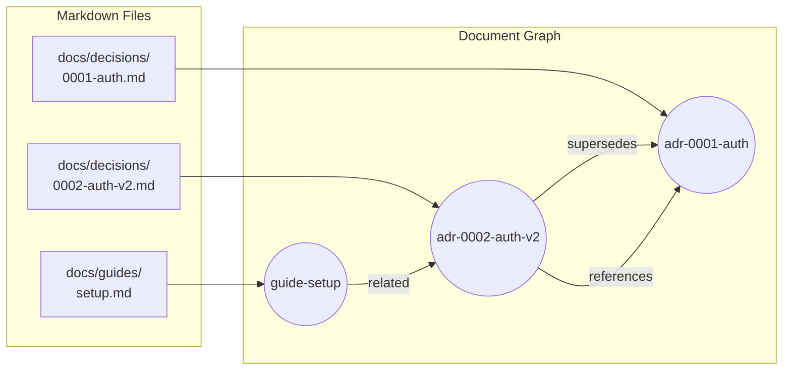
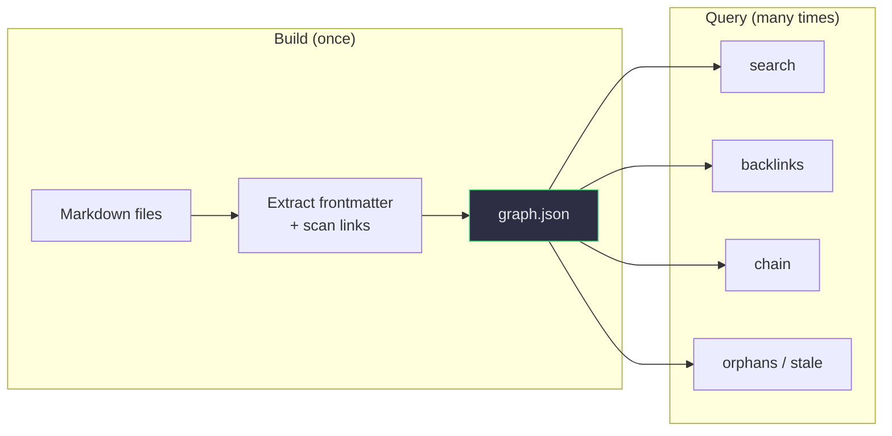
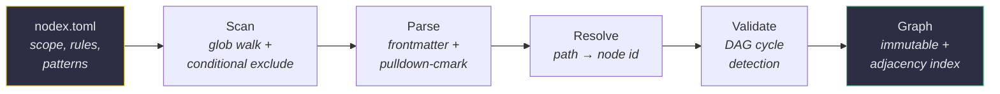
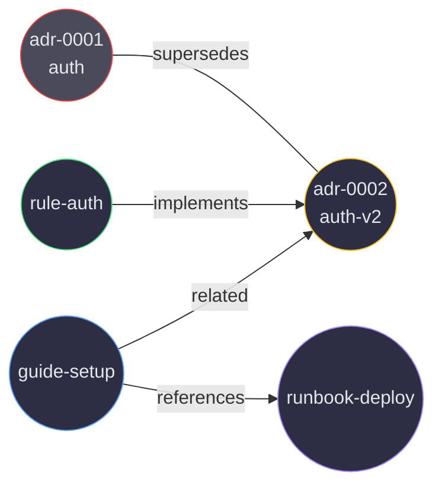
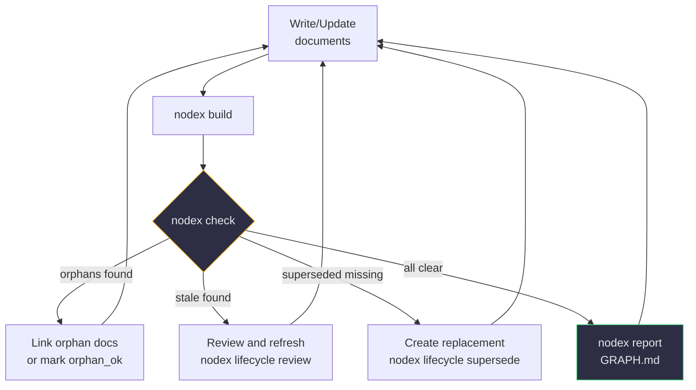

[](https://www.rust-lang.org)
[](https://doc.rust-lang.org/edition-guide/rust-2024/)
[](LICENSE)

# nodex

> **English** | **[한국어](README.ko.md)**

**Turn markdown files into a queryable document graph.**

nodex scans your project's markdown files, extracts YAML frontmatter and link relationships, and builds an immutable document graph you can search, validate, and report on — all through a JSON-first CLI designed for AI agent integration.

---

## Why nodex?

- **Graph, not folders** — discover how documents relate through backlinks, supersession chains, and cross-references
- **Config, not code** — all project-specific rules live in `nodex.toml`, zero hardcoded domain logic
- **Fast** — Rust + rayon parallel parsing, incremental build with SHA256 cache
- **AI-agent native** — every command outputs structured JSON with consistent `{ok, data}` envelope

---

## Quick Start

```bash
# Install (macOS / Linux)
curl -fsSL https://raw.githubusercontent.com/junyeong-ai/nodex/main/scripts/install.sh | bash

# Initialize config in your project
nodex init

# Build the document graph
nodex build

# Search for documents
nodex query search "auth"

# Explore relationships
nodex query backlinks <node-id>
nodex query chain <node-id>
```

---

## How the Graph Works

### From Files to Graph

nodex transforms a flat collection of markdown files into a navigable knowledge graph. Each document becomes a **node**, and every link between documents becomes a directed **edge**.



### Edge Types

Edges are extracted from two sources:

| Source | Edge Type | Example |
|--------|-----------|---------|
| Frontmatter `supersedes` | supersedes | ADR 2 supersedes ADR 1 |
| Frontmatter `implements` | implements | Rule implements ADR |
| Frontmatter `related` | related | Guide is related to ADR |
| Markdown `[text](path.md)` | references | Body link to another doc |
| Custom pattern `@path.md` | imports | Configurable via `nodex.toml` |

### Index Once, Query Forever

Traditional approaches read every file on every search. nodex separates **indexing** from **querying**:



- **Build** extracts each file's frontmatter metadata and scans for markdown links — the compact `graph.json` captures all nodes and relationships
- **Queries** read only `graph.json`, never the original files — sub-millisecond response
- **Incremental**: SHA256 hash per file, only re-parses changed files on next build

### Build Pipeline



- **Scan**: walks filesystem using include/exclude globs, applies conditional exclude for terminal spec sub-files
- **Parse**: YAML frontmatter via serde, markdown links via pulldown-cmark AST (not regex), custom patterns for project-specific syntax
- **Resolve**: converts file paths to node IDs — strict matching only, no bare filename fallback
- **Validate**: iterative 3-color DFS to detect cycles in supersedes edges
- **Graph**: frozen `Graph` struct with pre-built adjacency indices for O(degree) queries

### Multi-Hop Discovery Without a Graph DB

nodex stores the graph in memory with pre-built adjacency indices — no external database needed.



Starting from `adr-0001`, an AI agent can follow edges to discover the entire related knowledge cluster:

```bash
# Hop 1: Where did adr-0001 go?
nodex query chain adr-0001
# → adr-0001 → adr-0002-auth-v2

# Hop 2: Who depends on the replacement?
nodex query backlinks adr-0002-auth-v2
# → rule-auth, guide-setup

# Hop 3: What else is related?
nodex query node guide-setup
# → outgoing: references runbook-deploy
```

Each query is O(degree) using the adjacency index — no full graph scan needed.

### Beyond Keyword Search

`grep "auth"` finds files containing the word. Graph traversal finds **structurally related** documents even when they don't share keywords:

| Scenario | `grep` result | `nodex` result |
|----------|--------------|----------------|
| "What replaced this ADR?" | No answer | `chain` → supersession history |
| "What depends on this doc?" | No answer | `backlinks` → all linking documents |
| "What's isolated knowledge?" | No answer | `orphans` → disconnected documents |
| "What's outdated?" | No answer | `stale` → review date past threshold |
| "Find auth docs" | All files mentioning "auth" | `search` + relationship context |

The key difference: **grep operates on text, nodex operates on relationships**. A guide may never mention "auth" but be structurally related to the auth ADR through `related:` frontmatter.

### Documentation Health Loop

nodex enables a continuous self-improvement cycle for documentation:



| Signal | Meaning | Action |
|--------|---------|--------|
| Orphan detected | Document has no incoming links — isolated knowledge | Add `related:` links or set `orphan_ok: true` |
| Stale detected | Active document not reviewed in N days | Verify accuracy, then `lifecycle review` |
| Chain broken | Superseded document missing successor | Create replacement, then `lifecycle supersede` |
| Validation error | Required frontmatter fields missing | Add frontmatter via `migrate --apply` |

This is not limited to ADRs. **Specs, guides, runbooks, rules, skills** — any document with frontmatter participates in the graph. The tool works for any project that manages knowledge in markdown files.

---

## Commands

| Command | Description |
|---------|-------------|
| `nodex init` | Generate `nodex.toml` with annotated defaults |
| `nodex build [--full]` | Build graph (incremental by default) |
| `nodex query search <keyword>` | Keyword search across id, title, tags |
| `nodex query backlinks <id>` | Find all nodes linking to target |
| `nodex query chain <id>` | Walk supersession chain |
| `nodex query orphans` | Nodes with zero incoming edges |
| `nodex query stale` | Docs past review threshold |
| `nodex query tags <tag...> [--all]` | Tag-based search |
| `nodex query node <id>` | Full node detail with edges |
| `nodex query issues` | Unified report of orphans, stale docs, unresolved edges, and rule violations |
| `nodex check [--severity error\|warning]` | Run validation rules |
| `nodex lifecycle <action> <id>` | Transition: supersede, archive, deprecate, abandon, review |
| `nodex report [--format md\|json\|all]` | Generate GRAPH.md + graph.json + backlinks.json (default: all) |
| `nodex migrate [--apply]` | Inject frontmatter into legacy docs |
| `nodex rename <old> <new>` | Move file and update all references |
| `nodex scaffold --kind X --title "..."` | Create a new document with valid frontmatter |

All commands output JSON. Add `--pretty` for human-readable formatting.

---

## Configuration

All behavior is driven by `nodex.toml`:

```toml
[scope]
include = ["docs/**/*.md", "specs/**/*.md", "README.md"]
exclude = ["docs/_index/**"]

# Kinds your project uses. `adr` is a project addition; the other
# four are defaults. Adding a kind here is the prerequisite for
# referencing it from identity / schema rules below.
[kinds]
allowed = ["generic", "guide", "readme", "adr"]

# Status vocabulary. You can add values (e.g. "draft") but the four
# lifecycle-target statuses — superseded, archived, deprecated,
# abandoned — must stay in `allowed` so `nodex lifecycle` always
# writes a value the rest of the config accepts.
[statuses]
allowed = ["draft", "active", "superseded", "archived", "deprecated", "abandoned"]
terminal = ["superseded", "archived", "deprecated", "abandoned"]

# Kind inference — first match wins
[[identity.kind_rules]]
glob = "docs/decisions/**"
kind = "adr"

# ID template with variables: {stem}, {parent}, {kind}, {path_slug}
[[identity.id_rules]]
kind = "adr"
template = "adr-{stem}"

# Custom link patterns (e.g., @path.md syntax)
[[parser.link_patterns]]
pattern = "@([A-Za-z0-9_./-]+\\.md)"
relation = "imports"

# Validation rules
[[rules.naming]]
glob = "docs/decisions/**"
pattern = "^\\d{4}-[a-z0-9-]+\\.md$"
sequential = true

# Schema enforcement. Top-level entries apply to every document;
# `overrides` merge on top of them for specific kinds. Override enum
# values must be a subset of the global `statuses.allowed` /
# `kinds.allowed`, and any `enums.status` declaration must still
# cover all four lifecycle targets (`superseded`, `archived`,
# `deprecated`, `abandoned`) so `nodex lifecycle <action>` never
# writes a value that fails its own config — `Config::load` rejects
# mismatches at startup.
[schema]
required = ["id", "title", "kind", "status"]
cross_field = [
  { when = "status=superseded", require = "superseded_by" },
]

[[schema.overrides]]
kinds = ["adr"]
required = ["id", "title", "kind", "status", "decision_date"]
types = { decision_date = "date" }
enums = { priority = ["low", "medium", "high"] }

[detection]
stale_days = 180
orphan_grace_days = 14
```

---

## Architecture

```
nodex/
├── nodex-core/    Library: model, parser, builder, query, rules, output
└── nodex-cli/     Binary: clap CLI wrapping core with JSON envelope
```

- **nodex-core** — all logic: parsing, graph construction, queries, validation, report generation
- **nodex-cli** — thin clap wrapper, JSON formatting, error classification

---

## Install

### Quick install (recommended)

**macOS / Linux**
```bash
curl -fsSL https://raw.githubusercontent.com/junyeong-ai/nodex/main/scripts/install.sh | bash
```

**Windows (PowerShell)**
```powershell
iwr -useb https://raw.githubusercontent.com/junyeong-ai/nodex/main/scripts/install.ps1 | iex
```

The installer detects your platform, downloads a verified prebuilt binary, installs it to `~/.local/bin` (or `%USERPROFILE%\.local\bin` on Windows), and optionally installs the Claude Code skill. It is fully interactive when run in a terminal, and supports `--yes` for automation.

### Supported platforms

| OS | Architecture | Target |
|---|---|---|
| Linux | x86_64 | `x86_64-unknown-linux-musl` (static) |
| Linux | arm64 | `aarch64-unknown-linux-musl` (static) |
| macOS | Intel + Apple Silicon | `universal-apple-darwin` (fat binary) |
| Windows | x86_64 | `x86_64-pc-windows-msvc` |

### Installer flags

```
--version VERSION        Install specific version (default: latest)
--install-dir PATH       Binary location (default: ~/.local/bin)
--skill user|project|none  Skill install level (default: user)
--from-source            Build from source instead of downloading
--force                  Overwrite without prompting
--yes, -y                Non-interactive mode
--dry-run                Print plan, do not execute
```

All flags have matching environment variables (`NODEX_VERSION`, `NODEX_INSTALL_DIR`, `NODEX_SKILL_LEVEL`, `NODEX_FROM_SOURCE`, `NODEX_FORCE`, `NODEX_YES`, `NODEX_DRY_RUN`). Set `NO_COLOR=1` to disable ANSI color output. Flags take precedence over environment; environment takes precedence over defaults.

### Manual install (with checksum verification)

**macOS / Linux**
```bash
VERSION=0.2.0
TARGET=x86_64-unknown-linux-musl   # or aarch64-unknown-linux-musl, universal-apple-darwin
curl -fLO "https://github.com/junyeong-ai/nodex/releases/download/v$VERSION/nodex-v$VERSION-$TARGET.tar.gz"
curl -fLO "https://github.com/junyeong-ai/nodex/releases/download/v$VERSION/nodex-v$VERSION-$TARGET.tar.gz.sha256"
shasum -a 256 -c "nodex-v$VERSION-$TARGET.tar.gz.sha256"
tar -xzf "nodex-v$VERSION-$TARGET.tar.gz"
install -m 755 nodex "$HOME/.local/bin/nodex"
```

**Windows (PowerShell)**
```powershell
$Version = "0.2.0"
$Target  = "x86_64-pc-windows-msvc"
$Archive = "nodex-v$Version-$Target.zip"
Invoke-WebRequest -Uri "https://github.com/junyeong-ai/nodex/releases/download/v$Version/$Archive"         -OutFile $Archive
Invoke-WebRequest -Uri "https://github.com/junyeong-ai/nodex/releases/download/v$Version/$Archive.sha256" -OutFile "$Archive.sha256"
$expected = (Get-Content "$Archive.sha256" -Raw).Trim().Split()[0]
$actual   = (Get-FileHash $Archive -Algorithm SHA256).Hash.ToLower()
if ($expected -ne $actual) { throw "checksum mismatch" }
Expand-Archive -Path $Archive -DestinationPath "$env:USERPROFILE\.local\bin" -Force
```

### Build from source

```bash
git clone https://github.com/junyeong-ai/nodex
cd nodex
./scripts/install.sh --from-source
# or: cargo install --path nodex-cli
```

### Uninstall

```bash
# macOS / Linux
curl -fsSL https://raw.githubusercontent.com/junyeong-ai/nodex/main/scripts/uninstall.sh | bash

# Windows
iwr -useb https://raw.githubusercontent.com/junyeong-ai/nodex/main/scripts/uninstall.ps1 | iex
```

---

## License

MIT

---

> **English** | **[한국어](README.ko.md)**
