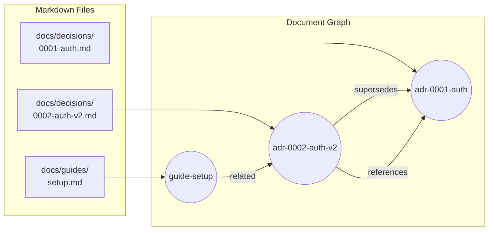
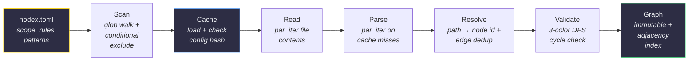
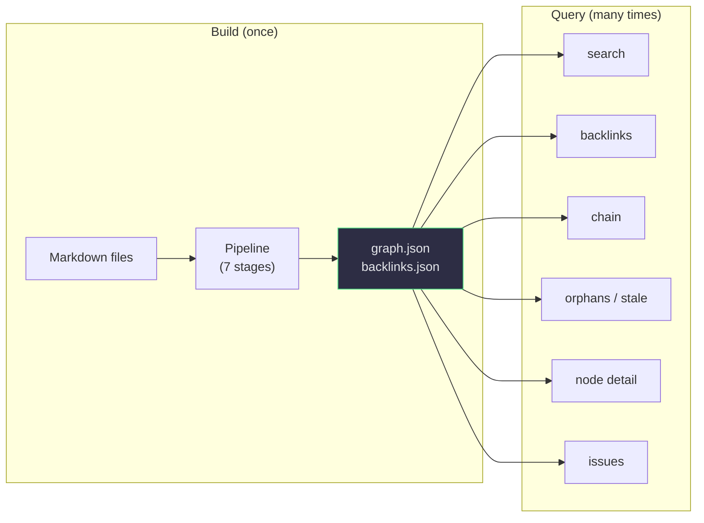
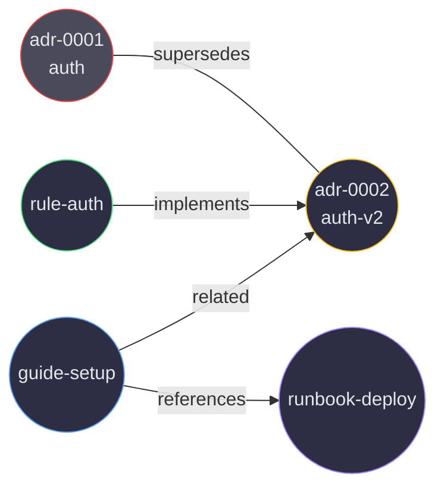
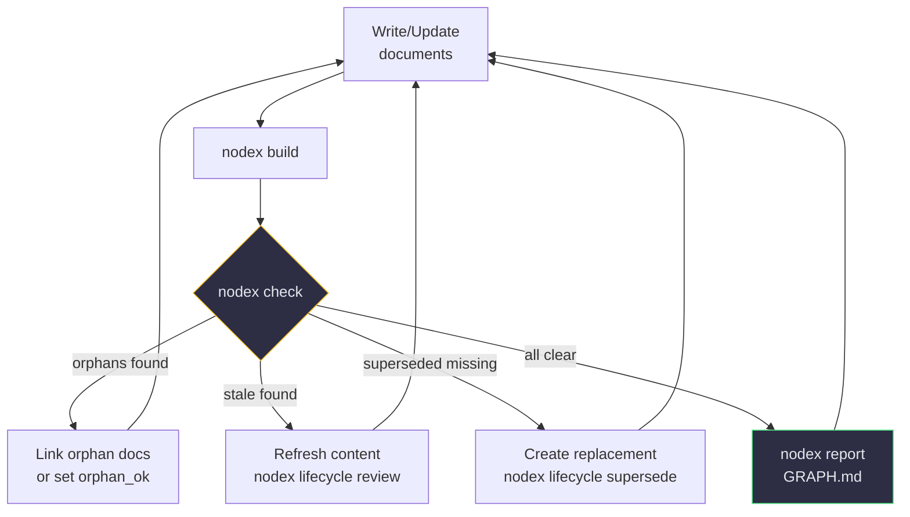

[](https://www.rust-lang.org)
[](https://doc.rust-lang.org/edition-guide/rust-2024/)
[](LICENSE)

# nodex

> **English** | **[한국어](README.ko.md)**

**Turn markdown files into a queryable document graph.**

nodex scans your project's markdown files, extracts YAML frontmatter and link relationships, and builds an immutable document graph you can search, validate, and report on — all through a JSON-first CLI designed for AI agent integration.

---

## Table of Contents

1. [The Problem](#the-problem)
2. [Quick Start](#quick-start)
3. [Core Concepts](#core-concepts) — files become a graph, edge types, frontmatter schema
4. [How It Works](#how-it-works) — build pipeline, incremental cache, query algorithms
5. [JSON-First CLI](#json-first-cli) — envelope, error codes, exit codes, command reference, sample output
6. [Validation & Lifecycle](#validation--lifecycle) — built-in rules, lifecycle actions, health loop
7. [Configuration](#configuration) — every `nodex.toml` section explained
8. [Architecture & Design Principles](#architecture--design-principles) — workspace, modules, invariants
9. [Install](#install)
10. [License](#license)

---

## The Problem

A project's documentation is rarely a flat pile of files — it's a graph. ADR-0002 supersedes ADR-0001. A runbook depends on a guide. A spec is implemented by three rules. But that graph lives implicitly in `[link text](paths.md)` and frontmatter fields, invisible to `grep` and `find`.

This makes routine questions hard to answer:

| Question | What `grep` does | What you actually need |
|---|---|---|
| "What replaced this ADR?" | nothing — supersession isn't text | Walk `superseded_by` forward |
| "What depends on this doc?" | finds files mentioning its name, misses `related:` frontmatter | All incoming edges, regardless of source |
| "Which docs are isolated?" | nothing — absence isn't searchable | Nodes with zero incoming edges |
| "Which docs are stale?" | nothing — dates aren't compared | Active docs past review threshold |
| "Find auth docs" | every file containing "auth" | Score by id/title/tag, with relationship context |

nodex makes the implicit graph explicit. It parses your markdown once, builds a typed in-memory graph with adjacency indices, and answers structural questions in sub-millisecond time — the kind of queries an AI agent or automation needs to actually understand a documentation set, not just keyword-match it.

**Core properties:**

- **Graph, not folders** — supersession chains, backlinks, cross-references are first-class
- **Config, not code** — all project-specific rules live in `nodex.toml`; zero hardcoded domain logic
- **Incremental & parallel** — Rust + rayon parallel reads, SHA256 per-file cache invalidates only what changed
- **AI-agent native** — every command emits a stable JSON envelope (`{ok, data, warnings}` / `{ok, error: {code, message}}`) with classified error codes

---

## Quick Start

```bash
# Install (macOS / Linux)
curl -fsSL https://raw.githubusercontent.com/junyeong-ai/nodex/main/scripts/install.sh | bash

# Initialize config in your project
nodex init

# Build the document graph
nodex build

# Search for documents
nodex query search "auth"

# Explore relationships
nodex query backlinks <node-id>
nodex query chain <node-id>
```

All commands output JSON. Add `--pretty` for human-readable formatting. See [JSON-First CLI](#json-first-cli) for full output examples.

---

## Core Concepts

### Files Become a Graph

nodex transforms a flat collection of markdown files into a navigable knowledge graph. Each document becomes a **node**, and every link between documents becomes a directed **edge**.



### Edge Types

Edges come from two sources: YAML frontmatter fields, and the markdown body itself.

| Source | Default Relation | Example |
|---|---|---|
| Frontmatter `supersedes` | `supersedes` | ADR 2 supersedes ADR 1 |
| Frontmatter `implements` | `implements` | Rule implements ADR |
| Frontmatter `related` | `related` | Guide is related to ADR |
| Markdown body link `[text](path.md)` | `references` | Body link to another doc |
| Custom pattern (configurable) | **any string you choose** | e.g. `@path.md` → `imports` |

The five frontmatter / body relations above are built in. Beyond them, `[[parser.link_patterns]]` in `nodex.toml` lets you define **arbitrary relation names** — pair a regex (matching some text in the body) with a relation string, and every match becomes an edge with that relation. So a project that wants `imports`, `cites`, `mentions`, or `todo_reference` as edge types can add them without touching any code.

Markdown links are extracted via [pulldown-cmark](https://github.com/pulldown-cmark/pulldown-cmark) — an AST-based parser, not regex — so links inside fenced code blocks are correctly ignored.

### Frontmatter Schema

Every node is built from these recognised fields. Anything not listed here goes into `attrs` (a free-form `BTreeMap`) and is preserved through round-trips, so project-specific fields survive untouched.

| Field | Type | Required | Meaning |
|---|---|---|---|
| `id` | string | yes (or auto-inferred from path) | Unique node identifier |
| `title` | string | yes | Human-readable name |
| `kind` | string | yes (or auto-inferred) | Document type — must be in `[kinds].allowed` |
| `status` | string | yes | Lifecycle state — must be in `[statuses].allowed` |
| `created` | date (ISO) | optional | Creation date |
| `updated` | date (ISO) | optional | Last edit date |
| `reviewed` | date (ISO) | optional | Last review date — drives stale detection |
| `owner` | string | optional | Owner identifier |
| `supersedes` | string \| array | optional | IDs of replaced docs |
| `superseded_by` | string | optional | ID of replacement doc |
| `implements` | string \| array | optional | IDs of implemented specs |
| `related` | string \| array | optional | IDs of related docs |
| `tags` | array | optional | Arbitrary tags |
| `orphan_ok` | bool | optional (default `false`) | Suppress orphan warning |
| (anything else) | any | optional | Stored under `attrs`, project-specific |

`supersedes`, `implements`, `related`, and `tags` accept both a single string and an array — both forms parse into the same shape.

---

## How It Works

### Build Pipeline

The build is a series of pure stages — input in, output out. The only shared state is the SHA256 cache.



| Stage | What it does | Module |
|---|---|---|
| **Scan** | Walks the filesystem using `[scope].include` / `exclude` globs. Applies `conditional_exclude` to skip child files of terminal-status parents (e.g., archived spec sub-files). | `builder/scanner.rs` |
| **Cache** | Loads `_index/cache.json`. Cache invalidates wholesale if the config-serialization SHA256 or the `nodex` binary version changed (so a binary upgrade never reuses stale cache). | `builder/cache.rs` |
| **Read** | Reads file contents in parallel via `rayon::par_iter`. IO errors become warnings, not fatal failures — one unreadable file doesn't kill the build. | `builder/mod.rs` |
| **Parse** | Per-file SHA256 hash check. On hit, replay the cached `Node` + `RawEdge` set. On miss, parse YAML frontmatter (via `yaml_serde`), extract markdown links via pulldown-cmark AST, run any configured custom-pattern regexes — also in parallel via `rayon::par_iter`. | `parser/` |
| **Dedupe IDs** | Reject the build with `Error::DuplicateId { id, first, second }` if two documents resolved to the same node id. Surfaces as error code `DUPLICATE_ID`. | `builder/mod.rs` |
| **Resolve** | Convert each `RawEdge.target_path` into a node id. Strict matching only — no bare-filename fallback, no case-insensitivity. Unmatched targets become `ResolvedTarget::Unresolved { raw, reason }` (preserved as warnings, not silently dropped). Then mirror every `superseded_by: Y` scalar into a canonical `Y → M` `supersedes` edge so both authoring styles produce the same graph, and dedupe on `(source, target, relation)` so a doc declaring both sides only emits one edge. | `builder/resolver.rs` |
| **Validate** | Iterative 3-color DFS over `supersedes` edges to detect cycles. Returns `Error::SupersedesCycle { chain }` if found, with the offending node IDs in order. | `builder/validator.rs` |
| **Graph** | Sort edges and nodes for deterministic output, then construct the immutable `Graph`: nodes in an `IndexMap` (insertion-order, serializable), edges in a `Vec`, plus pre-built `incoming` / `outgoing` adjacency indices (`BTreeMap<String, Vec<usize>>`). | `model/graph.rs` |

After the graph is built, `_index/graph.json` and `_index/backlinks.json` are written.

### Index Once, Query Forever

Traditional approaches re-read every file on every search. nodex separates **indexing** (once) from **querying** (many times):



- **Build artifacts**: `graph.json` (full graph for queries), `backlinks.json` (precomputed inverted index for tools that want the bare backlink map without loading nodex)
- **Queries** read only `graph.json` — original markdown files are never re-touched, response is sub-millisecond
- **Incremental**: SHA256 per file means only changed files re-parse on the next build. Add `--full` to force a fresh build (e.g., after upgrading a custom rule)

### Query Algorithms

The graph keeps two adjacency indices in memory. Every query is O(degree) or O(n) — never a full graph scan unless the query semantically demands it.

| Query | Result | Algorithm | Complexity |
|---|---|---|---|
| `search <kw>` | id/title/tag matches with score | Substring match, scored (id exact +3.0, title exact +2.5, id substr +1.5, title substr +1.0, tag +0.5) | O(n·m) |
| `backlinks <id>` | Nodes linking to target | `incoming_indices(id)` lookup, dereference edges | O(degree_in) |
| `chain <id>` | Supersession chain (oldest → newest) | Walk `superseded_by` pointers forward | O(chain_length) |
| `node <id>` | Full node + incoming/outgoing edges | Lookup in `IndexMap` + both adjacency indices | O(degree) |
| `tags <t...>` | Nodes matching tags | Linear filter (any-of or all-of with `--all`) | O(n·t) |
| `orphans` | Nodes with zero incoming edges | Linear scan, filter by adjacency emptiness, apply `orphan_grace_days` | O(n) |
| `stale` | Active docs not reviewed within `stale_days` | Linear scan, filter by status (non-terminal) and `reviewed` date | O(n) |
| `issues` | Combined orphans + stale + unresolved edges + rule violations | Composes the above + runs all `Rule` impls | O(n + e) |

**Note on adjacency**: only resolved edges are indexed. `Unresolved { raw, reason }` edges still exist on the graph (so you can list them via `query issues`) but don't appear in `incoming_indices` — a backlink query never returns a node whose target couldn't be resolved.

### Multi-Hop Discovery



Starting from `adr-0001`, an AI agent can discover the entire related cluster in three calls:

```bash
# Hop 1: Where did adr-0001 go?
nodex query chain adr-0001
# → adr-0001 → adr-0002-auth-v2

# Hop 2: Who depends on the replacement?
nodex query backlinks adr-0002-auth-v2
# → rule-auth, guide-setup

# Hop 3: What else does guide-setup point to?
nodex query node guide-setup
# → outgoing: references runbook-deploy
```

Each hop is O(degree) — no full graph scan, no file re-reads.

---

## JSON-First CLI

Every command emits JSON to stdout. Human-readable text appears only for `--help` / `--version` (per CLI convention). This is the AI-agent contract — programs parse the envelope, error code, and data shape without scraping prose.

### Envelope Schema

**Success:**
```json
{
  "ok": true,
  "data": { /* command-specific shape */ },
  "warnings": ["..."]
}
```
- `warnings` is omitted when empty (`skip_serializing_if`).
- All `query` commands return `data: { items: [...], total: N }` so consumers can paginate or count without re-counting.

**Error:**
```json
{
  "ok": false,
  "error": { "code": "ERROR_CODE", "message": "..." }
}
```

### Error Codes

Error codes are derived from the typed `nodex_core::error::Error` enum via `downcast_ref` — they are **never** string-matched on messages, so they remain stable across cosmetic message changes.

| Code | Cause |
|---|---|
| `CYCLE_DETECTED` | A cycle exists in `supersedes` edges (chain provided in message) |
| `DUPLICATE_ID` | Two documents resolved to the same node id |
| `PARSE_ERROR` | Malformed YAML frontmatter, or corrupt `graph.json` |
| `INVALID_TRANSITION` | `lifecycle` action attempted from a status that doesn't allow it (e.g., terminal → terminal) |
| `NOT_FOUND` | Referenced node id doesn't exist in the graph |
| `ALREADY_EXISTS` | `scaffold` / `rename` target path already occupies a real file |
| `PATH_ESCAPES_ROOT` | A path traversal (`..`) or symlink would escape the project root |
| `CONFIG_ERROR` | `nodex.toml` failed validation at load time (e.g., terminal status missing from `allowed`) |
| `IO_ERROR` | Filesystem read/write failure |
| `INVALID_ARGUMENT` | clap parse failure — unknown flag, bad value, missing required arg |
| `INTERNAL_ERROR` | Anything unclassified (bug — please report) |

### Exit Codes

| Code | Meaning |
|---|---|
| `0` | Success — command completed, no validation errors |
| `1` | `nodex check` found `severity = error` violations |
| `2` | Runtime failure — anything that produced an error envelope |

Exit code `1` is reserved exclusively for `check` finding errors. Every other failure (parse, IO, cycle, not-found, …) is exit code `2` so CI can treat "validation failed" and "tool broken" differently.

### Sample Output

<details>
<summary><strong>Build</strong> — <code>nodex build --pretty</code></summary>

```json
{
  "ok": true,
  "data": {
    "nodes": 3,
    "edges": 5,
    "cached": 0,
    "parsed": 3,
    "duration_ms": 2
  }
}
```

`cached` vs `parsed` shows incremental cache effectiveness — on a no-op rebuild, `parsed` would be 0 and `cached` would equal `nodes`.
</details>

<details>
<summary><strong>Backlinks</strong> — <code>nodex query backlinks adr-0002-auth-v2 --pretty</code></summary>

```json
{
  "ok": true,
  "data": {
    "items": [
      {
        "id": "guide-setup",
        "title": "Setup guide",
        "relation": "references",
        "location": "L2"
      },
      {
        "id": "guide-setup",
        "title": "Setup guide",
        "relation": "related",
        "location": "frontmatter:related"
      }
    ],
    "total": 2
  }
}
```

`location` distinguishes a body-link backlink (`L2` = line 2 of the source file) from a frontmatter backlink (`frontmatter:related`).
</details>

<details>
<summary><strong>Node detail</strong> — <code>nodex query node guide-setup --pretty</code></summary>

```json
{
  "ok": true,
  "data": {
    "node": {
      "id": "guide-setup",
      "path": "docs/guides/setup.md",
      "title": "Setup guide",
      "kind": "guide",
      "status": "active",
      "created": "2025-03-05",
      "reviewed": "2025-03-05",
      "related": ["adr-0002-auth-v2"],
      "tags": ["setup", "onboarding"],
      "orphan_ok": false
    },
    "incoming": [
      { "node_id": "adr-0002-auth-v2", "relation": "references", "confidence": "extracted" },
      { "node_id": "adr-0002-auth-v2", "relation": "related", "confidence": "extracted" }
    ],
    "outgoing": [
      { "node_id": "adr-0002-auth-v2", "relation": "references", "confidence": "extracted" },
      { "node_id": "adr-0002-auth-v2", "relation": "related", "confidence": "extracted" }
    ]
  }
}
```
</details>

<details>
<summary><strong>Issues</strong> — <code>nodex query issues --pretty</code></summary>

```json
{
  "ok": true,
  "data": {
    "orphans": [],
    "stale": [
      {
        "id": "adr-0002-auth-v2",
        "title": "Auth v2 with JWT",
        "path": "docs/decisions/0002-auth-v2.md",
        "reviewed": "2025-03-01",
        "days_since": 416
      }
    ],
    "unresolved_edges": [],
    "violations": [
      {
        "rule_id": "stale_review",
        "severity": "warning",
        "node_id": "adr-0002-auth-v2",
        "path": "docs/decisions/0002-auth-v2.md",
        "message": "not reviewed for 416 days (threshold: 180 days)"
      }
    ],
    "summary": {
      "total": 2,
      "by_category": { "stale": 1, "violation_stale_review": 1 }
    }
  }
}
```

`issues` is the one-stop "what should I fix?" view — it composes orphans, stale, unresolved edges, and rule violations into a single envelope.
</details>

<details>
<summary><strong>Error</strong> — <code>nodex query node nonexistent-id</code></summary>

```json
{"ok":false,"error":{"code":"NOT_FOUND","message":"node not found: nonexistent-id"}}
```

Exit code: `2`. The `code` field is the stable contract; the `message` is human-facing and may be reworded.
</details>

### Command Reference

**Global flags** (apply to every subcommand):

| Flag | Effect |
|---|---|
| `-C DIR` | Run as if started in `DIR` (like `git -C`) |
| `--pretty` | Pretty-print JSON output |

**Subcommands:**

| Command | Description |
|---|---|
| `nodex init` | Generate `nodex.toml` with annotated defaults |
| `nodex build [--full]` | Build graph; `--full` ignores cache |
| `nodex query search <keyword> [--status x,y]` | Keyword search across id, title, tags |
| `nodex query backlinks <id>` | All nodes linking to target |
| `nodex query chain <id>` | Walk supersession chain (oldest → newest) |
| `nodex query orphans` | Nodes with zero incoming edges (after `orphan_grace_days`) |
| `nodex query stale` | Active docs past `stale_days` review threshold |
| `nodex query tags <tag...> [--all]` | Tag-based search; `--all` requires every tag |
| `nodex query node <id>` | Full node detail with incoming + outgoing edges |
| `nodex query issues` | Unified orphans + stale + unresolved + rule violations |
| `nodex check [--severity error\|warning]` | Run all validation rules; exit 1 on errors |
| `nodex lifecycle <action> <id> [--to id]` | Transition: `supersede --to <new>`, `archive`, `deprecate`, `abandon`, `review` |
| `nodex report [--format md\|json\|all]` | Generate `GRAPH.md` + `graph.json` + `backlinks.json` (default: `all`) |
| `nodex migrate [--apply]` | Inject frontmatter into legacy docs (dry-run by default) |
| `nodex rename <old> <new>` | Move file and rewrite all references in body links |
| `nodex scaffold --kind X --title "..." [--id ...] [--path ...] [--dry-run] [--force]` | Create new document with valid frontmatter |

---

## Validation & Lifecycle

### Built-in Rules

`nodex check` runs every registered rule against the graph and emits a flat list of `Violation` records. Each violation carries `rule_id`, `severity`, optional `node_id` / `path`, and a human message.

| `rule_id` | Severity | What it checks |
|---|---|---|
| `required_field` | error | Every required field (per `[schema].required` + per-kind override) is present |
| `field_type` | error | `attrs` values match declared `types` (string / integer / bool / date) |
| `field_enum` | error | `attrs` + `kind` + `status` are in the declared `enums` allow-list |
| `cross_field` | error | Conditional requirements like `when status=superseded require superseded_by` |
| `filename_pattern` | error | Filenames match `[[rules.naming]].pattern` regex |
| `sequential_numbering` | warning | No gaps in leading-digit sequences (e.g., `0001`, `0002`, then `0004` flags `0003` missing) |
| `unique_numbering` | warning | No two files share the same leading digit prefix |
| `stale_review` | warning | Active (non-terminal) nodes not reviewed within `[detection].stale_days` |

`--severity error` filters to errors only. With no flag, both errors and warnings are returned. Adding a custom rule means implementing the `Rule` trait in `nodex-core/src/rules/` and registering it in `check_all()` — see [`nodex-core/CLAUDE.md`](nodex-core/CLAUDE.md#adding-a-validation-rule).

### Lifecycle Actions

`nodex lifecycle <action> <node-id>` is the only safe way to mutate a document's status — it goes through `lifecycle::transition()`, which validates the source status, edits the YAML frontmatter in place, and refuses to write through symlinks.

| Action | Resulting `status` | Other fields written |
|---|---|---|
| `supersede --to <new-id>` | `superseded` | `superseded_by: <new-id>` |
| `archive` | `archived` | (none) |
| `deprecate` | `deprecated` | (none) |
| `abandon` | `abandoned` | (none) |
| `review` | (unchanged) | `reviewed: <today>` |

The four target statuses (`superseded`, `archived`, `deprecated`, `abandoned`) are **terminal** — once a doc is in a terminal status, no further `lifecycle` action will move it. `review` is the only non-status-changing action; it bumps the `reviewed` date so the doc drops off the `stale` list.

### Documentation Health Loop

These commands compose into a continuous improvement cycle:



| Signal | Meaning | Action |
|---|---|---|
| Orphan detected | Document has no incoming links — isolated knowledge | Add `related:` links or set `orphan_ok: true` |
| Stale detected | Active document not reviewed in N days | Verify accuracy, then `lifecycle review` |
| Chain broken | Superseded document missing successor | Create replacement, then `lifecycle supersede --to <new>` |
| Validation error | Required frontmatter fields missing | Add via `migrate --apply` or hand-edit |

This is not limited to ADRs. **Specs, guides, runbooks, rules, skills** — any document with frontmatter participates in the graph.

---

## Configuration

All behavior is driven by `nodex.toml`. `Config::load` runs `validate()` at startup and rejects inconsistent configs (e.g., `lifecycle` would write a status that the same config rejects), so misconfigurations fail fast instead of producing garbage builds.

```toml
[scope]
include = ["docs/**/*.md", "specs/**/*.md", "README.md"]
exclude = ["docs/_index/**"]
# Skip child files of terminal-status parents:
# [[scope.conditional_exclude]]
# parent_glob = "specs/**/*.md"
# condition = "status_terminal"   # default

# Kinds your project uses. "generic", "guide", "readme" are the
# built-in defaults; "adr" is this project's addition. Every kind
# referenced by identity / schema rules below must appear here.
[kinds]
allowed = ["generic", "guide", "readme", "adr"]

# Status vocabulary. You can add values (e.g. "draft") but the four
# lifecycle-target statuses — superseded, archived, deprecated,
# abandoned — must stay in `allowed` so `nodex lifecycle` always
# writes a value the rest of the config accepts.
[statuses]
allowed = ["draft", "active", "superseded", "archived", "deprecated", "abandoned"]
terminal = ["superseded", "archived", "deprecated", "abandoned"]

# Kind inference — first match wins
[[identity.kind_rules]]
glob = "docs/decisions/**"
kind = "adr"

# ID template variables: {stem}, {parent}, {kind}, {path_slug}
[[identity.id_rules]]
kind = "adr"
template = "adr-{stem}"

# Custom link patterns — relation can be ANY string
[[parser.link_patterns]]
pattern = "@([A-Za-z0-9_./-]+\\.md)"
relation = "imports"

# Validation rules
[[rules.naming]]
glob = "docs/decisions/**"
pattern = "^\\d{4}-[a-z0-9-]+\\.md$"
sequential = true
unique = true

# Schema enforcement. Top-level entries apply to every document;
# `overrides` merge on top of them for specific kinds. Override enum
# values must be a subset of the global `statuses.allowed` /
# `kinds.allowed`, and any `enums.status` declaration must still
# cover all four lifecycle targets (`superseded`, `archived`,
# `deprecated`, `abandoned`) so `nodex lifecycle <action>` never
# writes a value that fails its own config — `Config::load` rejects
# mismatches at startup.
[schema]
required = ["id", "title", "kind", "status"]
cross_field = [
  { when = "status=superseded", require = "superseded_by" },
]

[[schema.overrides]]
kinds = ["adr"]
required = ["id", "title", "kind", "status", "decision_date"]
types = { decision_date = "date" }
enums = { priority = ["low", "medium", "high"] }

[detection]
stale_days = 180
orphan_grace_days = 14

[output]
dir = "_index"   # default

[report]
title = "Document Graph"
god_node_display_limit = 10
orphan_display_limit = 20
stale_display_limit = 20
```

<details>
<summary><strong>Section reference</strong> — what each section controls</summary>

| Section | Controls |
|---|---|
| `[scope]` | Which files are scanned; `conditional_exclude` skips children of terminal-status parents |
| `[kinds]` | Allowed `kind` values (must include `"generic"` — the fallback) |
| `[statuses]` | Allowed `status` values + which are terminal (block further lifecycle moves) |
| `[identity]` | `kind_rules` (glob → kind) and `id_rules` (template with `{stem}`, `{parent}`, `{kind}`, `{path_slug}`) |
| `[parser]` | Custom `link_patterns` (regex + relation name) |
| `[rules]` | `naming` patterns with optional `sequential` / `unique` numbering checks |
| `[schema]` | Top-level `required` / `types` / `enums` / `cross_field` + per-kind `overrides` |
| `[detection]` | `stale_days` and `orphan_grace_days` thresholds |
| `[output]` | Where build artifacts land (default `_index`) |
| `[report]` | `GRAPH.md` formatting limits |

</details>

---

## Architecture & Design Principles

### Workspace Layout

```
nodex/
├── nodex-core/    Library — all logic: parser, builder, query, rules, output, lifecycle, scaffold
└── nodex-cli/     Binary  — clap CLI; thin wrapper that adds JSON envelope + error classification
```

The split exists so `nodex-core` can be embedded in other Rust tools (build scripts, custom validators, IDE plugins) without pulling in a CLI-specific dependency stack. The CLI never contains domain logic — it parses flags, calls a single core function, and prints the result.

### nodex-core Modules

<details>
<summary><strong>Module map</strong> — what each module owns</summary>

| Module | Responsibility | Key types / functions |
|---|---|---|
| `model/` | Data types — the graph's vocabulary | `Node`, `Edge`, `Graph`, `Kind`, `Status`, `Confidence`, `ResolvedTarget`, `RawEdge` |
| `parser/` | Convert a markdown file → `(Node, Vec<RawEdge>)` | `parse_document()`, `frontmatter::split_frontmatter()`, `body::extract_links()`, `identity::infer_kind()` / `infer_id()` |
| `builder/` | Orchestrate the build pipeline | `build()`, `scanner::scan_scope()`, `cache::BuildCache`, `resolver::resolve_edges()`, `validator::validate_supersedes_dag()` |
| `query/` | Read-only graph traversals | `search::search()` / `search_by_tags()`, `traverse::find_backlinks()` / `find_chain()` / `find_node_detail()`, `detect::find_orphans()` / `find_stale()`, `issues::collect_issues()` |
| `rules/` | `Rule` trait + built-in implementations | `Rule { id, severity, check }`, `RequiredFieldRule`, `FieldTypeRule`, `FieldEnumRule`, `CrossFieldRule`, `FilenamePatternRule`, `SequentialNumberingRule`, `UniqueNumberingRule`, `StaleReviewRule` |
| `output/` | Serialize graph to disk | `json::write_json_outputs()` (`graph.json` + `backlinks.json`), `markdown::render_markdown()` (deterministic `GRAPH.md`) |
| `lifecycle.rs` | Status transitions that mutate frontmatter on disk | `transition()`, canonical status constants, `LIFECYCLE_TARGET_STATUSES` |
| `scaffold.rs` | Create new docs with valid frontmatter | `scaffold()`, `render_default_frontmatter()` (also used by `migrate`) |
| `path_guard.rs` | Mutation safety — symlink + `..` rejection | `reject_traversal()`, `is_symlink()` (used by every command that writes) |
| `config.rs` | `nodex.toml` deserialization + load-time validation | `Config::load()`, `Config::validate()`, `Config::required_for(kind)` / `types_for(kind)` / `enums_for(kind)` / `cross_field_for(kind)` / `is_terminal(status)` / `initial_status_for(kind)` |
| `error.rs` | Typed error enum used everywhere | `Error` (mapped to stable error codes via `downcast_ref`), `Result<T>` |

</details>

### Design Principles

These invariants are enforced at the type system or load-time validation level — they aren't just style guidelines.

1. **Immutable graph.** `Graph` is built once via `Graph::new()` and never mutated. Adjacency indices are derived state, computed inside the constructor and rebuilt by `Deserialize` on load. There is no `add_node()` / `remove_edge()` API. This means a query result is always consistent — there's no concurrent-modification class of bug.

2. **Config over code.** Anything project-specific lives in `nodex.toml`. Kind names, status vocabularies, edge relation names, ID templates, naming rules, schema constraints, custom link patterns — all configurable. The core has zero hardcoded domain knowledge. Adding a new project to nodex is writing a config file, not patching a fork.

3. **Type-safe edge resolution.** `ResolvedTarget` is an enum: `Resolved { id }` or `Unresolved { raw, reason }`. There is no string-prefix hack like `"unresolved://path"`. Unresolved edges are explicit, surfaced via `query issues`, and skipped by adjacency indices — so a backlink query can never accidentally return a phantom node.

4. **SHA256 incremental, with version invalidation.** Per-file content hashes mean only changed files re-parse. The cache key mixes in both the config-serialization hash *and* the `nodex` binary version, so upgrading the binary or changing any config value triggers a clean rebuild. There is no path where a stale cache produces a different result than `--full`.

5. **Symmetric mutation guards.** Every command that writes to disk (`scaffold`, `migrate`, `rename`, `lifecycle`) routes through `path_guard` to reject `..` / absolute paths and refuse to write through symlinks. The guards live in core, not in each CLI handler — so no future command can accidentally skip them. The build's scanner still *follows* symlinks for reading, so linked docs are indexed.

A meta-invariant ties them together: **anything nodex itself writes must pass nodex's own `check`.** If `scaffold`, `migrate`, or `lifecycle` could produce a document the same config rejects, that's considered a bug and `Config::validate` is extended to reject the offending config shape at load time. See [`.claude/rules/config-driven.md`](.claude/rules/config-driven.md) for the current list of self-consistency invariants.

---

## Install

### Quick install (recommended)

**macOS / Linux**
```bash
curl -fsSL https://raw.githubusercontent.com/junyeong-ai/nodex/main/scripts/install.sh | bash
```

**Windows (PowerShell)**
```powershell
iwr -useb https://raw.githubusercontent.com/junyeong-ai/nodex/main/scripts/install.ps1 | iex
```

The installer detects your platform, downloads a verified prebuilt binary, installs it to `~/.local/bin` (or `%USERPROFILE%\.local\bin` on Windows), and optionally installs the Claude Code skill. It is fully interactive when run in a terminal, and supports `--yes` for automation.

### Supported platforms

| OS | Architecture | Target |
|---|---|---|
| Linux | x86_64 | `x86_64-unknown-linux-musl` (static) |
| Linux | arm64 | `aarch64-unknown-linux-musl` (static) |
| macOS | Intel + Apple Silicon | `universal-apple-darwin` (fat binary) |
| Windows | x86_64 | `x86_64-pc-windows-msvc` |

### Installer flags

```
--version VERSION        Install specific version (default: latest)
--install-dir PATH       Binary location (default: ~/.local/bin)
--skill user|project|none  Skill install level (default: user)
--from-source            Build from source instead of downloading
--force                  Overwrite without prompting
--yes, -y                Non-interactive mode
--dry-run                Print plan, do not execute
```

All flags have matching environment variables (`NODEX_VERSION`, `NODEX_INSTALL_DIR`, `NODEX_SKILL_LEVEL`, `NODEX_FROM_SOURCE`, `NODEX_FORCE`, `NODEX_YES`, `NODEX_DRY_RUN`). Set `NO_COLOR=1` to disable ANSI color output. Flags take precedence over environment; environment takes precedence over defaults.

### Manual install (with checksum verification)

**macOS / Linux**
```bash
VERSION=0.2.1
TARGET=x86_64-unknown-linux-musl   # or aarch64-unknown-linux-musl, universal-apple-darwin
curl -fLO "https://github.com/junyeong-ai/nodex/releases/download/v$VERSION/nodex-v$VERSION-$TARGET.tar.gz"
curl -fLO "https://github.com/junyeong-ai/nodex/releases/download/v$VERSION/nodex-v$VERSION-$TARGET.tar.gz.sha256"
shasum -a 256 -c "nodex-v$VERSION-$TARGET.tar.gz.sha256"
tar -xzf "nodex-v$VERSION-$TARGET.tar.gz"
install -m 755 nodex "$HOME/.local/bin/nodex"
```

**Windows (PowerShell)**
```powershell
$Version = "0.2.1"
$Target  = "x86_64-pc-windows-msvc"
$Archive = "nodex-v$Version-$Target.zip"
Invoke-WebRequest -Uri "https://github.com/junyeong-ai/nodex/releases/download/v$Version/$Archive"         -OutFile $Archive
Invoke-WebRequest -Uri "https://github.com/junyeong-ai/nodex/releases/download/v$Version/$Archive.sha256" -OutFile "$Archive.sha256"
$expected = (Get-Content "$Archive.sha256" -Raw).Trim().Split()[0]
$actual   = (Get-FileHash $Archive -Algorithm SHA256).Hash.ToLower()
if ($expected -ne $actual) { throw "checksum mismatch" }
Expand-Archive -Path $Archive -DestinationPath "$env:USERPROFILE\.local\bin" -Force
```

### Build from source

```bash
git clone https://github.com/junyeong-ai/nodex
cd nodex
./scripts/install.sh --from-source
# or: cargo install --path nodex-cli
```

### Uninstall

```bash
# macOS / Linux
curl -fsSL https://raw.githubusercontent.com/junyeong-ai/nodex/main/scripts/uninstall.sh | bash

# Windows
iwr -useb https://raw.githubusercontent.com/junyeong-ai/nodex/main/scripts/uninstall.ps1 | iex
```

---

## License

MIT

---

> **English** | **[한국어](README.ko.md)**
