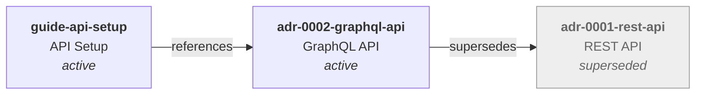
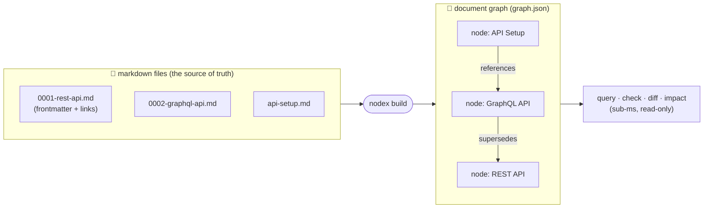
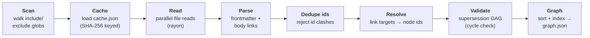

[](https://www.rust-lang.org)
[](https://doc.rust-lang.org/edition-guide/rust-2024/)
[](LICENSE)

# nodex

> **English** | **[한국어](README.ko.md)**

**Turn markdown files into a queryable, validated document graph.**

nodex scans your project's markdown files, extracts YAML frontmatter and link relationships, and builds an immutable document graph you can search, validate, diff, and report on — all through a JSON-first CLI. No agents, no servers, no AI dependencies. Just a Rust binary with a stable JSON contract.

---

## Table of Contents

1. [The Problem](#the-problem)
2. [Quick Start](#quick-start)
3. [Core Concepts](#core-concepts) — files become a graph, edge types, frontmatter schema
4. [How It Works](#how-it-works) — build pipeline, incremental cache, query algorithms
5. [JSON-First CLI](#json-first-cli) — envelope, error codes, exit codes, command reference
6. [Validation & Lifecycle](#validation--lifecycle) — built-in rules, strict mode, diff-aware rules
7. [Diff & Export](#diff--export) — structural delta, JSON Schema, enum manifests
8. [Configuration](#configuration) — the `nodex.toml` reference
9. [Architecture](#architecture) — workspace, modules, design invariants
10. [Install](#install)
11. [License](#license)

---

## The Problem

A project's documentation is rarely a flat pile of files — it's a graph. ADR-0002 supersedes ADR-0001. A runbook depends on a guide. A spec is implemented by three rules. But that graph lives implicitly in `[link text](paths.md)` and frontmatter fields, invisible to `grep` and `find`.

This makes routine questions hard to answer:

| Question | What `grep` does | What you actually need |
|---|---|---|
| "What replaced this ADR?" | nothing — supersession isn't text | The full supersession lineage from any member; the current doc is a non-terminal (`active`) tip (a fork can have several) |
| "What depends on this doc?" | finds files mentioning its name, misses `related:` frontmatter | All incoming edges, regardless of source |
| "Which docs are isolated?" | nothing — absence isn't searchable | Nodes with zero incoming edges |
| "Which docs are stale?" | nothing — dates aren't compared | Active docs past review threshold |
| "What changed between these refs?" | line diff at best | Added / removed nodes, status transitions, field changes |
| "Find auth docs" | every file containing "auth" | Score by id/title/tag, with relationship context |

nodex makes the implicit graph explicit. It parses your markdown once, builds a typed in-memory graph with adjacency indices, and answers structural questions in sub-millisecond time. Routine workflows — pre-commit validation, PR diff gating, deduplication before authoring, vocabulary sync with external tooling — collapse into single JSON-emitting commands.

**Core properties:**

- **Graph, not folders** — supersession chains, backlinks, cross-references are first-class
- **Config, not code** — all project-specific rules live in `nodex.toml`; zero hardcoded domain logic
- **Incremental & parallel** — Rust + rayon parallel reads, SHA256 per-file cache invalidates only what changed
- **JSON-first contract** — every command emits a stable envelope (`{ok, data, warnings}` / `{ok, error: {code, message}}`) with classified error codes
- **Pure CLI** — no daemons, no servers, no AI / network dependencies; everything is a synchronous local process

---

## Quick Start

```bash
# Install (macOS / Linux)
curl -fsSL https://raw.githubusercontent.com/junyeong-ai/nodex/main/scripts/install.sh | bash

# Initialize config in your project
nodex init

# Build the document graph
nodex build

# Search for documents
nodex query search "auth"

# Explore relationships
nodex query backlinks <node-id>
nodex query chain <node-id>

# Validate against the schema
nodex check

# Diff between git refs
nodex diff origin/main HEAD
```

All commands output JSON. Add `--pretty` for human-readable formatting.

---

## Walkthrough: From Files to Answers

Say you have three markdown files — two architecture decisions (one replaced by the other) and a guide that links to the current decision:

```text
docs/
├── decisions/
│   ├── 0001-rest-api.md      # an old decision, now superseded
│   └── 0002-graphql-api.md   # the decision that replaced it
└── guides/
    └── api-setup.md          # links to the current decision
```

```markdown
---
title: REST API
status: superseded
superseded_by: adr-0002-graphql-api
created: 2025-01-10
---
# REST API
Our original API design.
```

…and the guide links to the current decision on its first body line (so a
backlink later resolves to `L2` — body line 1 is the `# API Setup` heading):

```markdown
---
title: API Setup
status: active
created: 2025-02-01
---
# API Setup
Start from the [GraphQL API decision](../decisions/0002-graphql-api.md).
```

A minimal `nodex.toml` says how to read them (full reference is in [Configuration](#configuration)):

```toml
[scope]
include = ["docs/**/*.md"]         # scan the docs tree; a scratch draft elsewhere stays out of scope

[kinds]
allowed = ["generic", "adr", "guide"]

[statuses]
allowed = ["active", "superseded"]
terminal = ["superseded"]

[[identity.kind_rules]]            # files under docs/decisions/ are ADRs
glob = "docs/decisions/**"
kind = "adr"
[[identity.kind_rules]]            # files under docs/guides/ are guides
glob = "docs/guides/**"
kind = "guide"
[[identity.id_rules]]              # an ADR's id is "adr-<filename>"
kind = "adr"
template = "adr-{stem}"

[schema]
required = ["created"]             # every doc must declare a created date
cross_field = [{ when = "status=superseded", require = "superseded_by" }]
```

**1. Build the graph** — scan the files once into an immutable graph:

```jsonc
$ nodex build --pretty
{ "ok": true, "data": {
  "nodes": 3, "edges": 2, "annotations": 0, "body_line_matches": 0,
  "cached": 0, "parsed": 3, "duration_ms": 1
} }
```

The result is a graph where the supersession and the body link are first-class edges:


```mermaid
graph LR
  A1["<b>adr-0001-rest-api</b><br/>REST API<br/><i>superseded</i>"]
  A2["<b>adr-0002-graphql-api</b><br/>GraphQL API<br/><i>active</i>"]
  G["<b>guide-api-setup</b><br/>API Setup<br/><i>active</i>"]
  A2 -- supersedes --> A1
  G  -- references --> A2
  classDef term fill:#eee,stroke:#999,color:#666;
  class A1 term;
```

**2. "What replaced the REST API decision?"** — `grep` can't answer this; a graph walk can:

```jsonc
$ nodex query chain adr-0001-rest-api --pretty
{ "ok": true, "data": { "items": [
  { "id": "adr-0001-rest-api",    "title": "REST API",     "status": "superseded", ... },
  { "id": "adr-0002-graphql-api", "title": "GraphQL API",  "status": "active",     ... }
], "total": 2 } }   //  oldest → newest — in this linear lineage the current doc is the last entry (the
                    //  only `active` tip): GraphQL replaced REST. Anchor on ANY member, even the current
                    //  doc, for the whole lineage. (supersedes is a DAG — a fork/consolidation can have
                    //  several tips; read currency from `status`, not position.)
```

**3. "What points at the current decision?"** — every incoming edge, regardless of where it came from:

```jsonc
$ nodex query backlinks adr-0002-graphql-api --pretty
{ "ok": true, "data": { "items": [
  { "id": "guide-api-setup", "relation": "references", "location": "L2", ... }
], "total": 1 } }   //  the guide links to it (body line 2)
```

**4. Validate the whole corpus** — schema, cross-field rules, broken links, supersession cycles, all in one pass:

```jsonc
$ nodex check --pretty
{ "ok": true, "data": { "violations": [], "skipped_rules": [], "total": 0, "has_errors": false } }
//  exit code 0 — every doc has a created date, the superseded ADR names its successor, no cycles
```

**5. Gate an edit *before* it is written** — an agent proposes a new ADR but forgets the `created` date. `check --content` validates the proposed bytes without touching disk and answers in machine-readable form:

```jsonc
$ nodex check --content docs/decisions/0003-grpc-api.md=draft.md --pretty
{ "ok": true, "data": {
  "violations": [ {
    "rule_id": "required_field", "severity": "error",
    "node_id": "adr-0003-grpc-api", "path": "docs/decisions/0003-grpc-api.md",
    "message": "missing required field: created",
    "details": { "type": "required_field", "field": "created" }   // ← typed, not prose
  } ],
  "skipped_rules": [],
  "total": 1,
  "has_errors": true,
  "proposals": [ { "path": "docs/decisions/0003-grpc-api.md", "in_scope": true, "has_path_errors": true } ]
} }
```

The agent reads `details.field == "created"` and adds the date — **no message-string parsing**. That typed `details` object is the same for every rule (`field_enum` carries the `allowed` set, `field_type` the expected type, and so on), so a tool can auto-propose a fix mechanically.

> Everything above is one synchronous local process per command, with a stable JSON shape you can pipe into `jq`, a typed client, or an LLM agent. No daemon, no network, no surprises.

---

## Core Concepts

### Files Become a Graph

nodex transforms a flat collection of markdown files into a navigable graph. Each document becomes a **node**, and every link between documents becomes a directed **edge** — so questions that live *between* files (what replaced this? what depends on it? what's orphaned?) become single queries instead of manual cross-referencing.


```mermaid
flowchart LR
  subgraph FS["📁 markdown files (the source of truth)"]
    direction TB
    f1["0001-rest-api.md<br/>(frontmatter + links)"]
    f2["0002-graphql-api.md"]
    f3["api-setup.md"]
  end
  build(["nodex build"])
  subgraph GR["🔗 document graph (graph.json)"]
    direction TB
    n1["node: REST API"]
    n2["node: GraphQL API"]
    n3["node: API Setup"]
    n2 -->|supersedes| n1
    n3 -->|references| n2
  end
  FS --> build --> GR
  GR --> Q["query · check · diff · impact<br/>(sub-ms, read-only)"]
```

### Edge Types

Edges come from two sources: YAML frontmatter fields, and the markdown body itself.

| Source | Default Relation | Example |
|---|---|---|
| Frontmatter `supersedes` | `supersedes` | ADR 2 supersedes ADR 1 |
| Frontmatter `implements` | `implements` | Rule implements ADR |
| Frontmatter `related` | `related` | Guide is related to ADR |
| Frontmatter `covers` | `covers` | Doc covers `src/auth.rs` (an out-of-graph code path) |
| Markdown body link `[text](path.md)` | `references` | Body link to another doc |
| Custom pattern (configurable) | **any new relation name** | e.g. `@path.md` → `imports` |

The five built-in relations above — `supersedes`, `implements`, `related`, `covers`, `references` — are fixed. Beyond them, `[[parser.link_patterns]]` in `nodex.toml` lets you define new relation names — pair a regex with a relation string, and every match becomes an edge with that relation. The built-ins whose resolution mode is fixed in code are off-limits: `covers` (path-only) and `supersedes` / `implements` / `related` (id-resolved) are fed exclusively by their frontmatter fields, and a link pattern naming one is rejected at load. `references` stays legal on patterns — it resolves as a document reference either way.

Markdown links are extracted via [pulldown-cmark](https://github.com/pulldown-cmark/pulldown-cmark) — an AST-based parser, not regex — so links inside fenced code blocks are correctly ignored.

### Frontmatter Schema

| Field | Type | Required | Meaning |
|---|---|---|---|
| `id` | string | yes (or auto-inferred from path) | Unique node identifier |
| `title` | string | yes (or auto-inferred) | Human-readable name (falls back to the first H1, then the filename stem) |
| `kind` | string | yes (or auto-inferred) | Document type — must be in `[kinds].allowed` |
| `status` | string | yes (or auto-inferred) | Lifecycle state — must be in `[statuses].allowed`; a status-less document gets `[statuses].initial` (else the first allowed value) |
| `created` | date (ISO) | optional | Creation date |
| `updated` | date (ISO) | optional | Last edit date |
| `reviewed` | date (ISO) | optional | Last review date — drives stale detection |
| `owner` | string | optional | Owner identifier |
| `supersedes` | string \| array | optional | IDs of replaced docs |
| `superseded_by` | string | optional | ID of replacement doc |
| `implements` | string \| array | optional | IDs of implemented specs |
| `related` | string \| array | optional | IDs of related docs |
| `tags` | string \| array | optional | Arbitrary tags |
| `covers` | string \| array | optional | Source-code paths this doc claims authority over |
| `orphan_ok` | bool | optional (default `false`) | Suppress orphan warning |
| (anything else) | any | optional | Stored under `attrs`; rejected under `[schema].mode = "strict"` |

`supersedes`, `implements`, `related`, `tags`, and `covers` accept both a single string and an array.

---

## How It Works

### Build Pipeline

Each `nodex build` runs a fixed, deterministic pipeline — files in, immutable graph out:


```mermaid
flowchart LR
  scan["<b>Scan</b><br/>walk include/<br/>exclude globs"]
  cache["<b>Cache</b><br/>load cache.json<br/>(SHA-256 keyed)"]
  read["<b>Read</b><br/>parallel file reads<br/>(rayon)"]
  parse["<b>Parse</b><br/>frontmatter +<br/>body links"]
  dedupe["<b>Dedupe ids</b><br/>reject id clashes"]
  resolve["<b>Resolve</b><br/>link targets → node ids"]
  validate["<b>Validate</b><br/>supersession DAG<br/>(cycle check)"]
  built["<b>Graph</b><br/>sort + index →<br/>graph.json"]
  scan --> cache --> read --> parse --> dedupe --> resolve --> validate --> built
```

| Stage | What it does | Module |
|---|---|---|
| **Scan** | Walks the filesystem using `[scope].include` / `exclude` globs. Applies `conditional_exclude` to drop a terminal parent's `child_glob`-matching sub-artifacts (reported on the build result, never silent). | `builder/scanner.rs` |
| **Cache** | Loads `_index/cache.json`. Cache invalidates wholesale if the config-serialization SHA256 or the `nodex` binary version changed. | `builder/cache.rs` |
| **Read** | Reads file contents in parallel via `rayon::par_iter`. A file that cannot be delivered as text (unreadable, or not valid UTF-8) becomes a typed `ParseFailure` on the graph — an Error-severity `parse_failure` in `check`, never a fatal failure or a warning a gate ignores. | `builder/mod.rs` |
| **Parse** | Per-file SHA256 hash check. On hit, replay the cached `Node` + `RawEdge` set. On miss, parse YAML frontmatter, extract markdown links via pulldown-cmark, run any configured custom-pattern regexes — also in parallel. | `parser/` |
| **Dedupe IDs** | Reject the build with `Error::DuplicateId { id, first, second }` if two documents resolved to the same node id. | `builder/mod.rs` |
| **Resolve** | Convert each `RawEdge.target_path` into a node id. Strict matching only. Unmatched targets become `ResolvedTarget::Unresolved { raw, cause }` (surfaced by `query issues`, never silently dropped). Mirror every `superseded_by: Y` scalar into a canonical `supersedes` edge — or, when `Y` is unknown, an unresolved `superseded_by` edge so the dangling reference still surfaces. | `builder/resolver.rs` |
| **Validate** | Iterative 3-color DFS over `supersedes` edges to detect cycles. | `builder/validator.rs` |
| **Graph** | Sort edges and nodes for deterministic output, then construct the immutable `Graph`: nodes in an `IndexMap`, edges in a `Vec`, plus pre-built `incoming` / `outgoing` adjacency indices. | `model/graph.rs` |

After the graph is built, `_index/graph.json` is written. Backlinks are derived state — every consumer recomputes them from edges in O(degree) via `Graph::incoming_indices`.

### Index Once, Query Forever

- **Build artifact**: `graph.json` — single source of truth
- **Queries** read only `graph.json` — original markdown files are never re-touched, response is sub-millisecond
- **Incremental**: SHA256 per file means only changed files re-parse on the next build. Add `--full` to force a fresh build

### Query Algorithms

| Query | Result | Algorithm |
|---|---|---|
| `search <kw>` | id/title/tag matches with score | Substring match, scored |
| `nodes [--kind --status --tag]` | Every node matching every named predicate | Linear filter, no ranking |
| `backlinks <id>` | Nodes linking to target | `incoming_indices(id)` lookup |
| `chain <id>` | Supersession chain | Full lineage from any member, oldest → newest |
| `node <id> \| --path` | Full node + incoming/outgoing | Lookup (id direct, path linear) + both adjacency indices |
| `orphans` | Nodes with zero external incoming edges | Linear scan + `orphan_grace_days` |
| `stale` | Active docs past `stale_days` | Linear scan, filter by status + `reviewed` |
| `recent` | Docs with date in window | Linear scan + date filter |
| `similar` | Score-ranked candidates | Token Jaccard + tag / kind / dir / neighbour overlap |
| `trust <id>` | Composite reliability + components | Weighted average over *present* component scores (absent signals dropped, denominator renormalised) |
| `components` | Connected component partition | Undirected BFS, deterministic ordering |
| `neighborhood <id>` | Nodes within N hops | Bounded BFS (undirected) |
| `covered-by <path>` | Docs declaring this code path | Linear scan over `covers:` frontmatter |
| `issues` | Orphans + stale + unresolved + rule violations + skipped rules | Composes the above + `check` under the resolved `rules.immutable_baseline` |

**Note on adjacency**: only resolved edges are indexed. `Unresolved { raw, cause }` edges still exist on the graph (so you can list them via `query issues`) but don't appear in `incoming_indices`.

---

## JSON-First CLI

Every command emits JSON to stdout. Human-readable text appears only for `--help` / `--version`.

### Envelope Schema

**Success:**
```json
{
  "ok": true,
  "data": { /* command-specific shape */ },
  "warnings": ["..."]
}
```
- `warnings` is omitted when empty.
- List queries return `data: { items: [...], total: N }` — always both fields. For plain listings (`nodes`, `search`, `backlinks`, `orphans`, `stale`, `components`), `total` counts every match and a `--limit` cap announces itself via `returned` (omitted otherwise), so a capped response never reads as complete. Selection queries (`trust --top/--bottom`, `similar`, `recent`) deliberately select in core: their `total` is the size of the selection itself.

**Error:**
```json
{
  "ok": false,
  "error": { "code": "ERROR_CODE", "message": "..." }
}
```

### Error Codes

Error codes are derived from the typed `nodex_core::error::Error` enum via `downcast_ref` — they are **never** string-matched on messages.

| Code | Cause |
|---|---|
| `CYCLE_DETECTED` | A cycle exists in `supersedes` edges |
| `DUPLICATE_ID` | Two documents resolved to the same node id |
| `PARSE_ERROR` | Malformed YAML frontmatter, or corrupt `graph.json` |
| `INVALID_TRANSITION` | `lifecycle` action attempted from a status that doesn't allow it |
| `NOT_FOUND` | Referenced node id doesn't exist in the graph |
| `GRAPH_MISSING` | A `query` ran with no `graph.json` snapshot — run `nodex build` |
| `ALREADY_EXISTS` | `scaffold` / `rename` target path already occupies a real file |
| `PATH_ESCAPES_ROOT` | A path traversal (`..`) or symlink would escape the project root |
| `CONTENT_VIOLATIONS` | A write gate refused supplied content: the document introduces Error-severity `check` violations (each listed as `rule_id: message`) |
| `CONFIG_ERROR` | `nodex.toml` failed validation at load time |
| `IO_ERROR` | Filesystem read/write failure |
| `VERSION_MISMATCH` | The running binary fell outside a version requirement — either the `--check-version <req>` flag (every command) or a document-writing command under a `[meta] nodex_version` pin |
| `GIT_ERROR` | `git` failed (e.g., not a work tree, missing ref) — surfaced by `diff` and `check --since` |
| `INVALID_ARGUMENT` | clap parse failure |
| `INTERNAL_ERROR` | Anything unclassified (bug) |

### Exit Codes

| Code | Meaning |
|---|---|
| `0` | Success |
| `1` | `nodex check` found `severity = error` violations |
| `2` | Runtime failure — anything that produced an error envelope |

### Global Flags

| Flag | Effect |
|---|---|
| `-C DIR` | Run as if started in `DIR` (like `git -C`) |
| `--pretty` | Pretty-print JSON output |
| `--check-version <REQ>` | Refuse to run unless the binary version satisfies the SemVer requirement (CI pin) |

### Command Reference

| Command | Description |
|---|---|
| `nodex init` | Generate `nodex.toml` with annotated defaults |
| `nodex build [--full]` | Build graph; `--full` ignores cache |
| `nodex status` | Graph snapshot state — `absent` / `unreadable` / `schema_mismatch` / `outdated` / `current`, with the exact divergence (`config_changed`, `added_paths`, `removed_paths`, content-probed `changed_paths`) and the snapshot's recorded `unbuildable_paths`. A probe, not a gate: exit 0 whenever the probe runs |
| `nodex check [--severity error\|warning] [--since <ref>] [--content <path>=<-\|FILE> ...]` | Run validation rules; `--since` restricts violations to changed nodes and activates diff-aware rules; `--content <path>=<source>` (repeatable) validates proposed (unwritten) bytes overlaid on the working tree in one build, gating an edit — or a multi-file batch — at its source; exit 1 on errors. `--severity` is an exact-match **display** filter — `--severity warning` shows *only* warnings, so it hides Error-severity violations and exits 0 (a warning announces how many it hid); to gate on errors run plain `check` or `--severity error` |
| `nodex diff <ref-a> <ref-b>` | Structural delta between two git refs |
| `nodex impact <ref-a> <ref-b> [--depth N --relations a,b]` | "What breaks if I merge this?" — the diff plus each modified node's transitive dependents and each removed node's direct referrers that still point at it (now dangling), with a `likely_breaking` list of removed nodes the *after* graph still references |
| `nodex report [--format md\|json\|all]` | Generate `GRAPH.md` + `graph.json` (default: `all`) |
| `nodex migrate [--apply]` | Inject frontmatter into legacy docs (dry-run by default) |
| `nodex rename <old> <new>` | Move file and rewrite body-link references (resolver-consistent, code-fence aware). A destination the scan would not admit is refused — but only for a *tracked* source; an untracked file (outside scope, or conditionally excluded) gets a plain guarded move with no gate, id anchoring, or rewriting. A source spelling the filesystem aliases onto a tracked document (letter case, Unicode normalization) is refused with the canonical spelling. A referencing doc whose body is immutability-locked is skipped with a warning instead of defaced — frozen history keeps its original spelling |
| `nodex retarget <old-id> <new-id>` | Repoint every reference to `<old-id>` (frontmatter relation fields + body id references) onto `<new-id>` by exact id match; the successor doc is skipped so its own `supersedes` never self-edges. A reference-unsafe successor id (trim-unstable / wikilink metacharacters) is refused up front, and a doc locked by `body_immutable` — or by a `frontmatter_immutable` block covering a relation field — is skipped with a warning instead of rewritten. Pairs with `lifecycle supersede` |
| `nodex scaffold --kind X --title "..." [--id ...] [--path ...] [--body <-\|FILE>] [--field KEY=VALUE]... [--dry-run] [--force]` | Create new document with valid frontmatter — no prior `nodex build` needed (the before-graph is built live from the working tree). `--body` supplies the markdown body (same SOURCE grammar as `check --content`); `--field` supplies frontmatter pairs (value is YAML) that feed the cross_field fixpoint. Supplying either engages the strict gate: an Error-severity check violation the document introduces refuses with `CONTENT_VIOLATIONS`; default-only scaffolds write with advisories. A path the scan would not admit is refused — a scaffolded doc the build can never graph is a write-only file |
| `nodex query search <keyword> [--status x,y] [--limit N]` | Keyword search across id, title, tags (score-then-id ranked) |
| `nodex query backlinks <id> [--limit N]` | All nodes linking to target |
| `nodex query chain <id>` | Full supersession lineage from any member (oldest → newest) |
| `nodex query orphans [--limit N]` | Nodes with zero external incoming edges (after `orphan_grace_days`; self-links don't count) |
| `nodex query stale [--limit N]` | Active docs past `stale_days` review threshold |
| `nodex query nodes [--kind K1,K2] [--status S1,S2] [--tag T1,T2 --all-tags] [--where F=V ...] [--limit N] [--fields id,title,...]` | Generic listing primitive — every node matching every predicate (AND across categories, OR within). Empty filter returns every node in id order. `--where field=value` (repeatable) narrows by exact field equality over the scalar fields of the same vocabulary as `--fields` (`path` included; a collection built-in like `tags` is rejected — use `--tag`), matched with the same read as a `cross_field` `when` predicate. `--fields` projects the result: the named identity-spine fields (`id,title,kind,status,path`) in place, and any project-declared frontmatter field (other built-ins, `attrs` keys) under a nested `attrs` object — so an agent pulls a document's own frontmatter in one listing instead of reparsing files; an undeclared field is a `CONFIG_ERROR`. Tag matching is case-insensitive (same fold every tag-consuming surface uses). |
| `nodex query node <id> \| --path <file> [--with-body]` | Full node detail with incoming + outgoing edges. `--path` is the reverse lookup for editor / IDE integrations holding the file path (`./`-prefixed and root-contained absolute forms normalise to the project-relative path); `--with-body` attaches the canonical body text (`""` for body-less docs, key absent when not asked) so agents skip a separate file read. |
| `nodex query covered-by <path>` | Docs whose `covers:` frontmatter declares this code path |
| `nodex query issues` | Unified orphans + stale + unresolved + rule violations + skipped rules. Resolves `rules.immutable_baseline` exactly as a default `check`, so immutability violations surface here without `--since` |
| `nodex query trust <id>` | Composite reliability + per-component breakdown for a single node. `status` is always present; `freshness`, `drift`, `backlinks` are omitted from the JSON when their source signal is absent (no `reviewed:` date / `git_drift_threshold` unset / no external incoming edges anywhere). The composite renormalises over the present components rather than substituting a neutral value. |
| `nodex query trust --bottom N [--kind K] [--below S]` | Ranked listing of the N lowest-trust nodes (ascending). `--kind` narrows the corpus; `--below` is an opt-in score cutoff (keep entries strictly below `S`). Mutually exclusive with `--top` and with the single-node `<id>` form. |
| `nodex query trust --top N    [--kind K] [--below S]` | Ranked listing of the N highest-trust nodes (descending). Same filters as `--bottom`. |
| `nodex query similar [--id <id> \| --title "<t>"] [--kind K --tags a,b --limit N --min-score S]` | Vector-free similarity (token Jaccard + tag/kind/dir/neighbour overlap). `--limit` caps the candidates (defaults to `similarity.default_limit`); `--min-score S` is an opt-in cutoff that keeps only candidates scoring at least `S`. Every per-component field is conditional — each is omitted when no signal exists (empty token / tag sets, pre-creation spec without `--kind` or `--parent-dir`, no graph id for `linked`). |
| `nodex query recent [--days N --field F --kind K --since YYYY-MM-DD --limit N]` | Docs whose configured date field falls in a recent window |
| `nodex query components [--limit N]` | Partition the graph into connected components (undirected projection, no policy, size-desc) |
| `nodex query neighborhood <id> [--depth N]` | Nodes within `N` hops of `<id>` (undirected, no token counting) |
| `nodex query dependents <id> [--depth N --relations a,b]` | Transitive reverse traversal — every node that depends on `<id>` |
| `nodex query annotations [--name <name>] [--min-count N] [--with-frontmatter f1,f2,...]` | Group body-text markers declared by `[[annotations]]` by capture key; `--name` exact-matches one declared `[[annotations]]` block name (not a glob; unknown name → `CONFIG_ERROR`); `--min-count` keeps only keys with at least N occurrences; `--with-frontmatter` enriches each source with selected frontmatter fields (built-in or project-declared) so consumers avoid file re-reads |
| `nodex lifecycle <action> <id> [--to id \| --status s]` | Transition: `supersede --to <new>`, `set --status <s>` (any allowed status), `review` |
| `nodex export schema` | JSON Schema (draft 2020-12) for the project's frontmatter |
| `nodex export enums` | Closed-vocabulary manifest (kinds, statuses, per-field enums) |
| `nodex export rules` | Active-rules manifest (which rules will fire under the current config, with per-rule `params` payload) |
| `nodex export envelope-schema [--inline-refs]` | JSON Schema (draft 2020-12) of every CLI envelope shape — drives codegen for typed downstream consumers; `--inline-refs` emits each per-command schema fully self-contained (no `$ref`/`$defs`) for `$ref`-naive generators |
| `nodex export config` | Resolved document-locating surface: scope, output, parser, identity rules in evaluation order plus the code-level fallbacks (`fallback_kind`, `fallback_id_template`), and the resolved `initial_status` |
| `nodex export commands` | Authoritative CLI invocation grammar: every leaf's `path` tokens, its `per_command` schema key, positional arity, and flag-selected payload modes (e.g. `query.trust-list`) |
| `nodex export diagnostics` | Error-code and exit-code vocabularies — the closed sets of envelope `error.code` values (each tagged `core`/`cli` origin) and advisory `warnings[].code` values, plus the `0`/`1`/`2` exit-code contract, so a consumer codegens an exhaustive error enum instead of hard-coding it from prose |

---

## Validation & Lifecycle

### Built-in Rules

`nodex check` runs every registered rule against the graph and emits a flat list of `Violation` records. Each violation carries `rule_id`, `severity`, optional `node_id` / `path`, a human `message`, and a typed `details` object: a stable machine category (the `type` discriminator) plus the structured parameters of the failure (offending field, expected set, failing value). The `message` is a single-source rendering of `details`, so an agent can branch on `details.type` and propose a fix without parsing prose. The response also lists `skipped_rules: [{rule_id, reason}]` for rules that declined to fire — silent skips are forbidden.

| `rule_id` | Severity | What it checks |
|---|---|---|
| `parse_failure` | error | Every in-scope document parses; a dropped document (unparseable YAML, non-mapping frontmatter, unclosed `---` fence) is a node-less error, never a warning a gate ignores |
| `field_parse` | error | Built-in frontmatter fields parse as their type; a failed value (bad date, bad bool, non-string scalar) reads as absent and is flagged on the still-present node |
| `required_field` | error | Every required field (per `[schema].required` + per-kind override) is present |
| `field_type` | error | `attrs` values match declared `types` (string / integer / bool / date) |
| `field_enum` | error | `attrs` + `kind` + `status` are in the declared `enums` allow-list |
| `cross_field` | error | Conditional requirements like `when status=superseded require superseded_by` |
| `unknown_field` | error | Undeclared frontmatter keys (active only under `[schema].mode = "strict"`) |
| `explicit_field` | error | Named inferrable built-ins (`id` / `title` / `kind` / `status`) are authored, not left to inference (opt-in via `[schema].require_explicit`) |
| `filename_pattern` | error | Filenames match `[[rules.naming]].pattern` regex |
| `sequential_numbering` | warning | No gaps in the leading number of files matching `[[rules.naming]].pattern` |
| `unique_numbering` | error | No two files matching `[[rules.naming]].pattern` share the same leading number |
| `stale_review` | warning | Active (non-terminal) nodes not reviewed within `[detection].stale_days` |
| `git_drift` | warning | Active nodes whose referenced source files have changed since `reviewed` (opt-in via `git_drift_threshold`) |
| `frontmatter_immutable/<name>` | error | One per `[[rules.frontmatter_immutable]]` block — a locked field changed on a doc that was already terminal at the reference point (diff-aware: needs `--since` or `rules.immutable_baseline`) |
| `body_immutable/<name>` | error | One per `[[rules.body_immutable]]` block — body edited after the block's `trigger` engaged (`terminal`: doc was already terminal; `creation`: a prior committed snapshot exists); `mode = "frozen"` rejects any change, `mode = "append_only"` requires the locked body to remain a prefix of the new body (diff-aware) |
| `body_line/<name>` | error | One per `[[rules.body_line]]` block — lines matching `pattern` outside code blocks must carry capture values from declared enums |
| `acyclic_relation` | error | The resolved edge graph must stay acyclic for every relation in `rules.acyclic_relations` (default `["implements"]`); reports the exact cycle path. (`supersedes` is validated separately — and harder — as a build-time error) |

Adding a custom rule means implementing the `Rule` trait in `nodex-core/src/rules/` and registering it in `registered_rules()`.

### Schema Mode

`[schema].mode` controls how undeclared frontmatter keys are treated:

- `lenient` (default): undeclared keys land in `Node::attrs` untouched
- `strict`: any frontmatter key not built-in and not declared in `types` / `enums` / `required` / `cross_field` (global + per-kind override) fires a `unknown_field` violation — catches typos like `relatd:` or `Implementss:`

### Lifecycle Actions

`nodex lifecycle <action> <node-id>` is the only safe way to mutate a document's status — it goes through `lifecycle::transition()`, which validates the source status, edits the YAML frontmatter in place, and refuses to write through symlinks.

| Action | Resulting `status` | Other fields written |
|---|---|---|
| `supersede --to <new-id>` | `superseded` | `superseded_by: <new-id>`, `updated: <today>` |
| `set --status <s>` | `<s>` | `updated: <today>` |
| `review` | (unchanged) | `reviewed: <today>` (refused when the existing `reviewed` date is in the future — never moves backward) |

`supersede` is its own action because superseding carries a structural payload — a successor plus a supersession-DAG safety check. Every other status transition goes through the generic `set`, whose target is any value the project allows. The target is validated against `[statuses].allowed` for the kind being transitioned (its `status` enum, if any) or globally — a project that never models `deprecated` simply doesn't allow it, and `set --status deprecated` is refused at the write seam rather than the vocabulary being forced into every project. `set` also refuses a status a `cross_field` rule governs while the required field is absent (e.g. `superseded`, which needs `superseded_by` — that is `supersede`'s job), so the tool never writes a document its own `check` rejects. The terminal guard still refuses leaving a terminal status, so `set` can never un-terminalize a doc; `review` is the only non-status-changing action.

### Diff-Aware Validation

`nodex check --since <ref>` builds the graph at the named ref via `git worktree add --detach`, computes a structural diff, restricts violations to changed nodes (pure set-membership filter, no neighbour expansion), and activates rules whose semantics require two snapshots:

- `frontmatter_immutable/<name>` — freeze declared fields on a doc that was already terminal before the edit (the write that first makes it terminal is allowed; gated on the diff's *before* status). `id` is refused at load (structurally immutable); `status` is enforced via the transition stream. Multiple blocks; each carries a unique `name`, a `fields` list, and an optional `kinds` filter.
- `body_immutable/<name>` — body locks. `mode = "frozen"` rejects any body edit; `mode = "append_only"` requires the locked body to remain a prefix of the new body. `trigger = "terminal"` (default) uses the same already-terminal boundary; `trigger = "creation"` freezes the body as soon as a prior committed snapshot exists, regardless of status — the creating commit is structurally exempt and frontmatter (including `status`) stays editable for supersession. Driven by per-node body fingerprints (whole-body SHA-256 + per-line hash vector) computed at build time — no file re-reads at check time.

Without `--since` both families report themselves non-applicable in `skipped_rules` rather than passing silently.

### Write-Time Validation

```bash
nodex check --content docs/a.md=-                            # proposed bytes from stdin
nodex check --content docs/a.md=draft.md                     # …or from a file
nodex check --content docs/a.md=- --content docs/b.md=b.md   # batch: N proposals, one build
```

`check --content <path>=<source>` validates a document's **proposed** content before it is written; `<source>` is `-` (stdin) or a file path. The flag is repeatable, and every proposal is overlaid into **one** graph build, so a reference one proposal authors resolves against another proposal in the same batch — a `supersede` that also rewrites N referrers gates as a single atomic edit instead of reporting a still-dangling link a one-at-a-time check would. nodex builds the graph once for the working tree and once with the proposals overlaid, runs every rule — schema, cross-field, and the diff-aware immutability locks — against both, and reports the exact before/after difference: a violation already present without the proposal never refuses it, while any violation the overlay introduces — on a proposed document, on another node it affects, or the node-less `parse_failure` of a proposal that destroys its own node — fails the gate at exit 1. A proposed file need not exist on disk yet; an out-of-scope path is vacuously clean and the run warns that it validated nothing (so a write gate never passes silently on a misaimed path). Both builds are read-only, so a write-time check never touches `cache.json`. The result's `proposals` array carries a `{path, in_scope, has_path_errors}` verdict per pair (`has_path_errors` scoped to that proposal's own path; the run-wide gate is the top-level `has_errors`), and every violation carries a typed `details` payload (see [Built-in Rules](#built-in-rules)). At most one source may be stdin; a path may appear once; mutually exclusive with `--since`.

This is the natural gate for an agent editing files: the *before* snapshot is the current on-disk state (not an older committed ref), so an immutability lock can't be laundered by committing a doc as active and then editing it after it goes terminal. `--content` is mutually exclusive with `--since`.

### Kind Filter

Every per-block rule family — `[[rules.body_line]]`, `[[rules.body_immutable]]`, `[[rules.frontmatter_immutable]]` — plus `[[annotations]]` accepts an optional `kinds: ["..."]` list. Empty = no restriction; otherwise the rule fires only on nodes whose `kind` appears in the list. Every entry must be in `kinds.allowed`; `Config::load` rejects typos so a silent never-fire is impossible.

### Binary-Version Pin

`[meta] nodex_version = ">=0.20, <0.21"` in `nodex.toml` pins the binary that may **write** the project's documents. On a binary outside the requirement, read commands still run and attach a non-fatal advisory to the envelope `warnings`, while document-writing commands (`scaffold`, `migrate --apply`, `rename`, `retarget`, `lifecycle`) refuse with `VERSION_MISMATCH` — reading a graph can't corrupt it, so only mutations are gated. The project pins its tooling instead of every CI / contributor re-implementing the check. The global `--check-version` CLI flag is a separate hard gate that refuses *any* command on a mismatch.

---

## Diff & Export

### Structural diff

```bash
nodex diff <ref-a> <ref-b>
```

Builds the graph at each git ref via `git worktree add --detach` and emits a deterministic delta:

```json
{
  "added_nodes":   [...],
  "removed_nodes": [...],
  "added_edges":   [...],
  "removed_edges": [...],
  "status_transitions": [{"id": "...", "from": "...", "to": "..."}],
  "field_changes":      [{"id": "...", "field": "...", "before": ..., "after": ...}],
  "added_annotations":   [...],
  "removed_annotations": [...]
}
```

Pure structural primitive — no policy, no heuristics. Drives `check --since` and the `frontmatter_immutable` / `body_immutable` rules; consumers can build CI summaries on it.

Both snapshots are graphed under a **single lens** — the newer side's `nodex.toml` (`diff` / `impact`: the *after* ref's; `check --since`: the working tree's) — never the before ref's. This is deliberate twice over: a vocabulary change — for example, removing a value from `kinds.allowed` — surfaces as concrete field changes on the affected nodes instead of an apples-to-oranges diff across incompatible schemas, and the PR that migrates the config format itself still passes the diff gates — under per-ref configs that exact PR deadlocks, because the base ref's config no longer parses under the new binary.

### Authoritative manifests

```bash
nodex export schema                         # JSON Schema (draft 2020-12) for the project's frontmatter
nodex export enums                          # kinds + statuses + per-field enums
nodex export rules                          # active rules (built-in + config-driven) with `params`
nodex export envelope-schema [--inline-refs]  # JSON Schema for every CLI envelope shape (typed-codegen contract)
nodex export config                         # resolved scope / output / parser / identity surface + fallbacks
nodex export commands                       # authoritative CLI grammar (leaf paths, positionals, payload modes)
nodex export diagnostics                     # error-code + warning-code + exit-code vocabularies (closed sets, for codegen)
```

The dependency direction is enforced: nodex emits, external tools (TypeScript linters, IDE plugins, CI sync gates) consume. There is no inverse — nodex never parses an external file to derive its own vocabulary.

`export envelope-schema` is the codegen contract: each per-command entry is a draft-2020-12 schema with its nested types bundled under a per-entry `$defs` (the names drive named-model codegen); `--inline-refs` re-emits the same model fully self-contained for generators that do not follow `$ref`. The schema's `version` field is the source-of-truth nodex version, and release CI diffs each release's schema against the previous release's published asset (`nodex-envelope-schema-v<ver>.json`, `nodex-commands-v<ver>.json` ship as pinnable assets) — a shape change without the promised minor-or-major bump fails the release.

---

## Configuration

All behavior is driven by `nodex.toml`. `Config::load` runs `validate()` at startup and rejects inconsistent configs (e.g., a `terminal` status absent from `allowed`, or an `initial` status excluded by a `status` enum), so misconfigurations fail fast. Self-consistency that depends on the document being acted on — a `lifecycle` action never writing a status the project rejects — is enforced at that command's write seam instead, so a project is never forced to declare statuses for actions it doesn't use.

```toml
[scope]
include = ["docs/**/*.md", "specs/**/*.md", "README.md"]
exclude = ["docs/_index/**"]
# Directory basenames pruned from the walk at any depth (default below).
# Tune for your stack — a Go repo has no `.venv`; a docs vault under a
# dir named like one of these opts it back in by dropping it here.
# prune_dirs = ["node_modules", "__pycache__", "target", ".git", ".venv"]
# Drop a terminal parent's sub-artifacts (only child_glob matches; the
# dropped paths are reported on the build result):
# [[scope.conditional_exclude]]
# parent_glob = "specs/**/SPEC.md"
# child_glob = "specs/**/tasks/**"   # "**/*" clears the whole subtree
# condition = "status_terminal"

[kinds]
allowed = ["generic", "guide", "readme", "adr"]

[statuses]
allowed = ["draft", "active", "superseded", "archived", "deprecated", "abandoned"]
terminal = ["superseded", "archived", "deprecated", "abandoned"]
# Status written by scaffold / migrate and assumed for frontmatter-less
# docs. Omitted = the first `allowed` value:
initial = "draft"

[[identity.kind_rules]]
glob = "docs/decisions/**"
kind = "adr"

[[identity.id_rules]]
kind = "adr"
template = "adr-{stem}"

[[parser.link_patterns]]
pattern = "@([A-Za-z0-9_./-]+\\.md)"
relation = "imports"

[[rules.naming]]
glob = "docs/decisions/**"
pattern = "^\\d{4}-[a-z0-9-]+\\.md$"
sequential = true
unique = true

# Freeze fields once a doc is ALREADY terminal; diff-aware (needs `--since` or
# `rules.immutable_baseline`). The write that first makes a doc terminal — e.g.
# setting `superseded_by` as it is superseded — is allowed; only later edits lock.
# `id` is refused (structurally immutable); `status` is enforced via the transition stream.
# Multiple blocks supported — each carries a unique `name` and an optional `kinds` filter.
[[rules.frontmatter_immutable]]
name = "identity"
fields = ["kind", "superseded_by"]
# kinds = ["adr"]

# Body lock. `frozen` rejects any body edit; `append_only` requires the
# locked body to remain a prefix of the new body. `trigger` picks when the
# lock engages: "terminal" (default) at terminal status; "creation" as soon
# as a prior committed snapshot exists, regardless of status.
# [[rules.body_immutable]]
# name = "adr-decisions"
# mode = "frozen"
# trigger = "creation"
# kinds = ["adr"]

# Per-line body-text vocabulary conformance — one block per pattern.
# Captures named in `enums` must hold a value from the allowed set;
# non-matching lines are silently ignored (this is a conformance rule,
# not a presence rule).
# [[rules.body_line]]
# name = "spec-decision-log"
# pattern = '''^- \*\*(?P<gate>[a-z-]+)\*\*'''
# kinds = ["spec"]
# enums.gate = ["scope", "design", "rollout", "ship"]

# Body-text marker extraction — surfaced by `nodex query annotations`.
# Pre-graph identifiers that intentionally do not resolve to a node
# (TODO topics, promotion candidates, open research questions).
# [[annotations]]
# name = "promotes"
# pattern = '''\[PROMOTES:\s*(?P<id>[\w-]+)\]'''
# key = "id"
# kinds = ["learning"]

[schema]
# Authored fields only — id / title / kind / status / orphan_ok are
# parser-resolved for every document and rejected here at load.
required = ["created"]
mode = "lenient"   # "strict" rejects undeclared frontmatter keys
cross_field = [
  { when = "status=superseded", require = "superseded_by" },
]

[[schema.overrides]]
kinds = ["adr"]
required = ["decision_date"]   # added on top of the global required set
types = { decision_date = "date" }
enums = { priority = ["low", "medium", "high"] }

[detection]
stale_days = 180
orphan_grace_days = 14
# orphan_ok_kinds = ["readme"]
# git_drift_threshold = 5
# git_drift_relations = ["references"]
# Ordered first-match classification of unresolved references —
# severity "error" registers check rule `unresolved_reference/<name>`,
# "warning" joins the counted fallthrough, "info" is reported outside
# the warning total. Globs match the link's normalized resolution
# candidates, not the raw target. Declaring the table replaces the
# default row {name = "excluded_target", cause = "excluded_from_scope",
# severity = "info"} — re-declare it to keep it.
# [[detection.unresolved_policy]]
# name = "legacy-archive"
# cause = "missing"
# glob = "archive/**"
# severity = "info"

[output]
dir = "_index"

[report]
title = "Document Graph"
god_node_display_limit = 10
orphan_display_limit = 20
stale_display_limit = 20

[trust]
# Composite renormalises over *present* components only — each per-component
# field is omitted from the JSON when its source signal is absent:
#   - `freshness` absent ⇔ node has no `reviewed:` date
#   - `drift`     absent ⇔ `detection.git_drift_threshold` unset (or node has no `reviewed:`)
#   - `backlinks` absent ⇔ no external incoming edges anywhere in the graph
# Absent signals are dropped from the denominator, not replaced with a
# neutral fallback — tune weights on the components your corpus actually carries.
# Threshold-style filters are opt-in CLI flags
# (`nodex query trust --bottom N --below S`), not config defaults — corpus-
# dependent cutoffs would otherwise drift across projects.
weights = { status = 0.4, freshness = 0.3, drift = 0.2, backlinks = 0.1 }

[similarity]
# Every component (`title`, `tags`, `kind`, `directory`, `linked`) is
# conditional — omitted from the JSON when no signal exists (empty token /
# tag sets, pre-creation spec without `--kind` or `--parent-dir`, no graph
# id for `linked`). Composite renormalises over the present components.
# `default_limit` is the operator-capacity cap; score cutoffs are opt-in
# CLI flags (`nodex query similar --min-score S`), not config defaults.
default_limit = 10
weights = { title = 0.4, tags = 0.2, kind = 0.1, directory = 0.1, linked = 0.2 }
title_stop_words = ["the","a","an","and","or","of","to","for","in","on","with","is","are","be","by","as","at","from"]

[search]
# `nodex query search <keyword>` ranking. Unlike trust/similarity (which
# renormalise a composite over the whole corpus), search is ADDITIVE: a
# node's score is the sum of the weights of the fields the keyword matched,
# and a node matching nothing is excluded. Each field has an exact and a
# partial (substring) tier, so the exact-vs-partial preference is config,
# not a hidden constant. Each `SearchEntry` carries a `components` breakdown
# (per-field contribution, absent fields omitted) so a consumer sees why.
weights = { id_exact = 3.0, id_partial = 1.5, title_exact = 2.5, title_partial = 1.0, tag = 0.5 }
```

| Section | Controls |
|---|---|
| `[scope]` | Which files are scanned (`include` / `exclude` globs, `conditional_exclude`, `prune_dirs`). Dot-prefixed paths are skipped unless an include pattern literally names the dotted segment (e.g. `.claude/**/*.md`) |
| `[kinds]` | Allowed `kind` values (must include `"generic"`) |
| `[statuses]` | Allowed `status` values + which are terminal + `initial` (the status scaffold / migrate write and frontmatter-less docs receive; default: first allowed) |
| `[identity]` | `kind_rules` + `id_rules` (template with `{stem}`, `{parent}`, `{kind}`, `{path_slug}`) |
| `[parser]` | Custom `link_patterns`, extensions, wikilink toggle |
| `[rules]` | `naming` patterns + `frontmatter_immutable` (terminal-field lock) + `body_immutable` (terminal-body lock, `frozen` / `append_only`) + `body_line` (per-line vocabulary check) |
| `[[annotations]]` | Body-text marker patterns (regex + named-capture key); surfaced by `query annotations` |
| `[schema]` | `required` / `types` / `enums` / `cross_field` + per-kind `overrides` + `mode` + `require_explicit` (inferrable built-ins — `id` / `title` / `kind` / `status` — that must be authored, not inferred; reds `check` via the `explicit_field` rule) |
| `[detection]` | `stale_days` / `orphan_grace_days` / `orphan_ok_kinds` / optional `git_drift_threshold` + ordered `unresolved_policy` rows classifying unresolved references (`error` / `warning` / `info`) |
| `[output]` | Where build artifacts land |
| `[report]` | `GRAPH.md` formatting limits |
| `[trust]` | Composite-score weights (per-kind overrides supported) |
| `[similarity]` | Default operator-capacity limit, weights, stop words |
| `[search]` | `query search` keyword-ranking weights (per-field exact / partial tiers) |
| `[meta]` | `nodex_version` SemVer pin — document-writing commands refuse on a mismatching binary (see [Binary-Version Pin](#binary-version-pin)) |

---

## Architecture

### Workspace Layout

```
nodex/
├── nodex-core/    Library — all logic: parser, builder, query, diff, export, rules, output, lifecycle, scaffold
└── nodex-cli/     Binary  — clap CLI; thin wrapper that adds JSON envelope + error classification
```

The split keeps `nodex-core` reusable — embedding it in another Rust tool doesn't pull a CLI dependency stack.

### nodex-core Modules

| Module | Responsibility |
|---|---|
| `model/` | Data types — `Node`, `Edge`, `Graph`, `Kind`, `Status`, `ResolvedTarget`, `RawEdge`, `Annotation`, `RawAnnotation`, `BodyLineMatch`, `RawBodyLineMatch` |
| `parser/` | Markdown → `(Node, Vec<RawEdge>, Vec<RawAnnotation>, Vec<RawBodyLineMatch>)`; YAML frontmatter, body links (pulldown-cmark AST), `iter_body_lines` fence-aware iterator, identity inference, minimal-diff `FrontmatterEditor` |
| `builder/` | Scan → cache → read → parse → resolve → validate → graph |
| `query/` | Read-only traversals: `search`, `traverse`, `detect`, `structure`, `listing`, `issues`, `recent`, `similar` (`compute_similarity`), `trust` (`compute_trust`), `annotations` (`find_annotations`), `dependents` (`find_dependents`) |
| `diff.rs` | `compute_diff(before, after)` — pure structural delta primitive |
| `impact.rs` | `compute_impact(before, after)` — diff + transitive dependents; "what breaks if I merge this?" |
| `reference_rewrite.rs` | Resolver-consistent, fence-aware rewriting of body-link and id references — the single engine behind `rename` and `retarget` |
| `retarget.rs` | `retarget_document` — repoint one node id's references onto another by exact match |
| `mutate.rs` | `apply_to_file` — the single guarded write seam for batch reference rewrites: reader-follows / writer-skips symlink discipline + atomic root-contained write; every reference rewrite `rename` and `retarget` perform routes through it |
| `export.rs` | `export_schema(&Config)` + `export_enums(&Config)` + `export_rules(&Config)` + `export_config(&Config)` + `export_envelope_schema(inline_refs)` + `compute_envelope_schema_diff` — authoritative manifests and the release contract classifier |
| `rules/` | `Rule` trait + built-ins; `is_applicable` / `skip_reason` surface diff-aware rules; `check` returns `{violations, skipped_rules}` |
| `command_result.rs` | Typed `data` payload of every command (`LifecycleResult`, `MigrateResult`, `RenameResult`, `RetargetResult`, `InitResult`, `ReportResult`, `BuildResult`, `CheckResult`) — single source of truth for both the CLI emitter and the `export envelope-schema` derive |
| `output/` | `graph.json` (single source of truth) + deterministic `GRAPH.md` |
| `status.rs` | `load_graph` (the single snapshot-read seam: typed `GRAPH_MISSING`, exact membership-divergence warning) + `compute_status` / `compute_divergence` (the `nodex status` content probe) |
| `lifecycle.rs` | Status transitions that mutate frontmatter |
| `scaffold.rs` | Create new docs with valid frontmatter; deduplication via similarity |
| `path_guard.rs` | Reject `..` / symlinks; `write_atomic_in_root`, the single guarded write primitive |
| `config/` | `nodex.toml` load + validate (split into `types` / `validate` / `views` / `predicate`); `Config::declared_fields_for(kind)` powers strict mode |
| `error.rs` | Typed `Error` enum + stable `code()` strings |

### Design Principles

1. **Immutable graph.** `Graph` is built once via `Graph::new()` and never mutated. Adjacency indices are derived state. Query results are always consistent.

2. **Config over code.** Anything project-specific lives in `nodex.toml`. Kind names, status vocabularies, edge relation names, ID templates, naming rules, schema constraints, custom link patterns, frontmatter lock lists, trust weights, similarity weights — all configurable. The core has zero hardcoded domain knowledge.

3. **Type-safe edge resolution.** `ResolvedTarget` is `Resolved { id }` or `Unresolved { raw, cause }`. Unresolved edges are surfaced via `query issues`; they are skipped by adjacency indices.

4. **SHA256 incremental + version invalidation.** Per-file content hashes mean only changed files re-parse. The cache key mixes in the config-serialization hash *and* the `nodex` binary version.

5. **Symmetric mutation guards.** Everything nodex writes — documents (`scaffold`, `migrate`, `rename`, `retarget`, `lifecycle`) and infra artifacts (`graph.json`, `GRAPH.md`, `cache.json`, init's `nodex.toml`) — routes through `path_guard::write_atomic_in_root`, which rejects `..` / absolute paths, refuses symlinked targets, and enforces root containment across symlinked ancestors. Batch file rewrites (`rename`, `retarget`, `migrate --apply`) additionally share one core seam (`mutate::apply_to_file`) owning the reader-follows / writer-skips symlink discipline and the immutability lock consult (`mutate::BaselineProbe`). Guards live in core, not in each CLI handler.

6. **No silent rule skips.** Rules that decline to fire (`frontmatter_immutable` without `--since`, opt-in rules without their environment) appear in the `skipped_rules` array of every check / issues response — never as silent passes.

7. **One-way export.** External tools consume nodex's `export schema` / `export enums` manifests. nodex never parses an external file to derive its own vocabulary; the dependency direction is fixed.

A meta-invariant ties them together: **anything nodex itself writes must pass nodex's own `check`.** If `scaffold`, `migrate`, or `lifecycle` could produce a document the same config rejects, that's considered a bug — closed by rejecting the config shape at load time (`Config::validate`), deriving the written value from config, or validating a user-supplied value at the command's write seam (as `lifecycle set --status` does). See [`.claude/rules/config-driven.md`](.claude/rules/config-driven.md).

---

## Install

### Quick install

**macOS / Linux**
```bash
curl -fsSL https://raw.githubusercontent.com/junyeong-ai/nodex/main/scripts/install.sh | bash
```

**Windows (PowerShell)**
```powershell
iwr -useb https://raw.githubusercontent.com/junyeong-ai/nodex/main/scripts/install.ps1 | iex
```

The installer detects your platform, downloads a verified prebuilt binary, installs it to `~/.local/bin` (or `%USERPROFILE%\.local\bin` on Windows), and optionally installs the Claude Code skill.

### Supported platforms

| OS | Architecture | Target |
|---|---|---|
| Linux | x86_64 | `x86_64-unknown-linux-musl` (static) |
| Linux | arm64 | `aarch64-unknown-linux-musl` (static) |
| macOS | Intel + Apple Silicon | `universal-apple-darwin` (fat binary) |
| Windows | x86_64 | `x86_64-pc-windows-msvc` |

### Build from source

```bash
git clone https://github.com/junyeong-ai/nodex
cd nodex
./scripts/install.sh --from-source
# or: cargo install --path nodex-cli
```

### Pinning in CI

Every command accepts `--check-version <semver-req>` as a global flag — refuse to run unless the installed binary satisfies the requirement.

```bash
nodex --check-version ">=0.20, <0.21" build
```

---

## License

MIT

---

> **English** | **[한국어](README.ko.md)**
