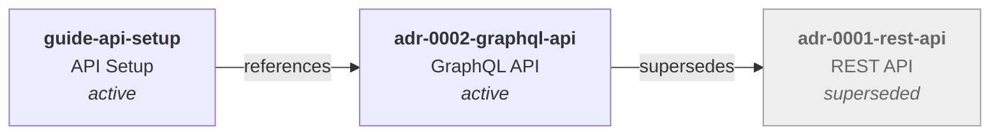
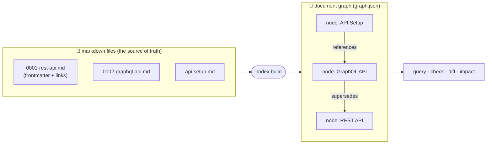
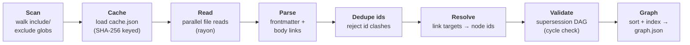

[](https://www.rust-lang.org)
[](LICENSE)

# nodex

> **English** | **[한국어](README.ko.md)**

**Turn markdown files into a queryable, validated document graph.**

nodex scans your project's markdown files, extracts YAML frontmatter and link relationships, and builds an immutable document graph you can search, validate, diff, and report on — all through a JSON-first CLI. No agents, no servers, no AI dependencies. Just a Rust binary with a stable JSON contract.

---

## Table of Contents

1. [The Problem](#the-problem)
2. [Quick Start](#quick-start)
3. [Walkthrough: From Files to Answers](#walkthrough-from-files-to-answers) — build, query, check, and gate an edit on three files
4. [Core Concepts](#core-concepts) — files become a graph, edge types, frontmatter schema
5. [How It Works](#how-it-works) — build pipeline, incremental cache, query algorithms
6. [JSON-First CLI](#json-first-cli) — envelope, error codes, exit codes, command reference
7. [Validation & Lifecycle](#validation--lifecycle) — built-in rules, strict mode, diff-aware rules
8. [Diff & Export](#diff--export) — structural delta, JSON Schema, enum manifests
9. [Configuration](#configuration) — the `nodex.toml` reference
10. [Architecture](#architecture) — workspace, modules, design invariants
11. [Install](#install)
12. [License](#license)

---

## The Problem

A project's documentation is rarely a flat pile of files — it's a graph. ADR-0002 supersedes ADR-0001. A runbook depends on a guide. A spec is implemented by three rules. But that graph lives implicitly in `[link text](paths.md)` and frontmatter fields, invisible to `grep` and `find`.

This makes routine questions hard to answer:

| Question | What `grep` does | What you actually need |
|---|---|---|
| "What replaced this ADR?" | nothing — supersession isn't text | The full supersession lineage from any member; the current doc is a non-terminal (`active`) tip (a fork can have several) |
| "What depends on this doc?" | finds files mentioning its name, misses `related:` frontmatter | All incoming edges, regardless of source |
| "Which docs still cite a replaced decision?" | finds the link, not that its target was replaced | Live citations of a terminal doc whose lineage continues, each naming the doc to cite instead |
| "Which docs are isolated?" | nothing — absence isn't searchable | Nodes with zero incoming edges |
| "Which docs are stale?" | nothing — dates aren't compared | Active docs past review threshold |
| "What changed between these refs?" | line diff at best | Added / removed nodes, status transitions, field changes |
| "Find auth docs" | every file containing "auth" | Ranked by id / title / tag, each hit with its per-field score breakdown |

nodex makes the implicit graph explicit. It parses your markdown once, builds a typed graph with adjacency indices, and answers structural questions from that snapshot without re-parsing the markdown. Routine workflows — pre-commit validation, PR diff gating, deduplication before authoring, vocabulary sync with external tooling — collapse into single JSON-emitting commands.

**Core properties:**

- **Graph, not folders** — supersession chains, backlinks, cross-references are first-class
- **Config, not code** — all project-specific rules live in `nodex.toml`; zero hardcoded domain logic
- **Incremental & parallel** — Rust + rayon parallel reads, SHA256 per-file cache invalidates only what changed
- **JSON-first contract** — every operational command emits a stable envelope (`{ok, data, warnings}` / `{ok, error: {code, message}}`) with classified error codes (clap's `--help` / `help` / `--version` surfaces aside)
- **Pure CLI** — no daemons, no servers, no AI / network dependencies; everything is a synchronous local process

---

## Quick Start

```bash
# Install (macOS / Linux)
curl -fsSL https://raw.githubusercontent.com/junyeong-ai/nodex/main/scripts/install.sh | bash

# Initialize config in your project
nodex init

# Build the document graph
nodex build

# Search for documents
nodex query search "auth"

# Explore relationships
nodex query backlinks <node-id>
nodex query chain <node-id>

# Validate against the schema
nodex check

# Diff between git refs
nodex diff origin/main HEAD
```

Every command prints JSON (clap's `--help` / `help` / `--version` aside); add `--pretty` to indent it.

---

## Walkthrough: From Files to Answers

Say you have three markdown files — two architecture decisions (one replaced by the other) and a guide that links to the current decision:

```text
docs/
├── decisions/
│   ├── 0001-rest-api.md      # an old decision, now superseded
│   └── 0002-graphql-api.md   # the decision that replaced it
└── guides/
    └── api-setup.md          # links to the current decision
```

```markdown
---
title: REST API
status: superseded
superseded_by: adr-0002-graphql-api
created: 2025-01-10
---
# REST API
Our original API design.
```

…and the guide links to the current decision on its first body line (so a
backlink later resolves to `L2` — body line 1 is the `# API Setup` heading):

```markdown
---
title: API Setup
status: active
created: 2025-02-01
---
# API Setup
Start from the [GraphQL API decision](../decisions/0002-graphql-api.md).
```

A minimal `nodex.toml` says how to read them (full reference is in [Configuration](#configuration)):

```toml
[scope]
include = ["docs/**/*.md"]         # scan the docs tree; a scratch draft elsewhere stays out of scope

[kinds]
allowed = ["generic", "adr", "guide"]

[statuses]
allowed = ["active", "superseded"]
terminal = ["superseded"]

[[identity.kind_rules]]            # files under docs/decisions/ are ADRs
glob = "docs/decisions/**"
kind = "adr"
[[identity.kind_rules]]            # files under docs/guides/ are guides
glob = "docs/guides/**"
kind = "guide"
[[identity.id_rules]]              # an ADR's id is "adr-<filename>"
kind = "adr"
template = "adr-{stem}"

[schema]
required = ["created"]             # every doc must declare a created date
cross_field = [{ when = "status=superseded", require = "superseded_by" }]
```

**1. Build the graph** — scan the files once into an immutable graph:

```jsonc
$ nodex build --pretty
{ "ok": true, "data": {
  "nodes": 3, "edges": 2, "annotations": 0, "body_line_matches": 0,
  "cached": 0, "parsed": 3, "duration_ms": 1
} }
```

The result is a graph where the supersession and the body link are first-class edges:


```mermaid
graph LR
  A1["<b>adr-0001-rest-api</b><br/>REST API<br/><i>superseded</i>"]
  A2["<b>adr-0002-graphql-api</b><br/>GraphQL API<br/><i>active</i>"]
  G["<b>guide-api-setup</b><br/>API Setup<br/><i>active</i>"]
  A2 -- supersedes --> A1
  G  -- references --> A2
  classDef term fill:#eee,stroke:#999,color:#666;
  class A1 term;
```

**2. "What replaced the REST API decision?"** — `grep` can't answer this; a graph walk can:

```jsonc
$ nodex query chain adr-0001-rest-api --pretty
{ "ok": true, "data": { "items": [
  { "id": "adr-0001-rest-api",    "title": "REST API",     "status": "superseded", ... },
  { "id": "adr-0002-graphql-api", "title": "GraphQL API",  "status": "active",     ... }
], "total": 2 } }   //  oldest → newest — in this linear lineage the current doc is the last entry (the
                    //  only `active` tip): GraphQL replaced REST. Anchor on ANY member, even the current
                    //  doc, for the whole lineage. (supersedes is a DAG — a fork/consolidation can have
                    //  several tips; read currency from `status`, not position.)
```

**3. "What points at the current decision?"** — every incoming edge, regardless of where it came from:

```jsonc
$ nodex query backlinks adr-0002-graphql-api --pretty
{ "ok": true, "data": { "items": [
  { "id": "guide-api-setup", "relation": "references", "location": "L2", ... }
], "total": 1 } }   //  the guide links to it (body line 2)
```

**4. Validate the whole corpus** — schema, cross-field rules and the detection rules, all in one pass:

```jsonc
$ nodex check --pretty
{ "ok": true, "data": {
  "violations": [ {
    "rule_id": "orphan", "severity": "warning",
    "node_id": "guide-api-setup", "path": "docs/guides/api-setup.md",
    "message": "no document references this one; link it, set `orphan_ok: true`, or add its kind to [detection].orphan_ok_kinds",
    "details": { "type": "orphan" }
  } ],
  "skipped_rules": [],
  "rule_coverage": [
    { "rule_id": "acyclic_relation", "unit": "edges", "subjects": 0, "unjudged": 0 },
    ...
    { "rule_id": "required_field",   "unit": "nodes", "subjects": 3, "unjudged": 0 },
    ...
  ],
  "total": 1, "has_errors": false
} }
//  exit code 0 — every doc has a created date and the superseded ADR names its successor; the one
//  finding is a warning: nothing links to the guide. A violation list says what failed, not how much
//  was examined, so rule_coverage carries the population each rule guarded — acyclic_relation guards
//  `implements` edges, and this corpus has none yet.
```

Two things never reach `check` as findings here. A supersession cycle is refused by `build` itself (`CYCLE_DETECTED`), so no graph holds one. A broken link is counted by `query issues` as `unresolved_edge` until a `[[detection.unresolved_policy]]` row makes it an error.

**5. Gate an edit *before* it is written** — an agent proposes a new ADR but forgets the `created` date. `check --content` validates the proposed bytes without touching disk and answers in machine-readable form:

```jsonc
$ nodex check --content docs/decisions/0003-grpc-api.md=draft.md --pretty
{ "ok": true, "data": {
  "violations": [
    { "rule_id": "orphan", "severity": "warning", "node_id": "adr-0003-grpc-api", ... },
    {
      "rule_id": "required_field", "severity": "error",
      "node_id": "adr-0003-grpc-api", "path": "docs/decisions/0003-grpc-api.md",
      "message": "missing required field: created",
      "details": { "type": "required_field", "field": "created" }   // ← typed, not prose
    }
  ],
  "skipped_rules": [],
  "rule_coverage": [ ..., { "rule_id": "required_field", "unit": "nodes", "subjects": 4, "unjudged": 0 }, ... ],
  "total": 2,
  "has_errors": true,
  "proposals": [ { "path": "docs/decisions/0003-grpc-api.md", "in_scope": true, "has_path_errors": true } ],
  "standing": [ { "rule_id": "orphan", "severity": "warning", "node_id": "adr-0003-grpc-api", ... } ]
} }
//  exit code 1 — the error fails the gate. `violations` is what the proposal introduces, the new ADR's
//  orphan warning included; `standing` is every warning the proposed document carries as proposed
```

The agent reads `details.field == "created"` and adds the date — **no message-string parsing**. Every rule carries such a typed `details` object, discriminated by `type` (`field_enum` carries the `allowed` set, `field_type` the expected type, and so on), so a tool can auto-propose a fix mechanically.

---

## Core Concepts

### Files Become a Graph

nodex transforms a flat collection of markdown files into a navigable graph. Each document becomes a **node**, and every link between documents becomes a directed **edge** — so questions that live *between* files (what replaced this? what depends on it? what's orphaned?) become single queries instead of manual cross-referencing.


```mermaid
flowchart LR
  subgraph FS["📁 markdown files (the source of truth)"]
    direction TB
    f1["0001-rest-api.md<br/>(frontmatter + links)"]
    f2["0002-graphql-api.md"]
    f3["api-setup.md"]
  end
  build(["nodex build"])
  subgraph GR["🔗 document graph (graph.json)"]
    direction TB
    n1["node: REST API"]
    n2["node: GraphQL API"]
    n3["node: API Setup"]
    n2 -->|supersedes| n1
    n3 -->|references| n2
  end
  FS --> build --> GR
  GR --> Q["query · check · diff · impact"]
```

### Edge Types

Edges come from two sources: YAML frontmatter fields, and the markdown body itself.

| Source | Default Relation | Example |
|---|---|---|
| Frontmatter `supersedes` | `supersedes` | ADR 2 supersedes ADR 1 |
| Frontmatter `implements` | `implements` | Rule implements ADR |
| Frontmatter `related` | `related` | Guide is related to ADR |
| Frontmatter `covers` | `covers` | Doc covers `src/auth.rs` (an out-of-graph code path) |
| Markdown body link `[text](path.md)` | `references` | Body link to another doc |
| Body wikilink `[[id]]` (with `[parser].wikilink_enabled`) | `references` | Wikilink to a node id |
| Custom pattern (configurable) | **any new relation name** | e.g. `@path.md` → `imports` |

The five built-in relations above — `supersedes`, `implements`, `related`, `covers`, `references` — are fixed. Beyond them, `[[parser.link_patterns]]` in `nodex.toml` lets you define new relation names — pair a regex with a relation string, and every match becomes an edge with that relation. The built-ins whose resolution mode is fixed in code are off-limits: `covers` (path-only) and `supersedes` / `implements` / `related` (id-resolved) are fed exclusively by their frontmatter fields, and a link pattern naming one is rejected at load. `references` stays legal on patterns — it resolves as a document reference either way.

A body reference is resolved down a ladder: the path as written from the project root, then the same path from the referring document's own directory, then — for a document reference — the bare node id. A reference opening `./` says which frame it is in, so it is read from the document's directory and never from the root; that is what CommonMark, your editor and the filesystem do with it, and the graph binding it anywhere else would describe a link nobody else follows. Segments that name nothing are dropped before any rung is tried, so `docs//x.md` and `docs/./x.md` are `docs/x.md` and `.//x.md` still says its frame. `..` is not noise and is kept, resolved by the frame that read it. A root-anchored path (`/etc/passwd.md`) means nothing inside a project-relative graph and is refused as `cause: absolute`.

Markdown links are extracted via [pulldown-cmark](https://github.com/pulldown-cmark/pulldown-cmark) — an AST-based parser, not regex — so links inside fenced code blocks are correctly ignored. Custom pattern captures skip code blocks *and* inline code spans the same way, and the reference rewriter (`rename` / `retarget`) honors the identical surface, so extraction and rewriting never disagree. For a corpus whose citation idiom lives inside spans — node ids written as `` `adr-001` `` — a pattern sets `code_spans = true`: an inline code span whose **entire content** matches the pattern is then a reference on both sides at once, while a partial match inside a span (`` `just adr-tool` ``) and anything in a code block stay code.

### Frontmatter Schema

| Field | Type | Required | Meaning |
|---|---|---|---|
| `id` | string | yes (or auto-inferred from path) | Unique node identifier |
| `title` | string | yes (or auto-inferred) | Human-readable name (falls back to the first H1, then the filename stem) |
| `kind` | string | yes (or auto-inferred) | Document type — must be in `[kinds].allowed` |
| `status` | string | yes (or auto-inferred) | Lifecycle state — must be in `[statuses].allowed`; a status-less document gets `[statuses.flow].initial` where a flow governs its kind, else `[statuses].initial` (else the first allowed value) |
| `created` | date (ISO) | optional | Creation date |
| `updated` | date (ISO) | optional | Last edit date |
| `reviewed` | date (ISO) | optional | Last review date — what `stale_review`, trust `freshness` and `git_drift` measure from |
| `owner` | string | optional | Owner identifier |
| `supersedes` | string \| array | optional | IDs of replaced docs |
| `superseded_by` | string | optional | ID of replacement doc |
| `implements` | string \| array | optional | IDs of implemented specs |
| `related` | string \| array | optional | IDs of related docs |
| `tags` | string \| array | optional | Arbitrary tags |
| `covers` | string \| array | optional | Source-code paths this doc claims authority over — a file or a whole directory |
| `orphan_ok` | bool | optional (default `false`) | Suppress orphan warning |
| (anything else) | any | optional | Stored under `attrs`; rejected under `[schema].mode = "strict"` |

`supersedes`, `implements`, `related`, `tags`, and `covers` accept both a single string and an array.

---

## How It Works

### Build Pipeline

Each `nodex build` runs a fixed, deterministic pipeline — files in, immutable graph out:


```mermaid
flowchart LR
  scan["<b>Scan</b><br/>walk include/<br/>exclude globs"]
  cache["<b>Cache</b><br/>load cache.json<br/>(SHA-256 keyed)"]
  read["<b>Read</b><br/>parallel file reads<br/>(rayon)"]
  parse["<b>Parse</b><br/>frontmatter +<br/>body links"]
  dedupe["<b>Dedupe ids</b><br/>reject id clashes"]
  resolve["<b>Resolve</b><br/>link targets → node ids"]
  validate["<b>Validate</b><br/>supersession DAG<br/>(cycle check)"]
  built["<b>Graph</b><br/>sort + index →<br/>graph.json"]
  scan --> cache --> read --> parse --> dedupe --> resolve --> validate --> built
```

| Stage | What it does | Module |
|---|---|---|
| **Scan** | Walks the filesystem using `[scope].include` / `exclude` globs. Applies `conditional_exclude` to drop a terminal parent's `child_glob`-matching sub-artifacts (reported on the build result, never silent). | `builder/scanner.rs` |
| **Cache** | Loads `_index/cache.json`. Cache invalidates wholesale if the config-serialization SHA256 or the `nodex` binary version changed. | `builder/cache.rs` |
| **Read** | Reads file contents in parallel via `rayon::par_iter`. A file that cannot be delivered as text (unreadable, or not valid UTF-8) becomes a typed `ParseFailure` on the graph — an Error-severity `parse_failure` in `check`, never a fatal failure or a warning a gate ignores. | `builder/mod.rs` |
| **Parse** | Per-file SHA256 hash check. On hit, replay the cached `Node` + `RawEdge` set. On miss, parse YAML frontmatter, extract markdown links via pulldown-cmark, run any configured custom-pattern regexes — also in parallel. | `parser/` |
| **Dedupe IDs** | Reject the build with `Error::DuplicateId { id, first, second }` if two documents resolved to the same node id. | `builder/mod.rs` |
| **Resolve** | Convert each `RawEdge.target_path` into a node id. Strict matching only. Unmatched targets become `ResolvedTarget::Unresolved { raw, cause }` (surfaced by `query issues`, never silently dropped). Mirror every `superseded_by: Y` scalar into a canonical `supersedes` edge — or, when `Y` is unknown, an unresolved `superseded_by` edge so the dangling reference still surfaces. | `builder/resolver.rs` |
| **Validate** | Iterative 3-color DFS over `supersedes` edges to detect cycles. | `builder/validator.rs` |
| **Graph** | Sort edges and nodes for deterministic output, then construct the immutable `Graph`: nodes in an `IndexMap`, edges in a `Vec`, plus pre-built `incoming` / `outgoing` adjacency indices. | `model/graph.rs` |

After the graph is built, `_index/graph.json` is written. Backlinks are derived state — every consumer recomputes them from edges in O(degree) via `Graph::incoming_indices`.

`build` names what it did not graph, each list omitted when empty: `parse_failures`, `conditionally_excluded` (and `conditionally_kept`, a `child_glob` match the same rule also reads as a terminal parent and so spares), `dangling_paths` (a broken symlink, socket or FIFO the walk met), `unfollowed_paths` and `aliased_paths`.

### Index Once, Query Forever

- **Build artifact**: `graph.json` — single source of truth
- **Queries** read `graph.json` — no markdown re-parse. Each compares the config and walks the scope's paths (never their content), warning `snapshot_divergence` when either moved since the build (`nodex status` also hashes content); a file is re-read only on opt-in (`query node --with-body` re-reads one file's body), and `trust` / unresolved-edge checks additionally probe git / the filesystem
- **Incremental**: SHA256 per file means only changed files re-parse on the next build. Add `--full` to force a fresh build

### Query Algorithms

| Query | Result | Algorithm |
|---|---|---|
| `search <kw>` | id/title/tag matches with score | Substring match, scored |
| `nodes [--kind --status --tag]` | Every node matching every named predicate | Linear filter, no ranking |
| `backlinks <id>` | Nodes linking to target | `incoming_indices(id)` lookup |
| `chain <id>` | Supersession chain | Full lineage from any member, oldest → newest |
| `node <id> \| --path` | Full node + incoming/outgoing | Lookup (id direct, path linear) + both adjacency indices |
| `orphans` | Live nodes with zero external incoming edges | Linear scan + the four exemptions |
| `stale` | Active docs whose `reviewed` is `stale_days` or more days old | Linear scan, filter by status + `reviewed` |
| `recent` | Docs with date in window | Linear scan + date filter |
| `similar` | Score-ranked candidates | Token Jaccard + tag / kind / dir / neighbour overlap |
| `trust <id>` | Composite reliability + components | Weighted average over the measured components (inapplicable ones dropped, denominator renormalised; a component the run can measure and the document leaves undeclared yields no composite) |
| `components` | Connected component partition | Undirected BFS, deterministic ordering |
| `neighborhood <id>` | Nodes within N hops | Bounded BFS (undirected) |
| `dependents <id>` | Every node whose dependency chain reaches it | Reverse BFS over incoming edges, bounded by `--depth` / `--relations` |
| `annotations` | Body markers grouped by block and key | Linear scan over extracted annotations |
| `covered-by <path>` | Docs declaring this code path | Linear scan over `covers:` frontmatter |
| `issues` | Orphans + stale + unresolved + rule violations + skipped rules + rule coverage | Composes the above + `check` under the resolved `rules.immutable_baseline` |

**Note on adjacency**: only resolved edges are indexed. `Unresolved { raw, cause }` edges still exist on the graph (so you can list them via `query issues`) but don't appear in `incoming_indices`.

---

## JSON-First CLI

Every operational command emits JSON to stdout; only clap's help surfaces (`--help`, the `help` command, `--version`) print human-readable text.

### Envelope Schema

**Success:**
```json
{
  "ok": true,
  "data": { /* command-specific shape */ },
  "warnings": [{ "code": "...", "message": "..." }]
}
```
- `warnings` is omitted when empty.
- List queries return `data: { items: [...], total: N }` — always both fields. For plain listings (`nodes`, `search`, `backlinks`, `orphans`, `stale`, `components`), `total` counts every match and a `--limit` cap announces itself via `returned` (omitted otherwise), so a capped response never reads as complete. Selection queries (`trust --top/--bottom`, `similar`, `recent`) deliberately select in core: their `total` is the size of the selection itself.

**Error:**
```json
{
  "ok": false,
  "error": { "code": "ERROR_CODE", "message": "..." }
}
```

### Error Codes

Error codes are derived from the typed `nodex_core::error::Error` enum via `downcast_ref` — they are **never** string-matched on messages.

| Code | Cause |
|---|---|
| `CYCLE_DETECTED` | A cycle exists in `supersedes` edges |
| `DUPLICATE_ID` | Two documents resolved to the same node id |
| `PARSE_ERROR` | A write command met a document whose frontmatter does not parse — or, for `lifecycle`, has none (`nodex migrate --apply` writes one) — or `graph.json` is corrupt or of another snapshot schema (`nodex build --full`); a build records a malformed document as a `parse_failure` violation instead |
| `INVALID_TRANSITION` | `lifecycle` action attempted from a status that doesn't allow it |
| `NOT_FOUND` | Referenced node id doesn't exist in the graph |
| `GRAPH_MISSING` | A `query` ran with no `graph.json` snapshot — run `nodex build` |
| `GRAPH_OUTDATED` | An id is absent from a snapshot the working tree no longer matches — run `nodex build`; the remedy is a rebuild, not a corrected id (that is `NOT_FOUND`) |
| `ALREADY_EXISTS` | `init` / `scaffold` / `rename` target path already occupies a real file |
| `PATH_ESCAPES_ROOT` | A path traversal (`..`) or symlink would escape the project root |
| `SYMLINK_TARGET` | A write seam refused a target whose final component is a symlink — the writer never follows one |
| `CONTENT_VIOLATIONS` | A write command's gate refused the write: what it would write introduces Error-severity `check` violations (each listed as `rule_id: message`) |
| `CONFIG_ERROR` | `nodex.toml` failed validation at load time, an argument names what the config does not declare (`--fields`, `--where`, `--name`, a `lifecycle` status the kind does not allow), or `rules.immutable_baseline` names a ref git cannot resolve |
| `IO_ERROR` | Filesystem read/write failure |
| `VERSION_MISMATCH` | The running binary fell outside a version requirement — either the `--check-version <req>` flag (every command) or a document-writing command under a `[meta] nodex_version` pin |
| `GIT_ERROR` | `git` failed (e.g., not a work tree, missing ref) — most often from `diff`, `impact` and `check --since` |
| `INVALID_ARGUMENT` | clap parse failure |
| `INTERNAL_ERROR` | Anything unclassified (bug) |

### Warning Codes

A `warnings[]` entry is advisory: the command succeeded, and its `code` says what the result is narrower or later than it reads.

| Code | Meaning |
|---|---|
| `scope_coverage` | What was read and what the project governs did not line up — a declaration that selected nothing, a document no `identity` rule names, a part of the tree the walk never read, or a `check --content` path the scope does not admit |
| `snapshot_divergence` | `graph.json` no longer answers for the working tree — run `nodex build` |
| `build_recommended` | A mutation left a follow-up before the graph is consistent (the message names it) |
| `similar_document` | A scaffold target closely resembles an existing document — consider `lifecycle supersede` |
| `binary_compat` | The binary is outside the `[meta] nodex_version` pin — reads run, writes refuse |
| `gate_suppression` | The listed violations are not the set judged (`--severity`, or a `--since` ref that does not carry the project); `has_errors` and the exit code still answer for every violation judged |
| `baseline_inert` | A git ref leaned on had nothing where it was asked — locks not enforced, inert for one document, or one side of a `diff` / `impact` comparison missing a path |
| `ranking_unscored` | Candidates carrying no score were left out of a ranking, and counted |
| `file_skipped` | An edit did not land as meant — something stood in the way, or a moved reference now names another document or nothing |
| `reference_kept` | A mutation left a reference standing because moving it would point it at the document holding it |
| `document_evicted` | A write made a `conditional_exclude` parent terminal and so dropped its sub-artifacts from the project |
| `history_unread` | The step rules could not read history they needed — a commit whose tree the build refuses, or history a shallow clone cut off; its records are counted as `unjudged` |
| `threshold_undeclared` | A listing asked by a detection threshold the project does not declare measured nothing — `query stale` without `[detection].stale_days` — so its empty answer is not a clean one |
| `cache` | A cache could not be read or persisted; the next run redoes that work |

### Exit Codes

| Code | Meaning |
|---|---|
| `0` | Success |
| `1` | `nodex check` found `severity = error` violations |
| `2` | Runtime failure — anything that produced an error envelope, or output stdout would not take (a pipe closed early, a full disk) |

### Global Flags

| Flag | Effect |
|---|---|
| `-C DIR` | Run as if started in `DIR` (like `git -C`) |
| `--pretty` | Pretty-print JSON output |
| `--check-version <REQ>` | Refuse to run unless the binary version satisfies the SemVer requirement (CI pin) |
| `--today <YYYY-MM-DD>` | Evaluate date-relative rules and queries — staleness, orphan grace, recency windows, trust freshness — and date what nodex writes as if today were DATE, so a run is reproducible |

### Command Reference

| Command | Description |
|---|---|
| `nodex init` | Generate `nodex.toml` with annotated defaults |
| `nodex build [--full]` | Build graph; `--full` ignores cache |
| `nodex status` | Graph snapshot state — `absent` / `unreadable` / `schema_mismatch` / `outdated` / `current`, with the exact divergence (`config_changed`, `added_paths`, `removed_paths`, content-probed `changed_paths`) and the snapshot's recorded `unbuildable_paths`. A probe, not a gate: exit 0 whenever the probe runs |
| `nodex check [--severity error\|warning] [--since <ref>] [--content <path>=<-\|FILE> ... \| --staged]` | Run validation rules; `--since` narrows the report to what the diff answers for — each rule says which of its findings (see *Diff-Aware Validation*) — and activates diff-aware rules; `--content <path>=<source>` (repeatable) validates proposed (unwritten) bytes overlaid on the working tree in one build, gating an edit — or a multi-file batch — at its source; `--staged` judges the project as the next commit records it (see *Commit-Time Validation*); exit 1 on errors. `--severity` is an exact-match **display** filter — `--severity warning` lists only warnings and `--severity error` only errors, while `has_errors`, the per-proposal verdicts and the exit code answer for every violation checked; a `gate_suppression` warning says how many the filter hid. In content mode the envelope additionally carries `standing`: the proposed nodes' warning-severity violations in the proposed state (the absolute view) — `violations` is the introduced delta, so a node's pre-existing housekeeping warnings (`stale_review`, `git_drift`) cancel out of it and an advisory consumer reads them from `standing` without a second project-wide check |
| `nodex diff <ref-a> <ref-b>` | Structural delta between two git refs |
| `nodex impact <ref-a> <ref-b> [--depth N --relations a,b]` | "What breaks if I merge this?" — the diff plus each modified node's transitive dependents, each removed node's direct referrers that still point at it (now dangling), and each moved node's both — what still depends on it where it is, and what still points at where it was — with a `likely_breaking` list of the removed and moved nodes the *after* graph still references at a place they are not |
| `nodex report [--format md\|json\|all]` | Generate `GRAPH.md` + `graph.json` (default: `all`) |
| `nodex migrate [--apply]` | Inject frontmatter into legacy docs (dry-run by default) |
| `nodex rename <old> <new>` | Move file and rewrite body-link references (resolver-consistent, code-fence aware). A destination the scan would not admit is refused — but only for a *tracked* source; an untracked file (outside scope, or conditionally excluded) gets a plain guarded move with no gate, id anchoring, or rewriting. A source spelling the filesystem aliases onto a tracked document (letter case, Unicode normalization) is refused with the canonical spelling. A referencing doc whose body is immutability-locked is skipped with a warning instead of defaced — frozen history keeps its original spelling. Every reference the move leaves something to say about is named once: one it declined to repoint (it will dangle), and one it left standing that now names somebody else — the second is the only report a valid-but-changed graph gets |
| `nodex retarget <old-id> <new-id>` | Repoint every reference to `<old-id>` (frontmatter relation fields + body id references) onto `<new-id>` by exact id match; the successor doc is skipped so nothing there names itself, and it reports the predecessor references it kept — every one but `supersedes`, which is the succession record. A reference-unsafe successor id (trim-unstable / wikilink metacharacters) is refused up front, and a doc locked by `body_immutable` — or by a `frontmatter_immutable` block covering a relation field — is skipped with a warning instead of rewritten. Pairs with `lifecycle supersede` |
| `nodex scaffold --kind X --title "..." [--id ...] [--path ...] [--body <-\|FILE>] [--field KEY=VALUE]... [--dry-run] [--force]` | Create new document with valid frontmatter — no prior `nodex build` needed (the before-graph is built live from the working tree). `--body` supplies the markdown body (same SOURCE grammar as `check --content`); `--field` supplies frontmatter pairs (value is YAML) that feed the cross_field fixpoint. Supplying either engages the strict gate: an Error-severity check violation the document introduces refuses with `CONTENT_VIOLATIONS`; default-only scaffolds write with advisories. A path the scan would not admit is refused — a scaffolded doc the build can never graph is a write-only file |
| `nodex query search <keyword> [--status x,y] [--limit N]` | Keyword search across id, title, tags (score-then-id ranked) |
| `nodex query backlinks <id> [--limit N]` | All nodes linking to target |
| `nodex query chain <id>` | Full supersession lineage from any member (oldest → newest) |
| `nodex query orphans [--limit N]` | Live nodes no other document's record names — zero external incoming edges, and no predecessor naming it as `superseded_by` (the one authored pointer the graph folds into an edge the other way) — outside `orphan_ok_kinds`, per-node `orphan_ok` and `orphan_grace_days` (self-links don't count); the same population the `orphan` rule guards |
| `nodex query stale [--limit N]` | Active docs whose `reviewed` date is `stale_days` or more days old (a doc with no `reviewed` is not listed); without `stale_days` it lists nothing and carries `threshold_undeclared` |
| `nodex query nodes [--kind K1,K2] [--status S1,S2] [--tag T1,T2 --all-tags] [--where F=V ...] [--limit N] [--fields id,title,...]` | Generic listing primitive — every node matching every predicate (AND across categories, OR within). Empty filter returns every node in id order. `--where field=value` (repeatable) narrows by exact field equality over the scalar fields of the same vocabulary as `--fields` (`path` included; a collection built-in like `tags` is rejected — use `--tag`), matched with the same read as a `cross_field` `when` predicate. `--fields` projects the result: the named identity-spine fields (`id,title,kind,status,path`) in place, and any project-declared frontmatter field (other built-ins, `attrs` keys) under a nested `attrs` object — so an agent pulls a document's own frontmatter in one listing instead of reparsing files; an undeclared field is a `CONFIG_ERROR`. Tag matching is case-insensitive (same fold every tag-consuming surface uses). |
| `nodex query node <id> \| --path <file> [--with-body]` | Full node detail with incoming + outgoing edges. `--path` is the reverse lookup for editor / IDE integrations holding the file path (`./`-prefixed and root-contained absolute forms normalise to the project-relative path); `--with-body` attaches the canonical body text (`""` for body-less docs, key absent when not asked) so agents skip a separate file read. |
| `nodex query covered-by <path>` | Docs whose `covers:` frontmatter declares this code path. The declaring value is read on the build's own ladder, so `covers: ["./src/a.rs"]` in `docs/x.md` names `docs/src/a.rs`; the `<path>` argument is a needle with no frame, so `./`, `..` and `\` in it normalise away |
| `nodex query issues` | Unified orphans + stale + unresolved + rule violations + skipped rules + per-rule coverage. Resolves `rules.immutable_baseline` exactly as a default `check`, so immutability violations surface here without `--since`. The typed listings and the violations are two views of one set of findings: `orphans` and `stale` each carry a gate record in `violations` (`orphan`, `stale_review`), and a finding with a gate record is counted once — through the violation — so `summary.total` counts problems rather than mentions, and `by_category` keys each counted finding by the rule that found it. What no rule gates counts on its own: a warning-severity unresolved edge under `unresolved_edge`, an info-severity one under its policy row name, out of `total` |
| `nodex query trust <id>` | Composite reliability + per-component breakdown for a single node. `status` is always present; `freshness`, `drift`, `backlinks` are omitted from the JSON when the run did not measure them. Two absences hide behind that omission and `undeclared` tells them apart: a component nothing the document could write would produce (which, per component: the `[trust]` block in [Configuration](#configuration)) is dropped and the composite renormalises over the rest; a component the run *can* measure that the document declares no input for is named in `undeclared` and leaves no composite at all, because renormalising there would impute for the missing component exactly the score the present ones produced. |
| `nodex query trust --bottom N [--kind K] [--status S] [--below S]` | Ranked listing of the N lowest-trust nodes (ascending). `--kind` / `--status` narrow the corpus (`--status active` is the review-queue read — terminal nodes legitimately score near zero and would drown the signal); `--below` is an opt-in score cutoff (keep entries strictly below `S`). Mutually exclusive with `--top` and with the single-node `<id>` form. |
| `nodex query trust --top N    [--kind K] [--status S] [--below S]` | Ranked listing of the N highest-trust nodes (descending). Same filters as `--bottom`. |
| `nodex query similar [--id <id> \| --title "<t>"] [--kind K --tags a,b --parent-dir D --limit N --min-score S]` | Vector-free similarity (token Jaccard + tag/kind/dir/neighbour overlap). `--limit` caps the candidates (defaults to `similarity.default_limit`); `--min-score S` is an opt-in cutoff that keeps only candidates scoring at least `S`. Every per-component field is conditional — each is omitted when the *target* carries nothing to rank on (empty token / tag set, pre-creation spec without `--kind` or `--parent-dir`, no graph id or no neighbours for `linked`), which holds for every candidate alike. What a *candidate* lacks is measured, not omitted: no overlap with a set the target has is `0.0`. |
| `nodex query recent [--days N --field F --kind K --since YYYY-MM-DD --limit N]` | Docs whose configured date field falls in a recent window |
| `nodex query components [--limit N]` | Partition the graph into connected components (undirected, largest first) |
| `nodex query neighborhood <id> [--depth N]` | Nodes within `N` hops of `<id>` (undirected) |
| `nodex query dependents <id> [--depth N --relations a,b]` | Transitive reverse traversal — every node that depends on `<id>` |
| `nodex query annotations [--name <name>] [--min-count N] [--with-frontmatter f1,f2,...]` | Group body-text markers declared by `[[annotations]]` by capture key; `--name` exact-matches one declared `[[annotations]]` block name (not a glob; unknown name → `CONFIG_ERROR`); `--min-count` keeps only keys with at least N occurrences; `--with-frontmatter` enriches each source with selected frontmatter fields (built-in or project-declared) so consumers avoid file re-reads |
| `nodex lifecycle <action> <id> [--to id \| --status s]` | Transition: `supersede --to <new>`, `set --status <s>` (any allowed status), `review` |
| `nodex export schema` | JSON Schema (draft 2020-12) for the project's frontmatter |
| `nodex export enums` | Closed-vocabulary manifest (kinds, statuses, per-field enums) |
| `nodex export rules` | Registered-rules manifest — every rule the current config registers, with `id`, `severity`, `description`, `diff_aware` / `judges_steps` and a per-rule `params` payload (a registered rule can still report itself in `skipped_rules` when it runs) |
| `nodex export envelope-schema [--inline-refs]` | JSON Schema (draft 2020-12) of every CLI envelope shape — drives codegen for typed downstream consumers; `--inline-refs` emits each per-command schema fully self-contained (no `$ref`/`$defs`) for `$ref`-naive generators |
| `nodex export config` | Resolved document-locating surface: scope, output, parser, identity rules in evaluation order plus the code-level fallbacks (`fallback_kind`, `fallback_id_template`), and the resolved global `initial_status` (a kind a `[statuses.flow]` governs starts at that flow's `initial`) |
| `nodex export commands` | The authoritative list of leaves: every leaf's `path` tokens, its `per_command` schema key, its positionals (name, required) and flag-selected payload modes (e.g. `query.trust-list`); flags themselves are in `--help` |
| `nodex export diagnostics` | Error-code and exit-code vocabularies — the closed sets of envelope `error.code` values (each tagged `core`/`cli` origin) and advisory `warnings[].code` values, plus the `0`/`1`/`2` exit-code contract, so a consumer codegens an exhaustive error enum instead of hard-coding it from prose |

---

## Validation & Lifecycle

### Built-in Rules

`nodex check` runs every registered rule against the graph and emits a flat list of `Violation` records. Each violation carries `rule_id`, `severity`, optional `node_id` / `path`, a human `message`, and a typed `details` object: a stable machine category (the `type` discriminator) plus the structured parameters of the failure (offending field, expected set, failing value). The `message` is a single-source rendering of `details`, so an agent can branch on `details.type` and propose a fix without parsing prose. The response also lists `skipped_rules: [{rule_id, reason}]` for rules that declined to fire, and `rule_coverage: [{rule_id, unit, subjects, unjudged}]` for every rule that *did* — the population of nodes / edges / files that rule guards. The two partition the registry, so a consumer can ask whether the gate was complete and not only whether it found anything: an empty `violations` is what a thorough pass and a vacuous one both look like, and a rule reporting `subjects: 0` was in effect over nothing whatever its config declares. `subjects` counts what the rule protects, never what it caught — a `body_line` block counts documents of its kinds, `parse_failure` counts every document the build attempted, and a diff-aware lock counts the records it is armed over rather than the ones edited on this run. An immutability lock is armed only over records the baseline also holds: a diff carries its per-node channels over the ids both snapshots have, so a document with no baseline record cannot be judged against one and is left out of the reach. Records the scope selected and the rule cannot judge are reported beside the reach as `unjudged`, so a single response carries both. It is a difference rather than a defect, and what a non-zero points at is the rule's own question: an immutability lock counts a document added since the baseline — which costs nothing — alongside one whose baseline record went missing, and cannot tell them apart; `git_drift` counts a node whose every drift-relation edge went unmeasured, which is a reference to fix rather than a baseline to refresh.

| `rule_id` | Severity | What it checks |
|---|---|---|
| `parse_failure` | error | Every in-scope document parses; a dropped document (unparseable YAML, non-mapping frontmatter, a non-string key, unclosed `---` fence) is a node-less error, never a warning a gate ignores |
| `field_parse` | error | Built-in frontmatter fields parse as their type; a failed value (bad date, bad bool, non-string scalar) reads as absent and is flagged on the still-present node |
| `required_field` | error | Every required field (per `[schema].required` + per-kind override) is present |
| `forbidden_field` | error | No field a per-kind override lists in `forbidden` is present (registered only when one does) |
| `field_type` | error | `attrs` values match declared `types` (string / integer / bool / date) |
| `field_enum` | error | `attrs` + `kind` + `status` are in the declared `enums` allow-list |
| `cross_field` | error | Conditional requirements like `when status=superseded require superseded_by` |
| `unknown_field` | error | Undeclared frontmatter keys (active only under `[schema].mode = "strict"`) |
| `explicit_field` | error | Named inferrable built-ins (`id` / `title` / `kind` / `status`) are authored, not left to inference (opt-in via `[schema].require_explicit`) |
| `filename_pattern` | error | Filenames match `[[rules.naming]].pattern` regex |
| `sequential_numbering` | warning | No gaps in the leading number of files matching a `[[rules.naming]]` block with `sequential = true` |
| `unique_numbering` | error | No two files matching a `[[rules.naming]]` block with `unique = true` share the same leading number |
| `stale_review` | warning | Active (non-terminal) nodes whose `reviewed` date is `[detection].stale_days` or more days old; a node with no `reviewed` is outside the rule, so require the field to catch never-reviewed documents. Registered only when `stale_days` is set |
| `orphan` | warning | Live nodes no other document's record names — neither an incoming reference nor a predecessor's `superseded_by` — outside `[detection].orphan_ok_kinds`, the per-node `orphan_ok` flag, and `[detection].orphan_grace_days` |
| `superseded_reference` | warning | Live nodes citing a terminal node whose `supersedes` lineage continues in a live one; `details.current` names where it continues. A citation from the superseding lineage itself passes, and so does one of a terminal node whose lineage ends in terminal nodes (archived, deprecated). Not asked: `supersedes` itself, kinds in `[detection].superseded_reference_ok_kinds`, a target the citing document names in a marker of the `[[annotations]]` block `[detection].superseded_reference_ok_annotation` names (keyed by the target's id, so it covers every body citation of that target from that document; its frontmatter relations to the target stay asked), and a part a `frontmatter_immutable` / `body_immutable` block had already armed at the reference point — with no baseline, a citation a lock could hold counts as `unjudged` |
| `git_drift` | warning | Active nodes whose referenced targets — linked docs and `covers` code paths, a file or a whole directory — have accumulated more than `git_drift_threshold` commits since `reviewed` (opt-in). The measure is commits that *introduced* a change to the target on a day after `reviewed`: whole history, not the simplified view `git log -- <path>` shows by default, and a merge counts only where it differs from every parent. A working-tree `check` keeps the history it walked in `_index/history.json`, keyed by the commit it was taken at, so the next command walks only the commits since; the whole history is walked again where `HEAD` does not reach the kept commit, or where git can reshape history in place (a shallow clone, a graft, a replace ref) |
| `frontmatter_immutable/<name>` | error | One per `[[rules.frontmatter_immutable]]` block — a locked field changed on a doc the block's `trigger` had already armed at the reference point (diff-aware: needs `--since` or `rules.immutable_baseline`) |
| `body_immutable/<name>` | error | One per `[[rules.body_immutable]]` block — body edited after the block's `trigger` engaged (`terminal`: doc was already terminal; `status`: it held one of the statuses the block names; `creation`: a prior committed snapshot exists); `mode = "frozen"` rejects any change, `mode = "append_only"` requires the locked body to remain a prefix of the new body, and `append_section` confines that growth to one closing section (diff-aware) |
| `status_transition` | error | A status moved somewhere `[statuses.flow]` does not declare, over the kinds that flow governs — a move out of a terminal status included (registered only with a flow; needs a git work tree) |
| `status_entry` | error | A record entered the flow at anything but its entry status (registered only with a flow; needs a git work tree) |
| `body_line/<name>` | error | One per `[[rules.body_line]]` block — lines matching `pattern` outside code blocks must carry capture values from declared enums |
| `acyclic_relation` | error | The resolved edge graph must stay acyclic for every relation in `rules.acyclic_relations` (default `["implements"]`); reports the exact cycle path. (`supersedes` is validated separately — and harder — as a build-time error) |
| `unresolved_reference/<name>` | error | One per `[[detection.unresolved_policy]]` row with `severity = "error"` — an unresolved reference that row classifies fails `check`; `warning` / `info` rows are counted by `query issues` instead |

Adding a custom rule means implementing the `Rule` trait in `nodex-core/src/rules/` and registering it in `registered_rules()`.

> **Upgrading to 0.46.0:** on a project that does not set `[detection].stale_days`, `query stale` carries a `threshold_undeclared` warning and `GRAPH.md`'s Stale section reads "Not tracked" instead of "None", so staleness that is not measured no longer reads as none found. A consumer that treats an unknown warning code as an error sees one there.

> **Upgrading to 0.45.4:** a project that does not set `[detection].stale_days` no longer finds `stale_review` in `skipped_rules` or in `nodex export rules`. The rule is registered only when the horizon is set, as `git_drift` is only when its threshold is, so `skipped_rules` names only rules the project declared and the run could not evaluate. A script that read that entry to learn whether staleness is tracked asks `nodex export rules` instead: `stale_review` is listed, with its `stale_days`, exactly when it is in effect.

> **Upgrading to 0.45.3:** where a `[statuses.flow]` `initial` differs from `[statuses].initial`, two readings change with nothing edited. A `[[scope.conditional_exclude]]` parent that declares no status is read at the status the graph gives it — its flow's `initial` — rather than the global one, so its sub-artifacts can re-enter or leave the project. A status-less document of a kind outside `kinds.allowed` that a `kinds = []` flow governs starts at the flow's `initial`. `check` can report different findings as a result.

> **Upgrading to 0.45.1:** a project that sets `[detection].git_drift_threshold` finds `history.json` beside `cache.json` in its output directory (`_index/` by default) after the first working-tree `check` that measures drift. It is a cache in the same sense — the next command reads it and walks only the commits since — so ignore it the same way: a project that ignores `cache.json` by name, rather than the whole directory, otherwise sees it untracked.

> **Upgrading to 0.45.0:** `check` and `query issues` carry the `superseded_reference` warning rule, so a project that supersedes documents can see new findings with nothing changed. The exit code and `has_errors` are unchanged, `--severity error` hides them, and `by_category` gains `violation_superseded_reference`. A kind whose documents narrate history — a decision log, learnings — cites replaced documents as the record rather than as current guidance; list it in `[detection].superseded_reference_ok_kinds`. A consumer that judges `query issues` itself should decide by `rule_id` which findings gate, not by severity: a severity filter that drops warnings drops this rule with them. `orphans` / `stale` carry the same findings as the `orphan` / `stale_review` violations in a second shape, so read one or the other, never both; `summary.total` already counts each finding once.

> **Upgrading to 0.39.0:** three outputs read differently on a project that changed nothing. `check` and `query issues` now carry the `orphan` warning rule — the exit code and `has_errors` are unchanged, `--severity error` hides it, and `--since` reports an orphan only when the diff reached it — stranded it, or touched its own record. `query issues` counts every listed finding once, through its rule: `summary.total` is smaller wherever it double-counted `stale`, and `by_category` keys `violation_orphan` / `violation_stale_review` replace the bare `orphan` / `stale`, which are no longer reserved policy-row names. `query trust --top` / `--bottom` no longer rank a live document that declares no `reviewed:` when `[detection].stale_days` is set and `freshness` carries weight — it leaves the ranking through `ranking_unscored` rather than being scored as if reviewed; to list such documents, put `reviewed` in `[schema].required` and read `check`.

### Schema Mode

`[schema].mode` controls how undeclared frontmatter keys are treated:

- `lenient` (default): undeclared keys land in `Node::attrs` untouched
- `strict`: any frontmatter key not built-in and not declared in `types` / `enums` / `required` / `cross_field` (global + per-kind override) or a per-kind `forbidden` fires a `unknown_field` violation — catches typos like `relatd:` or `Implementss:`

### Lifecycle Actions

`nodex lifecycle <action> <node-id>` is the only safe way to mutate a document's status — it goes through `lifecycle::transition()`, which validates the source status, edits the YAML frontmatter in place, and refuses to write through symlinks.

| Action | Resulting `status` | Other fields written |
|---|---|---|
| `supersede --to <new-id>` | `superseded` | `superseded_by: <new-id>`, `updated: <today>` |
| `set --status <s>` | `<s>` | `updated: <today>` |
| `review` | (unchanged) | `reviewed: <today>` (refused when the existing `reviewed` date is in the future — never moves backward) |

`updated: <today>` is left out where the document's kind lists `updated` in its override's `forbidden`.

### Status flow

`[statuses.flow]` declares a lifecycle — which statuses follow which, over the kinds that have one:

```toml
[statuses.flow]
kinds = ["adr"]          # empty = every kind
initial = "proposed"     # where a governed kind starts; omitted = [statuses].initial
transitions = { proposed = ["active"], active = ["superseded", "archived"] }
```

Declared, it registers `status_transition` and `status_entry`, and `lifecycle` / `scaffold --force` refuse a move it does not name at the write seam. Omitted, nothing is judged and `[statuses].terminal` stays the only statement nodex has about how a lifecycle ends.

`kinds` is what keeps a lifecycle from being invented for a kind that has none — an ADR is proposed and then accepted, a runbook is written live and has no promotion step. A kind outside the filter is judged by neither rule and keeps whatever status it is authored at. `initial` is what `scaffold`, `migrate` and the parse of a document declaring no status write for the kinds it governs, so a project adopts a lifecycle for one kind without moving the status every other kind is created at.

A flow answers for the statuses it **names** and nothing else: a terminal one has no way out and every other has one, each is reachable from the entry point, and each is admitted by every kind it governs (asked per kind, never over their union). Separately, a status no flow names and no ungoverned kind may hold is refused at load as vocabulary nothing could carry.

Both rules judge history a step at a time, against git rather than `rules.immutable_baseline`: every `check`, `query issues` and write seam judges the uncommitted change — under `check --staged`, the staged one — against `HEAD` (and every `MERGE_HEAD` while a merge is under way), and `check --since <ref>` also judges each commit the heads reach and `<ref>` does not, against its parents. A range therefore reports what a gate on each of its commits would under today's config — a record authored at `proposed` and accepted a commit later passes, and a detour through an undeclared status is reported at the commit that took it (`details.commit`; absent for the uncommitted change). A step finding is about a commit, so a plain `check` never re-judges history. `check --content` judges a proposal against the working tree, which is no commit, and reports both rules skipped; outside a git work tree both skip. A node is its id, so a record the flow governed on no parent *enters* the flow however it got there — authored, moved under a path-derived id, re-keyed, given a governed kind, or restored; `nodex rename` anchors the id first and produces no arrival. Where a step cannot be read unambiguously — lines that share no commit, a shallow clone's cut or a commit whose tree the build refuses, among others — the record is counted in `unjudged` rather than judged, and the last two are named by a `history_unread` warning. A squash merge enters a record at the status it was accepted at, so a squash-merging repository accepts in a PR of its own, and a `--since` range a shallow clone does not hold is refused (`GIT_ERROR`) — fetch it (`fetch-depth: 0`). How merges, unparseable documents, ignored paths and amended commits are judged, and what each run costs: [`reference/config.md` § Status flow](.claude/skills/nodex/reference/config.md#status-flow). **One flow per project**: a second lifecycle is a config-key change, deferred deliberately because `kinds` already expresses the requirement that arrived (kinds with *no* lifecycle) and the guards are already scoped per kind.

`supersede` is its own action because superseding carries a structural payload — a successor plus a supersession-DAG safety check. Every other status transition goes through the generic `set`, whose target is any value the project allows. The target is validated against `[statuses].allowed` for the kind being transitioned (its `status` enum, if any) or globally — a project that never models `deprecated` simply doesn't allow it, and `set --status deprecated` is refused at the write seam rather than the vocabulary being forced into every project. `set` also refuses a status a `cross_field` rule governs while the required field is absent (e.g. `superseded`, which needs `superseded_by` — that is `supersede`'s job), so the tool never writes a document its own `check` rejects. The terminal guard still refuses leaving a terminal status, so `set` can never un-terminalize a doc; `review` is the only non-status-changing action.

### Diff-Aware Validation

`nodex check --since <ref>` builds the graph at the named ref, computes a structural diff, narrows the report to the findings that diff answers for, and activates rules whose semantics require two snapshots. Which findings a diff answers for is each rule's to say (`Rule::touched_by`): by default the finding's own document is one the diff touched — added, removed, or changed, or an edge or annotation it authored moved — with no neighbour expansion; a rule whose findings are decided by other documents' records widens it: `orphan` to the documents a pointer at which moved — an added or removed edge, or a predecessor's `superseded_by` (so a document stranded by a neighbour's edit is reported, and a standing orphan only when the diff touched its own record), `superseded_reference` to the cited document and every successor in its lineage, when its own record moved or a pointer at it did (a terminal status or a succession declared there is the edit that makes a standing citation stale), `git_drift`, whose reading is git's, keeps a finding when the commits `<ref>..HEAD` added one it counts — on a measured document or on a covered code path outside the graph alike; a node-less, project-wide finding (`acyclic_relation`, `parse_failure`, `unique_numbering`, `sequential_numbering`) is always kept, and so is every `status_transition` / `status_entry` finding, each about a step inside the range, a move the range went on to undo included. `rule_coverage` is never narrowed — a rule guards what it guards whatever slice is shown. The rules that need two snapshots:

- `frontmatter_immutable/<name>` — freeze declared fields on a doc the block's `trigger` had already armed before the edit (the write that first arms it is allowed; gated on the diff's *before* status). `id` is refused at load (structurally immutable); a locked `status` is read from the diff's status transitions. Multiple blocks; each carries a unique `name`, a `fields` list, a `trigger`, and an optional `kinds` filter. Locking `kind` is what settles which lifecycle a record answers to: every kind-scoped rule reads it first, and `terminal` settles it only once the record is finished with — so a registry block reaches for `creation` or `status`. The `kinds` filter reads the before frame too, so a write that takes a record out of a block's kinds is judged by the block that held it.
- `body_immutable/<name>` — body locks. `mode = "frozen"` rejects any body edit; `mode = "append_only"` requires the locked body to remain a prefix of the new body. `append_section = "## Corrections"` confines that growth to the section the heading opens: every non-blank appended line must fall inside it, nothing may follow it at its heading level or above, and no appended line may belong to a link reference definition a committed reference resolves to — so a frozen record takes corrections while everything committed above them reads as it did. Headings match by level and text as the markdown parser reads them, so one inside code, a quote or a list opens no section. `details.refusal` names what to undo: `rewritten`, `outside_section` or `redefines_reference`. `trigger` reads as it does above: `creation` freezes the body as soon as a prior committed snapshot exists, regardless of status — the creating commit is structurally exempt and frontmatter (including `status`) stays editable for supersession. Driven by per-node body fingerprints (whole-body SHA-256 + per-line hash vector + top-level sections and resolved reference definitions) computed at build time — no file re-reads at check time.

Both families pick when they engage with the same `trigger`, read in the diff's *before* frame, so the single write that first arms a lock may set what that lock covers in the same edit: `terminal` (the default) arms at every `[statuses].terminal` status; `status` at the statuses the block names in `statuses = [...]`; `creation` at every status, from the record's first committed snapshot. Reach for `status` rather than moving a status into `[statuses].terminal`, which `statuses.flow` validation, `conditional_exclude`, trust scoring, the `terminal` trigger, the lifecycle seam, `git_drift`, orphan and stale detection, `superseded_reference` and the `GRAPH.md` report all read — arming a lock through that word declares the record finished to every one of them, and a flow declaring a move out of that status stops loading at all. Where `[statuses.flow]` governs a kind a block locks, load proves two things about the arming: no declared transition leaves it, so a status edit cannot disarm the lock; and where the block locks `status` itself, no declared transition moves a document while it is armed, so the lock cannot refuse a move the flow calls legal.

Without a diff context — no `--since`, no resolvable `rules.immutable_baseline`, and not a `check --content` overlay — both families report themselves non-applicable in `skipped_rules` rather than passing silently. (`rules.immutable_baseline` resolving to a git ref activates them on a plain `check`, no `--since` needed.)

#### The project and its repository

Every git-backed feature — the immutability baseline, `git_drift`, `diff`, `impact` — measures **the project**, at its own location inside the repository that tracks it. `git_drift` reads the history in one `git log` walk and so needs git 2.31 or newer; on an older git the walk is refused and every drift target reports unmeasurable rather than being mismeasured. A `nodex.toml` in a subdirectory of a larger repository is as ordinary as one at the repository root: paths are read against the project's own prefix, and a ref is graphed from the project's directory inside its checkout, not from the repository around it. A ref is read by checking it out into a directory nodex keeps under the repository's git directory (`.git/nodex/checkout/`) and switches from tree to tree, so a read writes only the files that differ from the tree it last held; the price is a copy of the repository's tracked files for each nodex process that has run at the same time as others, kept for reuse, and deleting the directory while none runs is safe — the next read checks everything out again. The binding is resolved once per command and named outright, so nothing in the ambient environment can move the target — an inherited `GIT_DIR`, the quarantine object directory a server-side hook exports, or a pathspec-magic variable changes nothing about what nodex measures. The one variable read is `GIT_INDEX_FILE`, and only by `check --staged`, where git uses it to name the index a commit under way is made from.

An inherited `GIT_DIR` / `GIT_WORK_TREE` is deliberately ignored: the project's location decides which repository is measured, so a repository designated only by the environment (the bare-repo dotfiles pattern) is not seen — nodex reports having no work tree rather than measuring one it was pointed at. Variables that merely bound *discovery* (`GIT_CEILING_DIRECTORIES`, `GIT_DISCOVERY_ACROSS_FILESYSTEM`) are left alone, since they cannot select a different repository.

When the locks cannot engage — the project is not in a git work tree, or the baseline ref carries nothing for the project — the run proceeds and says so: `warnings` carries a `baseline_inert` advisory naming the condition, and the diff-aware rules appear in `skipped_rules`. The advisory rides mutating commands (`scaffold`, `lifecycle`, `rename`, `retarget`, `migrate --apply`) too, so a write whose configured locks were never enforced never reads as a clean run. A baseline ref git cannot resolve at all is different: the rules can neither fire nor be enforced, so **both** planes refuse with `CONFIG_ERROR` rather than one warning while the other writes. A repository in which no ref names a commit is *not* that case — no baseline could name a snapshot there, so it stays inert and a project can be scaffolded before its first commit.

> **Upgrading to 0.23.0:** `immutable_baseline` pointing at a ref the checkout lacks — `"origin/main"` under `actions/checkout`'s default `fetch-depth: 1`, for instance — now refuses **every** command that resolves the baseline, not just `check`. Fetch the ref (`fetch-depth: 0`, or an explicit `git fetch origin main`) or name one the checkout has. Refusing is deliberate: a lock that cannot be read must not be reported as a lock that found nothing.

### Write-Time Validation

```bash
nodex check --content docs/a.md=-                            # proposed bytes from stdin
nodex check --content docs/a.md=draft.md                     # …or from a file
nodex check --content docs/a.md=- --content docs/b.md=b.md   # batch: N proposals, one build
```

`check --content <path>=<source>` validates a document's **proposed** content before it is written; `<source>` is `-` (stdin) or a file path. The flag is repeatable, and every proposal is overlaid into **one** graph build, so a reference one proposal authors resolves against another proposal in the same batch — a `supersede` that also rewrites N referrers gates as a single atomic edit instead of reporting a still-dangling link a one-at-a-time check would. nodex builds the graph once for the working tree and once with the proposals overlaid, runs every rule — schema, cross-field, and the diff-aware immutability locks — against both, and reports the exact before/after difference: a violation already present without the proposal never refuses it, while any violation the overlay introduces — on a proposed document, on another node it affects, or the node-less `parse_failure` of a proposal that destroys its own node — fails the gate at exit 1. A proposed file need not exist on disk yet; an out-of-scope path is vacuously clean and the run warns that it validated nothing (so a write gate never passes silently on a misaimed path). Both builds are read-only and the drift history is only consulted, so a write-time check writes nothing to the output directory — neither `cache.json` nor `history.json`. The result's `proposals` array carries a `{path, in_scope, has_path_errors}` verdict per pair (`has_path_errors` scoped to that proposal's own path; the run-wide gate is the top-level `has_errors`), and every violation carries a typed `details` payload (see [Built-in Rules](#built-in-rules)). At most one source may be stdin; a path may appear once; mutually exclusive with `--since`.

This is the natural gate for an agent editing files: the *before* snapshot is the current on-disk state (not an older committed ref), so an immutability lock can't be laundered by committing a doc as active and then editing it after it goes terminal.

### Commit-Time Validation

```bash
nodex check --staged     # the project as the next commit records it
```

A pre-commit gate answers for what the commit records, and the working tree is not that: an edit left unstaged is not committed, a document never added is not in the commit, and a staged change the working tree has since undone is. `check --staged` writes the index git is committing as a tree, checks it out, and runs `check` over that project under the tree's own `nodex.toml`, the config the commit carries. The baseline and the history are a plain `check`'s, and the step rules judge the move the commit makes from `HEAD` (and every `MERGE_HEAD`) to the index. `git commit -a` and `git commit <path>` commit an index of their own, which git names to their hooks in `GIT_INDEX_FILE`; `check --staged` reads it, relative to the directory the hook runs in, and the work tree's index otherwise. An index with unmerged entries has no tree and is refused, as `git commit` refuses it; so is an index that does not record the project's directory, and a `GIT_INDEX_FILE` naming no file (`GIT_ERROR`). A staged link resolving outside the repository is not read, and a `scope_coverage` warning names it. `git commit --amend` makes its step from `HEAD^`, which a hook is not told, so the staged check judges that step from `HEAD`. Mutually exclusive with `--content`; combines with `--since`.

```sh
#!/bin/sh
# .git/hooks/pre-commit
exec nodex check --staged
```

### Kind Filter

Every per-block rule family — `[[rules.body_line]]`, `[[rules.body_immutable]]`, `[[rules.frontmatter_immutable]]` — plus `[[annotations]]` accepts an optional `kinds: ["..."]` list. Empty = no restriction; otherwise the rule fires only on nodes whose `kind` appears in the list. Every entry must be in `kinds.allowed`; `Config::load` rejects typos so a silent never-fire is impossible. `[[schema.overrides]]` / `[[trust.overrides]]` `kinds` is a different thing: it names the kinds the override applies to, and an empty list is refused at load.

### Binary-Version Pin

`[meta] nodex_version = ">=0.47, <0.48"` in `nodex.toml` pins the binary that may **write** the project's documents. On a binary outside the requirement, read commands still run and attach a non-fatal advisory to the envelope `warnings`, while document-writing commands (`scaffold`, `migrate --apply`, `rename`, `retarget`, `lifecycle`) refuse with `VERSION_MISMATCH` — reading a graph can't corrupt it, so only mutations are gated. The project pins its tooling instead of every CI / contributor re-implementing the check. The global `--check-version` CLI flag is a separate hard gate that refuses *any* command on a mismatch.

---

## Diff & Export

### Structural diff

```bash
nodex diff <ref-a> <ref-b>
```

Builds the graph at each git ref and emits a deterministic delta:

```json
{
  "added_nodes":   [...],
  "removed_nodes": [...],
  "added_edges":   [...],
  "removed_edges": [...],
  "status_transitions": [{"id": "...", "from": "...", "to": "..."}],
  "field_changes":      [{"id": "...", "field": "...", "before": ..., "after": ...}],
  "path_changes":       [{"id": "...", "from": "...", "to": "..."}],
  "added_annotations":   [...],
  "removed_annotations": [...]
}
```

Pure structural primitive — no policy, no heuristics. `path_changes` names a document present on both sides under a different path — a move that kept its id, which changes nothing authored and every path-keyed reading of the document. Drives `check --since` and the `frontmatter_immutable` / `body_immutable` rules; consumers can build CI summaries on it.

Both snapshots are graphed under a **single lens** — the newer side's `nodex.toml` (`diff` / `impact`: the *after* ref's; `check --since`: the working tree's) — never the before ref's. This is deliberate twice over: a vocabulary change — for example, removing a value from `kinds.allowed` — surfaces as concrete field changes on the affected nodes instead of an apples-to-oranges diff across incompatible schemas, and the PR that migrates the config format itself still passes the diff gates — under per-ref configs that exact PR deadlocks, because the base ref's config no longer parses under the new binary.

### Authoritative manifests

```bash
nodex export schema                         # JSON Schema (draft 2020-12) for the project's frontmatter
nodex export enums                          # kinds + statuses + per-field enums
nodex export rules                          # active rules (built-in + config-driven) with `params`
nodex export envelope-schema [--inline-refs]  # JSON Schema for every CLI envelope shape (typed-codegen contract)
nodex export config                         # resolved scope / output / parser / identity surface + fallbacks
nodex export commands                       # every leaf, its positionals and payload modes (flags: --help)
nodex export diagnostics                     # error-code + warning-code + exit-code vocabularies (closed sets, for codegen)
```

The dependency direction is enforced: nodex emits, external tools (TypeScript linters, IDE plugins, CI sync gates) consume. There is no inverse — nodex never parses an external file to derive its own vocabulary.

`export envelope-schema` is the codegen contract: each per-command entry is a draft-2020-12 schema with its nested types bundled under a per-entry `$defs` (the names drive named-model codegen); `--inline-refs` re-emits the same model fully self-contained for generators that do not follow `$ref`. The schema's `version` field is the source-of-truth nodex version, and release CI diffs each release's schema against the previous release's published asset (`nodex-envelope-schema-v<ver>.json`, `nodex-commands-v<ver>.json` ship as pinnable assets) — a shape change without the promised minor-or-major bump fails the release.

---

## Configuration

All behavior is driven by `nodex.toml`. `Config::load` runs `validate()` at startup and rejects inconsistent configs (e.g., a `terminal` status absent from `allowed`, or an `initial` status excluded by a `status` enum), so misconfigurations fail fast. Self-consistency that depends on the document being acted on — a `lifecycle` action never writing a status the project rejects — is enforced at that command's write seam instead, so a project is never forced to declare statuses for actions it doesn't use.

```toml
[scope]
include = ["docs/**/*.md", { glob = "specs/**/*.md", may_be_empty = true }, "README.md"]
exclude = ["docs/drafts/**"]
# Directory basenames pruned from the walk at any depth (default below).
# Tune for your stack — a Go repo has no `.venv`; a docs vault under a
# dir named like one of these opts it back in by dropping it here.
# An empty list prunes nothing.
# prune_dirs = ["node_modules", "__pycache__", "target", ".git", ".venv"]
# Drop a terminal parent's sub-artifacts (only child_glob matches; the
# dropped paths are reported on the build result, and the write that
# makes the parent terminal names them via `document_evicted`):
# [[scope.conditional_exclude]]
# parent_glob = "specs/**/SPEC.md"
# child_glob = "specs/**/tasks/**"   # "**/*" clears the whole subtree
# condition = "status_terminal"

[kinds]
allowed = ["generic", "guide", "readme", "adr", "spec", "learning"]

[statuses]
allowed = ["draft", "active", "superseded", "archived", "deprecated", "abandoned"]
terminal = ["superseded", "archived", "deprecated", "abandoned"]
# Status written by scaffold / migrate and assumed for a document that
# declares none, where no [statuses.flow] governs its kind. Omitted = the
# first `allowed` value:
initial = "draft"

[[identity.kind_rules]]
glob = "docs/decisions/**"
kind = "adr"

[[identity.id_rules]]
kind = "adr"
template = "adr-{stem}"

[[parser.link_patterns]]
pattern = "@([A-Za-z0-9_./-]+\\.md)"
relation = "imports"
# code_spans = true   # a span whose ENTIRE content matches is a reference

[rules]
immutable_baseline = "HEAD"   # a plain `check` enforces the locks below against the last commit
# acyclic_relations = ["implements"]   # relations whose edges must stay a DAG (default)

[[rules.naming]]
glob = "docs/decisions/**"
pattern = "^\\d{4}-[a-z0-9-]+\\.md$"
sequential = true
unique = true

# Freeze fields once the block's `trigger` engages; diff-aware (needs `--since` or
# `rules.immutable_baseline`). The write that first arms the lock — e.g.
# setting `superseded_by` as a doc is superseded — is allowed; only later edits lock.
# `id` is refused (structurally immutable); a locked `status` is read from the diff's status transitions.
# Multiple blocks supported — each carries a unique `name` and an optional `kinds` filter.
[[rules.frontmatter_immutable]]
name = "identity"
fields = ["kind"]
trigger = "creation"    # which lifecycle a record answers to, settled by its first commit

[[rules.frontmatter_immutable]]
name = "supersession"
fields = ["superseded_by"]
# kinds = ["adr"]       # trigger omitted = "terminal"

# Body lock. `frozen` rejects any body edit; `append_only` requires the
# locked body to remain a prefix of the new body, and `append_section`
# (e.g. "## Corrections") confines that growth to the closing section the
# heading opens. `trigger` reads as it does above: both lock families
# share it — "terminal" (default), "status" with the block's own
# `statuses = [...]`, or "creation" from the first committed snapshot.
# [[rules.body_immutable]]
# name = "adr-decisions"
# mode = "frozen"
# trigger = "creation"
# kinds = ["adr"]

# Per-line body-text vocabulary conformance — one block per pattern.
# Captures named in `enums` must hold a value from the allowed set;
# non-matching lines are silently ignored (this is a conformance rule,
# not a presence rule).
# [[rules.body_line]]
# name = "spec-decision-log"
# pattern = '''^- \*\*(?P<gate>[a-z-]+)\*\*'''
# kinds = ["spec"]
# enums.gate = ["scope", "design", "rollout", "ship"]

# Body-text marker extraction — surfaced by `nodex query annotations`.
# Pre-graph identifiers that intentionally do not resolve to a node
# (TODO topics, promotion candidates, open research questions).
# [[annotations]]
# name = "promotes"
# pattern = '''\[PROMOTES:\s*(?P<id>[\w-]+)\]'''
# key = "id"
# kinds = ["learning"]
# The block superseded_reference_ok_annotation names: the key is the id of a
# target cited as history and a reason must follow it. Annotations read inline
# code, so it takes a marker only from a line that starts with <!--:
# <!-- superseded-ok: adr-0001 the figures are its own -->
# [[annotations]]
# name = "superseded-ok"
# pattern = '''^\s*<!--\s*superseded-ok:\s*(?P<target>[\w-]+)\s+\w'''
# key = "target"

[schema]
# Authored fields only — id / title / kind / status / orphan_ok are
# parser-resolved for every document and rejected here at load.
required = ["created"]
mode = "lenient"   # "strict" rejects undeclared frontmatter keys
cross_field = [
  { when = "status=superseded", require = "superseded_by" },
]

[[schema.overrides]]
kinds = ["adr"]
required = ["decision_date"]   # added on top of the global required set
types = { decision_date = "date" }
enums = { priority = ["low", "medium", "high"] }
forbidden = ["covers"]         # a decision record does not describe live code

[detection]
stale_days = 180
orphan_grace_days = 14
# orphan_ok_kinds = ["readme"]
# superseded_reference_ok_kinds = ["readme"]
# superseded_reference_ok_annotation = "superseded-ok"   # the [[annotations]] block above
# git_drift_threshold = 5
# Which relations carry the measurement (default shown).
# git_drift_relations = ["references", "implements", "covers"]
# Ordered first-match classification of unresolved references —
# severity "error" registers check rule `unresolved_reference/<name>`,
# "warning" joins the counted fallthrough, "info" is reported outside
# the warning total. A row narrows on three axes, each optional but
# `cause`: `cause` is one of missing | target_unparsed |
# excluded_from_scope | id_not_found | escapes_source | absolute;
# `relations` narrows to the relations the edge may carry (omitted =
# every one, and `superseded_by` is nameable here alone, being the one
# relation only an unresolved edge carries); `glob` matches the names the
# resolution *sought* — the node id for an id relation, the normalized
# resolution candidates for a document reference, never the raw target —
# and is refused at load on `escapes_source` / `absolute`, which are
# refused before anything is looked up. A row an earlier row already
# covers is refused at load: first match wins, so it could never fire —
# declare the narrow rows first. Declaring the table replaces the
# default row {name = "excluded_target", cause = "excluded_from_scope",
# severity = "info"} — re-declare it to keep it.
# [[detection.unresolved_policy]]
# name = "legacy-archive"
# cause = "missing"
# glob = "archive/**"
# severity = "info"
#
# The relation is what separates a structural edge from a prose citation
# when both name the same dead id for the same reason — a successor that
# does not exist is a defect, a citation of a purged record is history.
# [[detection.unresolved_policy]]
# name = "dead-successor"
# cause = "id_not_found"
# relations = ["superseded_by"]
# severity = "error"

[output]
dir = "_index"

[report]
title = "Document Graph"
god_node_display_limit = 10
orphan_display_limit = 20
stale_display_limit = 20

[trust]
# The composite renormalises over the components this run could measure —
# dropped from the denominator, never replaced with a neutral fallback.
# A component is inapplicable when nothing the document could write would
# produce it:
#   - `freshness` ⇔ `detection.stale_days` unset, or the doc is terminal
#   - `drift`     ⇔ `git_drift_threshold` unset, terminal doc, no resolvable
#                   `git_drift_relations` edge, or git can't measure one it has
#   - `backlinks` ⇔ no external incoming edges anywhere in the graph
# A component the run CAN measure and the document declares no input for is a
# different thing: `freshness` / `drift` both read `reviewed:`, so a live doc
# without one is listed in `undeclared` and carries no composite. Renormalising
# there would impute the score of the components it did supply, so withholding
# `reviewed:` could only raise a rank — set a component's weight to 0 (globally
# or per kind via `[[trust.overrides]]`) to say the project does not track it.
# Threshold-style filters are opt-in CLI flags
# (`nodex query trust --bottom N --below S`), not config defaults — corpus-
# dependent cutoffs would otherwise drift across projects.
weights = { status = 0.4, freshness = 0.3, drift = 0.2, backlinks = 0.1 }

[similarity]
# Every component (`title`, `tags`, `kind`, `directory`, `linked`) is
# conditional — omitted from the JSON when the TARGET carries nothing to rank
# on (empty token / tag set, pre-creation spec without `--kind` or
# `--parent-dir`, no graph id or no neighbours for `linked`), which holds for
# every candidate alike, so the composite renormalises over what the query does
# carry. What a CANDIDATE lacks is never an absence: no overlap with a set the
# target has is 0.0, a measurement — renormalising there would rank a candidate
# above a better match for declaring nothing.
# `default_limit` is the operator-capacity cap; score cutoffs are opt-in
# CLI flags (`nodex query similar --min-score S`), not config defaults.
default_limit = 10
weights = { title = 0.4, tags = 0.2, kind = 0.1, directory = 0.1, linked = 0.2 }
title_stop_words = ["the","a","an","and","or","of","to","for","in","on","with","is","are","be","by","as","at","from"]

[search]
# `nodex query search <keyword>` ranking. Unlike trust / similarity, whose
# composite renormalises over the components a run can measure, search is
# ADDITIVE: a node's score is the sum of the weights of the fields the
# keyword matched, and a node matching nothing is excluded. Each field has
# an exact and a partial (substring) tier, so the exact-vs-partial
# preference is config, not a hidden constant. Each `SearchEntry` carries a
# `components` breakdown (per-field contribution, absent fields omitted) so
# a consumer sees why.
weights = { id_exact = 3.0, id_partial = 1.5, title_exact = 2.5, title_partial = 1.0, tag = 0.5 }
```

| Section | Controls |
|---|---|
| `[scope]` | Which files are scanned (`include` / `exclude` globs, `conditional_exclude`, `prune_dirs`, `follow_symlinks`). Dot-prefixed paths are skipped unless an include pattern literally names the dotted segment (e.g. `.claude/**/*.md`). A directory reached through a symlink is not descended unless `follow_symlinks = true` — the default matches `git` / `ripgrep` / `fd` / `find` and keeps every path-keyed rule with exactly one path to key on; each undescended link is named in the build's `unfollowed_paths`, and each extra name a followed link admits in `aliased_paths`. An `include` entry may be a table `{ glob, may_be_empty = true }` (so may an `identity` or `conditional_exclude` rule) saying that selecting nothing is expected — it silences only that declaration's own `scope_coverage` warning |
| `[kinds]` | Allowed `kind` values (must include `"generic"`) |
| `[statuses]` | Allowed `status` values + which are terminal + `initial` (the status scaffold / migrate write and a document declaring none receives, for kinds no flow governs; default: first allowed) + `flow` (see [Status flow](#status-flow)) |
| `[identity]` | `kind_rules` + `id_rules` (template with `{stem}`, `{parent}`, `{kind}`, `{path_slug}`) |
| `[parser]` | Custom `link_patterns` (each with a `relation` and optional `code_spans`), `extensions` (link targets that count as documents, leading dot included), `wikilink_enabled` (`[[id]]` body syntax, off by default) |
| `[rules]` | `immutable_baseline` (the ref a plain `check` diffs against; `nodex init` writes `"HEAD"`) + `acyclic_relations` (default `["implements"]`) + `naming` patterns + `frontmatter_immutable` (field lock) + `body_immutable` (body lock, `frozen` / `append_only`, optional `append_section`) + `body_line` (per-line vocabulary check); both locks pick when they engage with `trigger` = `terminal` / `status` / `creation` |
| `[[annotations]]` | Body-text marker patterns (regex + named-capture key); surfaced by `query annotations`, and read by `superseded_reference` for the block `[detection].superseded_reference_ok_annotation` names |
| `[schema]` | `required` / `types` / `enums` / `cross_field` + per-kind `overrides` (which also take `forbidden`) + `mode` + `require_explicit` (inferrable built-ins — `id` / `title` / `kind` / `status` — that must be authored, not inferred; reds `check` via the `explicit_field` rule) |
| `[detection]` | `stale_days` / `orphan_grace_days` (default 14) / `orphan_ok_kinds` / `superseded_reference_ok_kinds` / `superseded_reference_ok_annotation` / optional `git_drift_threshold` with `git_drift_relations` + ordered `unresolved_policy` rows classifying unresolved references (`error` / `warning` / `info`) |
| `[output]` | Where build artifacts land |
| `[report]` | `GRAPH.md` formatting limits |
| `[trust]` | Composite-score weights (per-kind overrides supported) |
| `[similarity]` | Default operator-capacity limit, weights, stop words |
| `[search]` | `query search` keyword-ranking weights (per-field exact / partial tiers) |
| `[meta]` | `nodex_version` SemVer pin — document-writing commands refuse on a mismatching binary (see [Binary-Version Pin](#binary-version-pin)) |

---

## Architecture

### Workspace Layout

```
nodex/
├── nodex-core/    Library — all logic: parser, builder, query, diff, export, rules, output, lifecycle, scaffold
└── nodex-cli/     Binary  — clap CLI; thin wrapper that adds JSON envelope + error classification
```

The split keeps `nodex-core` reusable — embedding it in another Rust tool doesn't pull a CLI dependency stack.

### nodex-core Modules

| Module | Responsibility |
|---|---|
| `model/` | Data types — `Node`, `Edge`, `Graph`, `Kind`, `Status`, `ResolvedTarget`, `RawEdge`, `Annotation`, `RawAnnotation`, `BodyLineMatch`, `RawBodyLineMatch` |
| `parser/` | Markdown → `(Node, Vec<RawEdge>, Vec<RawAnnotation>, Vec<RawBodyLineMatch>)`; YAML frontmatter, body links (pulldown-cmark AST), `iter_body_lines` fence-aware iterator, identity inference, minimal-diff `FrontmatterEditor` |
| `builder/` | Scan → cache → read → parse → resolve → validate → graph |
| `query/` | Read-only traversals: `search`, `traverse`, `detect`, `structure`, `listing`, `issues`, `recent`, `similar` (`compute_similarity`), `trust` (`compute_trust`), `annotations` (`find_annotations`), `dependents` (`find_dependents`) |
| `diff.rs` | `compute_diff(before, after)` — pure structural delta primitive |
| `ancestry.rs` | Where each record stood at each step of history — a commit against its parents, the uncommitted change against `HEAD` and every `MERGE_HEAD` — for the rules that judge moves rather than endpoints (`status_transition`, `status_entry`) |
| `git.rs` | The repository a project is tracked in, resolved from the project's own location; the one seam every `git` invocation is built through |
| `impact.rs` | `compute_impact(before, after)` — diff + transitive dependents; "what breaks if I merge this?" |
| `reference_rewrite.rs` | Resolver-consistent, fence-aware rewriting of body-link and id references — the single engine behind `rename` and `retarget` |
| `retarget.rs` | `retarget_document` — repoint one node id's references onto another by exact match |
| `mutate.rs` | `plan_file` → `narrow` → `write_plan` — the guarded write path for batch rewrites: plan every file with reader-follows / writer-skips symlink discipline, gate the whole batch once against the immutability locks and hold back only the locked parts, then write each survivor atomically inside the root; `rename`, `retarget` and `migrate --apply` route through it |
| `export.rs` | `export_schema(&Config)` + `export_enums(&Config)` + `export_rules(&Config)` + `export_config(&Config)` + `export_envelope_schema(inline_refs)` + `compute_envelope_schema_diff` — authoritative manifests and the release contract classifier |
| `rules/` | `Rule` trait + built-ins; `is_applicable` / `skip_reason` report a registered rule a run could not evaluate; `check` returns `{violations, skipped_rules, rule_coverage}` |
| `command_result.rs` | Typed `data` payload of every command (`LifecycleResult`, `MigrateResult`, `RenameResult`, `RetargetResult`, `InitResult`, `ReportResult`, `BuildResult`, `CheckResult`) — single source of truth for both the CLI emitter and the `export envelope-schema` derive |
| `output/` | `graph.json` (single source of truth) + deterministic `GRAPH.md` |
| `status.rs` | `load_graph` (the single snapshot-read seam: typed `GRAPH_MISSING`, exact membership-divergence warning) + `compute_status` / `compute_divergence` (the `nodex status` content probe) |
| `lifecycle.rs` | Status transitions that mutate frontmatter |
| `scaffold.rs` | Create new docs with valid frontmatter; deduplication via similarity |
| `path_guard.rs` | Reject `..` / symlinks; `write_atomic_in_root`, the single guarded write primitive |
| `yaml_text.rs` | Line-level YAML scalar reading and quoting behind the minimal-diff frontmatter writes |
| `hash.rs` | SHA-256 content fingerprints for the build cache and the `GRAPH.md` stamp |
| `config/` | `nodex.toml` load + validate (split into `types` / `validate` / `views` / `predicate`); `Config::declared_fields_for(kind)` powers strict mode |
| `error.rs` | Typed `Error` enum + stable `code()` strings |
| `warning.rs` | Typed advisory warnings — a stable `WarningCode` beside the rendered message, the non-fatal counterpart to `error.rs` |

### Design Principles

1. **Immutable graph.** `Graph` is built once via `Graph::new()` and never mutated. Adjacency indices are derived state. Query results are always consistent.

2. **Config over code.** Anything project-specific lives in `nodex.toml`. Kind names, status vocabularies, edge relation names, ID templates, naming rules, schema constraints, custom link patterns, frontmatter lock lists, trust weights, similarity weights — all configurable. The core has zero hardcoded domain knowledge.

3. **Type-safe edge resolution.** `ResolvedTarget` is `Resolved { id }` or `Unresolved { raw, cause }`. Unresolved edges are surfaced via `query issues`; they are skipped by adjacency indices.

4. **SHA256 incremental + version invalidation.** Per-file content hashes mean only changed files re-parse. The cache key mixes in the config-serialization hash *and* the `nodex` binary version.

5. **Symmetric mutation guards.** Everything nodex writes — documents (`scaffold`, `migrate`, `rename`, `retarget`, `lifecycle`) and infra artifacts (`graph.json`, `GRAPH.md`, `cache.json`, `history.json`, init's `nodex.toml`) — routes through `path_guard::write_atomic_in_root`, which rejects `..` / absolute paths, refuses symlinked targets, and enforces root containment across symlinked ancestors. Batch file rewrites (`rename`, `retarget`, `migrate --apply`) additionally share one core path — `mutate::plan_file`, `mutate::narrow`, `mutate::write_plan` — owning the reader-follows / writer-skips symlink discipline and one immutability-lock verdict for the whole batch (`BaselineProbe::refusals`). Guards live in core, not in each CLI handler.

6. **No silent rule skips, and no silent vacuous passes.** Rules that decline to fire (`frontmatter_immutable` without `--since`, opt-in rules without their environment) appear in the `skipped_rules` array of every check / issues response — never as silent passes. Rules that *do* fire report their reach in `rule_coverage`, because a rule that examined nothing passes for the same reason a rule that examined everything passes. The two arrays partition the registry: a rule either declined or ran, and either way the report says which and over how much.

7. **One-way export.** External tools consume nodex's `export schema` / `export enums` manifests. nodex never parses an external file to derive its own vocabulary; the dependency direction is fixed.

A meta-invariant ties them together: **anything nodex itself writes must pass nodex's own `check`.** If `scaffold`, `migrate`, or `lifecycle` could produce a document the same config rejects, that's considered a bug — closed by rejecting the config shape at load time (`Config::validate`), deriving the written value from config, or validating a user-supplied value at the command's write seam (as `lifecycle set --status` does). See [`.claude/rules/config-driven.md`](.claude/rules/config-driven.md).

Principle 6 also reaches below the rule registry. Coverage is a property of the scan, not of the graph a command happens to build from it, so every command that reads the working tree to answer says what it read — `build`, `check`, `report`, `scaffold`, `migrate`, `rename`, and `diff` / `impact` once per ref. A mis-scoped `migrate` reports `total: 0` with a `scope_coverage` warning beside it, and a mis-scoped `rename` reports `total_updated: 0` the same way, because a finished migration and one that never saw a file are otherwise the same JSON. The snapshot readers say it too — every `query` leaf and `status` — because a snapshot of nothing matches a working tree of nothing exactly, so fidelity is the only thing that probe can report and emptiness the only thing it cannot: `nodex status` answers `current` over a corpus it never read, and a gate reading `state` alone would call that healthy. One place has no warnings array to ride: an id lookup that misses ends in an error envelope, so the `NOT_FOUND` message names what the project held instead — over a corpus governing nothing, or one whose every document failed to parse, no correction to the id could have succeeded.

Principle 6 has a write-plane half. A gate reports the violations a proposal introduces, and that is complete only over the population `check` runs on — so a write that *removes* a document from that population is silent by construction: the findings leave with it and the delta can only shrink. `[[scope.conditional_exclude]]` is the one membership rule a document's content moves, so a write that puts a terminal document in the parent slot — by changing its status, or by moving one that was already terminal there — is the write that drops its sub-artifacts, and it names them on the envelope as `document_evicted`. Both the write and its pre-write gate (`check --content`) report it, and the file is left untouched. The advisory itself never refuses: evicting them is what the rule was declared to do. A refusal can still arrive from what the eviction *breaks* elsewhere — a reference into a dropped document that the project's own `[[detection.unresolved_policy]]` calls an error fails the gate like any other introduced violation. What the advisory says is that `check`'s reach just shrank, and by which documents. The population is every record the project holds, nodes and `parse_failures` alike, so an evicted document that never parsed is named too — that is the case where a write turns a red `check` green.

---

## Install

### Quick install

**macOS / Linux**
```bash
curl -fsSL https://raw.githubusercontent.com/junyeong-ai/nodex/main/scripts/install.sh | bash
```

**Windows (PowerShell)**
```powershell
iwr -useb https://raw.githubusercontent.com/junyeong-ai/nodex/main/scripts/install.ps1 | iex
```

The installer detects your platform, downloads a verified prebuilt binary, installs it to `~/.local/bin` (or `%USERPROFILE%\.local\bin` on Windows), and optionally installs the Claude Code skill.

### Supported platforms

| OS | Architecture | Target |
|---|---|---|
| Linux | x86_64 | `x86_64-unknown-linux-musl` (static) |
| Linux | arm64 | `aarch64-unknown-linux-musl` (static) |
| macOS | Intel + Apple Silicon | `universal-apple-darwin` (fat binary) |
| Windows | x86_64 | `x86_64-pc-windows-msvc` |
| Windows | arm64 | `aarch64-pc-windows-msvc` |

### Build from source

```bash
git clone https://github.com/junyeong-ai/nodex
cd nodex
./scripts/install.sh --from-source
# or: cargo install --path nodex-cli
```

### Pinning in CI

Every command accepts `--check-version <semver-req>` as a global flag — refuse to run unless the installed binary satisfies the requirement.

```bash
nodex --check-version ">=0.47, <0.48" build
```

---

## License

MIT

---

> **English** | **[한국어](README.ko.md)**
